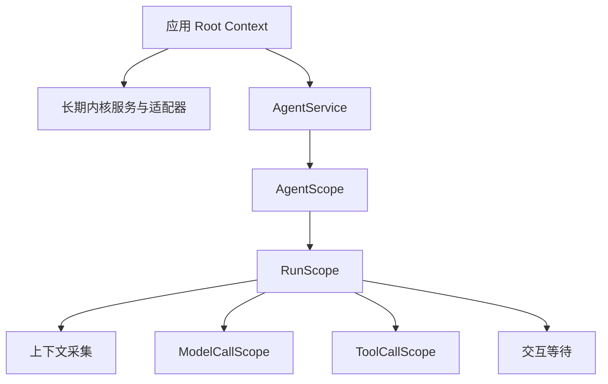
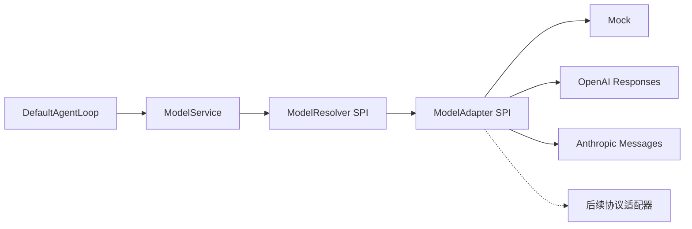

# 通用 Agent 内核 v1 开发计划

状态：待实施的设计与验收计划。日期：2026-09-07。

本文确定基于 NyaCore 的通用 Agent 内核需要哪些组件、各自承担什么职责、如何适配不同 LLM API，以及从零实现的顺序。所有组件名称、方法和目录均为拟定设计，当前没有对应的 Agent 内核实现。

架构原则：项目拥有自己的组件契约、领域数据和执行规则；开发初期允许使用成熟开源方案作为组件的阶段性实现，最终逐项替换为自研实现。可替换性适用于所有内核组件、作用域实现和策略模块，不能仅停留在 LLM 或存储适配器层。

本轮以本文作为内核范围和验收依据。[旧 Runtime 制作计划](runtime-implementation-plan.md)保留为较大范围的设计参考；其中固定 48 类组件、持久化后端和产品集成批次不自动成为本文的要求。

## 1. 目标与当前基线

### 1.1 内核目标

接收输入，根据 Agent 定义组织上下文、调用模型和工具、推进执行，并提供统一的状态、事件、交互、限制、取消和资源管理能力。

第一版要完成：

1. 定义和创建 Agent，在会话中执行有明确结果范围的 Run。
2. 完成“输入 → 模型 → 工具 → 模型 → 结果”的多步循环。
3. 用同一个执行引擎接入 Mock 和两种不同的真实 LLM API 协议。
4. 支持流式事件、历史与状态查询、显式取消、工具审批和请求外部输入。
5. 提供有限并发、上下文及输出上限、超时和失败处理。
6. 基于 Nya 管理注册、服务、实例与在途调用，关闭后没有受管工作遗留。

本轮专注通用内核，不设计或实现客户端、网络 Gateway、部署宿主、账号产品或设备同步。

### 1.2 当前已有与待建内容

- [application](../packages/application/src/index.ts)已装配 Core、Loader、Include、HMR、Timer、ConsoleLogger，并提供通用配置与生命周期控制。
- [现有公共接口](../packages/application/src/types.ts)只有应用启动、关闭、配置和框架 Context 等能力。
- 模型、工具、会话、Run、上下文与交互服务均待开发。
- 当前空配置示例和 application 测试继续作为框架装配回归基线。

### 1.3 第一版的收敛选择

| 决策 | v1 安排 |
| --- | --- |
| 实现来源 | 可以采用自研实现或第三方桥接实现；跨组件一律使用项目自有契约 |
| 长期目标 | v1 可用与最终完全自研分别验收；记录每个过渡实现及其替换条件 |
| 执行方式 | 一个默认模型与工具循环；保留 ExecutionStrategy 接口 |
| 会话并发 | 同一 Session 最多一个非终态 Run；其他提交返回 SESSION_BUSY |
| 多实例 | 可创建多个 Agent，使用内核级有限并发许可；不包含多 Agent 协作协议 |
| 输入干预 | 普通输入创建 Run；运行中仅接受绑定已有交互的回复；steer/inject 后续增加 |
| 状态后端 | 首版交付 MemoryStateStore；状态在当前内核生命周期内有效 |
| 持久化 | 首版定义事务、快照和保存契约，具体数据库及重启恢复后续独立交付 |
| 工具调度 | 默认串行；显式声明可并行的工具组才允许有限并行 |
| 上下文 | 实现预算和确定性裁剪；自动摘要压缩后续增加 |
| 模型重试 | 默认关闭自动重试；保留单层策略入口，禁止隐式模型切换 |
| 模型协议 | Mock + OpenAI Responses + Anthropic Messages；通过不同协议检验统一接口 |

Memory 模式中“接受成功”表示状态后端已经原子提交到内存，不表示写入磁盘。describe 必须报告 stateDurability=memory；API 和文档不得声称可以在重启后恢复或补读。以后接入持久化实现时，应另行声明并验证其保证。

## 2. 开发边界

| 层次 | 负责内容 | 本轮安排 |
| --- | --- | --- |
| NyaCore 与配套包 | 组件安装、服务依赖、Fiber、Effect、配置装配、进程内事件、框架日志 | 复用公共入口，不重复实现容器和组件生命周期 |
| Agent 内核 | Agent/Session/Run 语义、执行策略、模型与工具调用管线、上下文、交互、状态与限制 | 本轮主体 |
| 能力适配器 | LLM 协议、具体工具、上下文来源、状态保存实现 | 实现首批适配器，通过内核 SPI 接入 |
| 后续扩展 | Skills、MCP、长期记忆、RAG、自动化、多 Agent、工作流 | 明确接入点，本轮不要求完整实现 |
| 使用方 | 输入展示、交互回复、受信配置、外部资源授权与进程退出策略 | 调用内核 API，不侵入执行内部 |

组件按独立生命周期、资源所有权或替换需求划分。下文编号用于追踪职责，不要求一个编号对应一个 npm 包、公开服务或独立目录。纯计算逻辑优先保持为普通 TypeScript 模块。

### 2.1 所有组件必须可替换

| 设计要求 | 具体约束 |
| --- | --- |
| 契约由项目定义 | 每个组件明确输入、输出、状态修改权、错误、事件、能力、取消与清理保证；实现依赖契约 |
| 实现由组合根选择 | 使用 Nya 装配服务或注入工厂；消费者不能自行创建另一个组件的具体实现 |
| 第三方依赖局部封装 | 第三方类型、异常、SDK 对象、配置格式及生命周期对象只存在于对应实现内部，不能进入公共 API 或其他组件 |
| 领域数据自主 | Session、Run、消息、配置和事件使用项目结构；第三方私有 checkpoint 不能成为唯一事实来源 |
| 共享行为验收 | 同一合约套件验证正常流程、失败、状态竞争、限制、事件、取消与资源释放，不能仅检查类型兼容 |
| 状态迁移明确 | 实现更换涉及私有数据时，提供迁移、重建或明确失效规则；不能默认承诺旧在途状态无损续跑 |
| 边界适度 | 组件内部私有函数无需全部包装为公共服务；模块整体替换时，消费者只依赖契约 |

可替换首先指在相同契约版本下，通过改变装配即可更换实现，其他组件不需要理解新实现。所有组件都需要这个设计边界，但首版无需为每项同时制作两套完整生产实现。运行中无损热切换另行验收；默认切换过程是停止接收、取消并等待旧工作、释放旧实现，再安装新实现。状态唯一修改者的规则在替换期间仍然成立。

### 2.2 第三方方案的阶段性使用

以用户提出的 Vercel AI SDK 为例，可以考虑将它封装为模型接入组件的一种实现，向内核输出自有 ModelEvent、ModelOutcome 和 ModelError；以后用自研协议实现替换该组件，Run、工具、上下文与交互接口保持不变。这是架构示例，尚未选定或安装该 SDK，也不宣称其所有功能都满足本项目契约。

同样的方式适用于执行策略、上下文处理、工具执行、状态后端、交互或观测等模块。若借用第三方执行引擎，它也必须遵守受控执行接口和状态修改权；其内部循环不能绕过工具授权、预算、事件记录或取消管理。无法满足关键契约的部分不能直接作为等价实现接入。

每个借用方案建立实现记录，注明组件契约版本、第三方依赖与用途、能力差异、私有状态、合约测试、预期自研替代及退出条件。适配和封装代码本身不能作为该组件已完成自研的证据。

## 3. 领域对象与状态归属

| 对象 | 定义 | 边界 |
| --- | --- | --- |
| AgentDefinition | Agent 的不可变配置 revision | 包括模型引用、指令、工具选择、上下文策略及限制，不包含密钥值 |
| AgentInstance | 使用某个定义的活动实例 | 具有独立 generation 和资源作用域；不等同于历史会话 |
| Session | 连续交互的记录与版本 | 数据寿命由状态后端决定，不依赖一直存活的 Fiber |
| Run | 一次明确接受的执行 | 具有稳定 ID、输入、配置快照、状态和结果范围 |
| Step | Run 内一次上下文组装、模型请求及随后工具处理的范围 | 作为执行记录和内部对象，不强制成为公共 Nya 服务 |
| ModelAttempt | 一次实际模型调用 | 独立 attemptId；失败重试不得覆盖前次尝试记录 |
| ToolCall | 一次工具调用 | 关联调用 ID、参数、授权、结果及副作用不确定状态 |
| Interaction | 一次待响应的问题或审批 | 绑定 Run、交互 ID、版本、期限；审批另绑定工具及参数摘要 |
| Message / ContentPart | 输入、输出与上下文内容 | 保留来源、角色、类型和关联 ID，避免全部压成文本 |
| ResourceRef | 外部资源或大内容的引用 | 表达资源身份及元数据，不自动授予访问能力 |

Nya Context 表达组件作用域，ModelContext 表达模型输入；Fiber 表达组件生命周期，Run 表达业务执行。两组概念分别命名和建模。

状态修改权统一如下：

- AgentService 管理定义 revision 和活动实例索引。
- SessionService 管理会话及消息写入规则；RunCoordinator 可以组合其变更计划，不绕过校验。
- RunCoordinator 是 Run 状态、取消意图和终态的唯一修改者，按 Run 串行处理命令。
- InteractionService 管理交互记录，通过 RunCoordinator 协调等待、恢复和取消，不能直接恢复执行器。
- StateService 提供原子提交、条件检查和事件序号；它不自行决定业务迁移。
- ToolService、ModelService、策略与适配器报告结果，不直接写 Run 终态。
- EventFeed 和 Observability 只读取、传播或观察已经提交的事实。

Run 的串行命令队列只处理状态检查、有限提交和动作派发，不在占据队列时等待模型、工具、交互、workDone 或清理任务。执行任务的 workDone 不等待自身终态命令，父协调者在工作停止后另行完成结算，避免“取消命令等待执行、执行等待队列”的死锁。

## 4. 预期组件清单

### 4.1 长期职责组件

以下 12 项是预期的服务边界，全部遵守第 2.1 节的替换契约。初期可以合并安装，但保留可独立选择实现的装配入口及测试边界；Observability 可以按需安装。表中依赖描述完整 v1 的逻辑关系，具体 Nya 必需注入必须按当前已启用能力声明。

| ID / 组件 | 核心职责与拟定入口 | 主要依赖 | 所拥有的资源 | 首批 |
| --- | --- | --- | --- | --- |
| K01 KernelApi | describe、agents、sessions、runs、interactions、close；对外门面与接收门 | K02/K03/K04/K09/K11 | 门面关闭状态；不重复拥有 Run | G1 |
| K02 AgentService | 定义注册与 revision、create/get/close、同会话实例协调；内部合并 Registry/Factory/Manager | K05/K06/K07/K08 的能力描述 | AgentScope、定义和活动实例索引 | G1 |
| K03 SessionService | create/get/list/messages、版本校验、输入与输出记录变更计划 | K10 | 会话领域数据规则；无需常驻会话 Fiber | G1 |
| K04 RunCoordinator | start/get/cancel/wait、队列与有限许可、驱动执行、交互推进、唯一终态 | K02/K03/K08/K09/K10；启动时将所需能力传入 RunScope | 调度任务、许可和 Run 完成通知；RunScope 由 AgentScope 拥有 | G1 |
| K05 ModelService | 模型能力检查、通过 Resolver 取得本次句柄、统一调用协调 | ModelResolver SPI、K08 的已解析限制 | 协调中的借用句柄；连接客户端归接入组件，调用资源归 ModelCallScope | G1/G4 |
| K06 ToolService | 注册与撤销、schema 校验、授权、工具执行、结果限制；内部区分 registry/executor | K08；调用时传入交互及资源接口 | 工具注册；单次工作归 ToolCallScope | G2 |
| K07 ContextService | 指令和上下文提供方注册、收集、历史选取、组装与预算 | K03 的快照、K05/K06 能力描述、K08 | 注册和可撤销贡献；单次采集归 RunScope | G1/G2 |
| K08 PolicyService | 合并执行限制、工具允许/拒绝/审批决策、停止规则 | 受信配置与纯策略 | 策略注册；预算计数器归 RunScope | G1/G3 |
| K09 InteractionService | request/listPending/respond/expire/invalidate；问题与审批管理 | K10 | 交互索引和到期任务；等待句柄归 RunScope/ToolCallScope | G3 |
| K10 StateService | transaction/readSnapshot、状态记录与事件原子提交、分配 Run 事件序号 | StateStore SPI | 自建状态后端、提交协调与保留规则 | G1 |
| K11 EventFeed | readAfter/subscribe；从快照游标补读、有限缓冲、订阅释放 | K10；Nya 提交后通知 | 订阅资源；不拥有业务执行 | G1 |
| K12 Observability | 执行耗时、步骤、用量和错误观察；连接 Nya 日志与可选输出端 | K11、Nya Logger | 订阅和自建输出端；故障不改变 Run 结果 | G5 |

补充约束：

1. K04 的队列和调度先作为内部模块；出现独立调度生命周期需求后再拆 RunScheduler。
2. K09 返回交互决定；由 K04 接受恢复命令。双方不建立相互必需的服务注入。
3. K06 通过本次调用上下文请求审批，实际工具执行前再次检查参数、权限、交互有效性与取消状态。
4. K07 的异步内容采集是受管任务；纯提示词拼装和历史裁剪交给下节的普通模块。
5. K11 使用 Nya 事件作提交后唤醒，读取源仍是 K10；不建立第二套通用事件总线。

阶段装配规则：G1 使用 toolsEnabled=false、interactionsEnabled=false，K01/K02/K04/K07 不把未安装的 K06/K09 声明为必需注入；模型意外返回工具调用时明确失败。G2 启用 K06，但交互仍未启用，权限需要审批时返回 INTERACTION_UNAVAILABLE 并禁止执行。G3 安装 K09 后才启用审批和提问入口。describe 只报告当前实际可用能力，未启用的 API 返回明确的能力不可用错误。

### 4.2 每次执行的资源作用域

| ID / 作用域 | 归属 | 必须管理的资源与行为 |
| --- | --- | --- |
| S01 AgentScope | K02 AgentService | 活动实例 generation、局部能力注册、所有已接受 Run 的控制句柄及 RunScope 子树；包括尚未建立 RunScope 的 queued Run |
| S02 RunScope | S01 AgentScope | AbortController、执行策略任务、步骤、计数器、上下文采集、交互等待和调用子作用域 |
| S03 ModelCallScope | S02 RunScope | attemptId、网络请求、流迭代器、增量组装和清理等待 |
| S04 ToolCallScope | S02 RunScope | toolCallId、参数快照、审批等待、工具任务及工具登记的子资源 |

这些 Scope 表达所有权，可以通过 Nya 子组件或公开 EffectScope 实现，不要求每层都是公开服务。使用 EffectScope 时必须把其清理显式登记到所属组件 Effect；不能把一次 Context.extend() 当作独立清理所有者。



### 4.3 普通类型与策略模块

| 模块 | 负责内容 | 第一版实现 |
| --- | --- | --- |
| KernelContracts | 领域对象、内容、命令、事件、错误和能力类型 | strict 类型和外部输入运行时校验 |
| RunStateMachine | 状态迁移、条件冲突与终态规则 | 纯函数，由 K04 调用 |
| ExecutionStrategy / DefaultAgentLoop | 决定下一步动作：模型、工具、交互或结束 | 一个默认循环；再用最小测试策略验证可替换边界 |
| ModelContextBuilder | 指令组合、历史与工具结果配对、上下文裁剪 | 确定性组装，不删除原始会话事实 |
| ToolScheduler / ResultProcessor | 串行或有限并行调度、结果关联、大小限制 | 默认串行；并行显式启用，独占调用形成屏障 |
| CapabilityValidator / LimitMeter | 请求能力校验、输出和执行预算计量 | 不支持时显式拒绝；缺失用量不能当作零 |

ExecutionStrategy 只使用内核提供的受控执行接口，不能自行调用供应商 SDK、绕过工具授权、任意写状态或启动未托管任务。注册的是受信代码；Nya 的服务隔离不构成不可信代码沙箱。

### 4.4 适配器与贡献接口

| SPI | 首版实现 | 后续接入 |
| --- | --- | --- |
| ModelResolver | 单后端解析实现；多 Provider 目录可作为标准接入组件 | 自定义模型选择策略 |
| ModelAdapter | Mock、OpenAI Responses、Anthropic Messages 的契约实现；允许第三方桥接 | 自研替代实现、Chat Completions、Gemini 及其他协议 |
| ToolDefinition | 纯计算工具、可控延迟工具、请求交互的测试工具 | 文件、进程、浏览器、搜索、MCP 等 |
| ContextProvider | 静态指令与可控动态内容来源 | Skills、文件、检索、长期记忆 |
| StateStore | MemoryStateStore | 持久数据库、导入导出、恢复与迁移 |
| ObservationSink | 有限的内存采集或日志输出 | 指标、追踪和审计输出端 |

具体工具需要的环境、凭据和资源能力从受信执行上下文获得。本轮定义最小资源引用和能力接入契约，不要求实现通用文件系统、进程或沙箱服务。Provider 注册返回确切撤销句柄；卸载先阻止新获取，再取消并等待已有使用者。

## 5. LLM API 适配设计

### 5.1 内核与协议适配器的分工



内核管理统一语义、执行限制和调用所有权。适配器管理协议请求转换、鉴权请求、HTTP 或 SDK 调用、流解析及响应转换。核心包不能导入供应商 SDK；适配器内部可以使用现成 SDK。

ModelService 消费 ModelResolver，不必拥有完整 Provider 配置管理。Provider 接入组件持有连接配置、凭据解析、SDK 客户端及连接资源；多 Provider 目录是 Resolver 的一种可替换实现。使用目录时，目录服务保持稳定，Provider 只注册或撤销内部条目，不因增删一个 Provider 而替换整个 Nya 服务。

每次调用通过 Resolver 获取绑定具体 revision/generation 的 ModelLease，完成或取消后等待调用清理并释放借用。提供方撤销先停止新获取，再取消并等待已有借用，最后释放客户端。Run 保存模型引用和版本，不长期缓存 SDK 客户端或跨组件重启的服务 facade。

分别建模 protocolId、providerId 和 modelId：协议说明如何通信，提供方说明具体连接与配置，模型说明实际能力。两个品牌共用一个兼容协议不能算作两种协议适配验收。接受 Run 时固定模型引用和配置 revision，不在执行中暗换供应商或型号。

### 5.2 必须统一的契约

| 类型或行为 | 首版要求 |
| --- | --- |
| ModelRef | 协议、提供方、模型、配置版本；不携带密钥明文 |
| ModelCapabilities | 文本流、工具调用及可选能力；具体请求不满足时显式拒绝 |
| ModelRequest | 指令、规范化消息、内容块、工具定义、工具结果关联、输出限制及调用参数 |
| ModelEvent | 内容开始/增量/完成、工具参数增量/完整调用、用量、结束信息；ID 与顺序明确 |
| ModelOutcome | 标准结束原因、完整内容和工具调用、已获得的用量、提供方请求标识、续接数据 |
| ModelError | 无效请求、认证、限流、超时、网络、提供方、协议和取消；保留有界诊断信息 |
| ModelResolver / ModelLease | 按模型引用取得具体版本的借用句柄；单后端与多 Provider 实现使用同一契约 |
| ModelCallHandle | 可消费事件、请求停止、等待真实工作及流资源释放；错误也必须能完成清理等待 |

首版实际支持文本、系统指令、历史、流式输出、函数工具调用与结果、用量和取消。图片、音频、结构化输出、缓存和供应商托管工具可以声明为未支持；不能静默丢弃请求中的必要能力。

流事件中的 delta 表示增量，completed 表示完整值，二者不能重复累计。ModelOutcome 是该次调用的最终结论，ModelCallHandle 的完成等待还必须覆盖调用级资源清理。首版以成功完成的 ModelOutcome 中的工具调用集合为派发依据，再进行 schema 和权限校验；流中的完整工具帧可用于展示，但不能独立触发执行。完整工具帧之后若发生异常 EOF、协议失败或取消，本次调用的工具零执行。

### 5.3 保留供应商特有信息

通用内容旁保留受约束的 providerData/continuation：标记协议、提供方、模型及格式版本，设置大小上限，仅由对应适配器解释。需要续接时原样回传；不把这些数据拼入普通用户文本，也不自动转给另一模型。

历史裁剪必须尊重工具配对和续接数据边界。切换模型遇到不兼容续接状态时，显式拒绝或使用已定义的上下文重建方式，不能静默删除必要数据。

例如 Anthropic 用 tool_use/tool_result 内容块表达工具调用，部分 Gemini 调用需要保存 thought signatures；这些差异说明统一协议需要保留内容结构及续接信息。具体字段与版本在实现对应适配器时再次按官方规范冻结：[Anthropic 工具调用](https://platform.claude.com/docs/en/agents-and-tools/tool-use/handle-tool-calls)、[Gemini thought signatures](https://ai.google.dev/gemini-api/docs/generate-content/thought-signatures)。

### 5.4 取消、重试和工具边界

- ModelAdapter 层承担一次模型调用；本地工具执行与后续模型调用由内核调度。处于这一层的 SDK 自动工具循环必须关闭；复用第三方执行引擎时改在 ExecutionStrategy 边界接入，并满足第 2.2 节全部行为要求。
- Run 的取消信号传到模型请求和流读取；本地调用结束与远端计算是否停止分别表达，不承诺断开连接即可撤销供应商计算。
- 首版 SDK 与内核均不启用自动重试。以后由唯一重试策略决定，记录新的 attemptId；已输出内容、工具请求或副作用后不能无条件重放。
- 适配器报告实际能获得的用量。缺失用量为 unknown，供应商累计值不能重复相加；估算值要明确标记。
- 凭据从受信配置或解析回调按本次操作取得，不进入 AgentDefinition、消息、事件、普通日志或对外错误。
- 自建 SDK 客户端由提供方释放；借入客户端的清理所有权必须显式声明。

## 6. 执行、交互与事件语义

### 6.1 一次 Run 的执行链

1. K04 校验 Agent、Session、定义 revision、必要能力和限制。
2. 通过同一状态事务提交输入、Run、配置快照、会话版本、首个事件和请求键记录，向 AgentScope 登记该 Run 的确切取消/完成句柄，然后返回 RunAccepted。
3. 有限调度器取得许可，建立 RunScope。安装完成并确认可执行后调用一次执行入口。
4. K07 从一致性快照构造 ModelContext，K05 建立 ModelCallScope。
5. 模型内容提交后发布事件；模型调用成功完成后，最终工具请求集合经过 K06/K08 校验与授权。
6. 如需交互，提交 Interaction 并进入 waiting；有效回复通过 K04 协调继续。
7. ToolCallScope 执行工具，结果经过限制处理并提交，再进入下一 Step。
8. 执行结束、失败或取消时停止新调度，等待在途工作及操作清理，再提交唯一终态并释放许可。

请求键在当前状态后端内去重：同键同语义返回原 Run，同键不同语义返回冲突。第一版不自动淘汰已接受请求键；达到记录配额时拒绝新增请求，不通过删除旧键产生意外重放。

同一 Agent generation 的接受、发布和关闭须串行协调。所有已接受 Run 都在 AgentScope 登记控制句柄；排队阶段不因尚无 RunScope 而失去所有者。关闭 Agent 时同步关闭接收门，取消并等待其 queued 和活动 Run。接受已提交但登记、Scope 初始化或调度失败时，K04 必须结算该 Run；不能遗留永久占据 Session 的 queued 记录。

### 6.2 Run 状态

| 状态 | 含义 |
| --- | --- |
| queued | 已接受，等待执行许可 |
| running | 正在推进步骤或工具 |
| waiting | 等待问题回复或审批，waitingReason 表达具体原因 |
| cancelling | 已接受停止意图，在途工作及清理尚未全部结束 |
| completed | 正常结束且必要收尾已完成 |
| failed | 执行或限制导致失败，保存结构化原因和已有部分结果 |
| cancelled | 停止已生效，受管工作与必要操作清理已完成 |

queued 可以直接转 cancelled；running/waiting 可以进入 cancelling。终态不可被迟到成功覆盖。自然完成、取消和交互响应由 K04 的串行命令和条件更新决定有效顺序。

interrupted 是后续持久化恢复需要的结束原因预留。Memory 模式重启后没有旧状态，不生成虚构的恢复记录。组件依赖丢失时可在仍可写状态的情况下结算为 failed，并记录 dependency_unavailable 等原因。

### 6.3 交互与授权

- 审批和问题统一为 Interaction，记录类型、Run、版本、期限及允许的回复格式。
- 审批绑定 toolCallId 和参数摘要；参数变化后旧决定失效。
- 已接受的同语义回复重试返回原决定回执，即使 Run 随后取消也不重新恢复执行。对尚未接受的新回复再检查版本、期限和 Run 状态；冲突、过期及 cancelling/终态 Run 的新决定被拒绝。
- 审批拒绝可以作为工具结果交回模型；等待超时首版结束 Run，原因 interaction_timeout。
- 等待期间释放已完成模型调用的资源，保留受管等待句柄。
- 首版 waiting 仍占据 Session 位置与内核并发许可；复杂暂停和许可回收后续设计。
- 受信执行上下文携带允许的能力，Agent 配置只能收紧；提示词和工具返回内容不扩大权限。

### 6.4 状态与事件

- 状态、消息变化与对应事件同批提交。StateStore 不要求采用通用事件溯源架构，但要支持原子事务和一致性快照。
- 每个 Run 的 seq 从 1 单调递增；Session.version 用于命令冲突校验，不能当作事件游标。
- 快照包含 lastEventSeq；订阅从该位置补读，快照到订阅之间不得丢事件。
- 事件读取依赖已提交状态，Nya 通知只负责唤醒；允许输出合批，必须先提交再发布。
- 订阅缓冲和事件保留有上限；慢消费者超限后结束订阅，可按游标补读。过期游标返回 CURSOR_EXPIRED 并要求重新读取快照。
- 终态后不再提交新的业务输出。断开订阅或取消 wait 仅释放该观察者资源，不取消 Run。
- 重要状态提交失败时停止新接受和后续副作用；资源清理仍要执行，不伪造保存成功或已保存终态。
- 终态无法提交时，wait 以结构化结算错误拒绝。后端仍可读时 get 返回实际最后提交的状态并报告内核故障；无法读取则返回设施错误。事件流在可用尾部后以故障结束；不能等待一个永远无法产生的终态事件。

### 6.5 生命周期与关闭

- 组件 apply 完成初始化后返回，不 await 永久循环或用户任务。
- K01 关闭时同步关闭接收门，再请求所有活动 Run 停止并等待；独立清理失败要聚合，不阻止其他清理。
- 每个动态调用本身都实现 abort + await；不能只依赖根部统一 drain。
- workDone 表示业务工作及调用级清理停止，不能依赖自己的 Fiber.dispose；父协调者负责剩余结构清理。资源释放完成和终态提交完成分别记录，避免相互等待。
- StateService 保留到必要终态提交完成；共享模型客户端保留到使用者停止。
- 如果必要提交已经确定失败，StateService 的保留条件改为等待全部真实工作停止及有限的结算尝试完成。释放执行许可，close 随后释放其余资源并聚合拒绝，不无限等待终态写入成功；完成通知与清理不得依赖已故障的事件发布链路。
- 外部请求每次取得当前 Nya 服务；不缓存跨组件重启的旧 facade。
- 注册撤销绑定确切 owner/generation，旧 disposer 不能删除相同 ID 的新注册。
- HMR 仅显式开发模式；受影响 Run 停止并结算，依赖恢复后不自动重放。
- 进程信号、强制退出和退出期限由使用方处理；内核关闭幂等，并等待真实工作结束。

## 7. 拟定 API 与代码组织

### 7.1 嵌入 API 的语义范围

以下是待实现的接口形态，G0 冻结完整类型；不是当前可执行 API。

| 接口组 | 拟定操作 | 返回与控制边界 |
| --- | --- | --- |
| Kernel | describe、close | 能力、状态后端保证、就绪状态；close 取消并等待 |
| Agents | registerDefinition、create、get、close | 定义 revision 与实例句柄；关闭实例保留后端内的会话数据 |
| Sessions | create、list、get、messages | 会话和一致性历史快照 |
| Runs | start、get、cancel、wait | start 返回接受结果，不等待任务完成；wait 支持取消等待 |
| Interactions | listPending、respond | 决定通过 Run 命令协调生效 |
| Events | readAfter、subscribe | 序号记录与 AsyncIterable；signal 仅结束订阅 |
| 模型接入 | 注入 ModelResolver；可选 Provider 目录提供 register/unregister | 返回版本化借用与撤销句柄；不要求内核自带配置管理 |
| 工具与上下文贡献 | registerTool、registerContextProvider | 返回可等待的撤销句柄，按生命周期登记 |

普通命令使用对象参数与 Promise；事件流使用 AsyncIterable；模型、工具和状态实现通过 SPI 接入。领域记录保持可序列化，AbortSignal、Promise、Nya Context 和清理句柄只存在于嵌入控制接口及 SPI。

### 7.2 建议目录

```text
packages/
  application/                  现有 Nya 组合与应用生命周期
  agent-kernel/                 新增，按批次逐步创建
    src/contracts/              领域类型、命令、事件、错误
    src/spi/                    所有组件的服务、工厂与策略契约
    src/components/             K01—K12 的服务实现
    src/scopes/                 S01—S04 的资源所有权
    src/domain/                 状态机、事务变更计划、校验
    src/strategies/             默认循环、上下文和工具调度策略
    src/state/memory/           首版 MemoryStateStore
    src/testing/                Mock 与测试辅助入口
    tests/                      合约、集成和生命周期行为测试
  agent-adapters/               新增，先按目录组织协议实现
    src/models/openai-responses/
    src/models/anthropic-messages/
    src/integrations/           按组件封装第三方方案，按需创建
    tests/
examples/
  agent-kernel-demo.mjs         后续新增，有限、无网络的完整闭环
```

- agent-kernel 的实现只依赖公共 @nya/core、按需的 Nya Timer 和通用库，不依赖具体供应商 SDK。
- contracts/spi 子入口导入不启动内核；公共领域数据类型不引用供应商类型，Nya 集成类型单独放在嵌入入口。
- agent-adapters 依赖 agent-kernel/spi，内核不反向导入具体适配器。
- 第三方桥接同样放在实现边界内；不在 agent-kernel 公共导出中重导出第三方类型。其他组件只依赖自有契约，不依赖默认实现类。
- application 作为组合根按需接入内核与适配器，基础设施和业务共用一棵 Root Context。
- 第一版无需为每个组件创建包；需要独立版本或较重依赖时再拆适配器包。
- 部署配置可继续使用 Include；AgentDefinition、消息和凭据不混入组件装配配置。文件受管声明仍由 Include 修改。

## 8. 分阶段实施计划

### G0：固定契约与验证资源模型

- [ ] 定义第 3 节的对象、Run 状态、错误、事件和组件内部修改权。
- [ ] 为 K01—K12、S01—S04 及策略模块确定可替换边界；固定首版服务/工厂/SPI 契约、状态修改权、取消与完成语义。
- [ ] 建立组件合约套件和实现来源记录模板；拟借用第三方方案时先列出契约差异及退出条件。
- [ ] 定义默认循环使用的受控 ExecutionStrategy 接口。
- [ ] 冻结内核并发、排队、步骤、执行时长、输入、上下文、输出、工具结果、事件和记录保留上限。
- [ ] 用最小 Nya 程序验证初始化返回、Scope 挂载、取消等待、提供方撤销和关闭顺序。
- [ ] 建立 agent-kernel 包与 strict 构建，不生成空组件占位目录。

退出条件：契约可以在 strict 下使用，核心不依赖供应商 SDK；关键资源等待关系有行为证据。接口图本身不算完成执行验证。

### G1：内存状态与模拟模型闭环

涉及 K01—K05、K07/K08、K10/K11，先交付最小行为；S01—S03。

- [ ] MemoryStateStore 的事务回滚、条件检查、快照和容量限制。
- [ ] Agent 定义 revision、实例、Session、Run 接受与同键去重。
- [ ] MockModelAdapter、一次模型流、默认循环的文本完成路径。
- [ ] Run 级有限调度、基本限制、取消与等待；此阶段已经支持实际清理。
- [ ] 事件先提交后发布，快照游标与订阅释放。
- [ ] 验证两个会话独立执行，其中一个取消不影响另一个。

退出条件：无网络完成“接受 → 模拟输出 → 查询/补读 → 完成或取消”；重复 close 一致，无遗留受管任务。

### G2：工具循环与可扩展上下文

涉及 K06/K07、S04、ToolScheduler 和 ModelContextBuilder。

- [ ] 工具定义、注册撤销、参数校验和局部可见性。
- [ ] 纯计算与可控延迟工具，工具开始/结果记录。
- [ ] 完成“模型请求工具 → 内核执行 → 结果回传 → 模型结束”。
- [ ] 工具失败作为结构化结果处理；非法或不完整参数不能执行。
- [ ] 串行及显式有限并行、独占屏障、确定的结果关联。
- [ ] 动态上下文提供方、预算、历史裁剪与工具配对保护。

退出条件：默认循环无需知道具体工具和上下文来源；取消能够终止并等待工具与采集任务。

### G3：审批、提问与完整执行限制

涉及 K08/K09，扩展 K04/K06。

- [ ] 工具允许、拒绝、审批与执行前最终检查。
- [ ] Interaction 的问题与审批、回复校验、期限、重复决定及失效。
- [ ] 取消与回复竞争，等待超时及关闭时的等待释放。
- [ ] 实现 G0 定义的全部上限，限制策略只能收紧受信边界。
- [ ] 验证等待期间释放模型资源；一方任务失败不影响其他会话。

退出条件：无有效授权的工具零执行；取消后旧审批不恢复任务；所有等待都有显式结束路径。

### G4：两种 LLM API 协议适配

交付 OpenAI Responses 和 Anthropic Messages 两种协议的适配实现，使用相同的 ModelAdapter 合约套件。首版允许通过第三方方案实现协议桥接，记录其来源；后续自研替代沿用同一契约和测试。协议支持数量与自研实现数量分别记录。

- [ ] 按官方文档固定请求字段、协议/SDK 版本及首版支持能力。
- [ ] 请求与响应转换、工具 schema/结果回传、流解析、结束原因和错误映射。
- [ ] 供应商续接数据、缺失用量、部分输出失败与取消。
- [ ] 自建/借入客户端所有权、提供方注销、凭据解析与日志脱敏。
- [ ] 单后端 Resolver 与目录型 Resolver 跑同一模型调用合约；同一协议配置两个 Provider，验证并行调用、配置隔离和单方撤销。
- [ ] 两个适配器分别通过同一条模型与工具循环，执行引擎没有供应商分支。
- [ ] 使用受控 HTTP 服务验证请求体、异常响应和分块流；测试默认不访问外部模型服务。

退出条件：Mock 和两个不同协议均通过统一合约及 Agent 集成测试。真实服务联网冒烟单独记录：有明确配置的开发凭据时验证；没有凭据标为未验证，不能声称真实服务已验收。

### G5：集成、扩展与生命周期验收

补充 K12 和全组件组合验证。

- [ ] 观察执行耗时、步骤、失败及用量，输出端异常不改变 Run 结果。
- [ ] 用第二个最小执行策略和替代上下文/工具实现验证扩展入口。
- [ ] 所有职责组件均可从组合根显式选择实现；逐组件验证消费者不导入具体实现，所用第三方桥接通过该组件合约套件。
- [ ] 对每项第三方依赖检查类型/错误/数据泄漏、关闭路径及退出条件；至少选一个实际借用模块完成自研替代验证。首版未采用第三方模块时，用独立替代实现验证关键替换边界并记录适用范围。
- [ ] 验证提供方卸载、Agent 关闭、配置更新、开发 HMR 和失败清理。
- [ ] 增加 agent-kernel-demo，演示工具、事件和取消，默认无网络且有限结束。
- [ ] 接入 application 的同树组合，保留现有空配置示例。
- [ ] 补充使用文档、支持能力、Memory 保证及未实现功能说明。

退出条件：第 9 节验收矩阵通过；列明实际实现路径与测试证据，不以组件数量或目录齐全代替完成。

G0 → G1 → G2 → G3 为内核主链。G0 冻结模型 SPI 后，G4 的协议转换可独立推进；模型工具循环的最终验收依赖 G2/G3。G3 与 G4 都完成后，才进入 G5 的最终集成验收。本计划不虚构工期，开始各批时记录负责人和实际进度。

### G6：逐组件完成自研替换（v1 之后的长期目标）

- [ ] 按实现来源清单，为每个第三方过渡实现安排自研替代；覆盖内核服务、作用域、执行策略及协议适配等实际借用位置。
- [ ] 自研实现通过原有合约套件和集成场景；更换装配后不要求其他组件依赖新的实现细节。
- [ ] 处理私有状态的迁移、重建或明确失效，验证停止旧实现、释放资源和启用新实现的完整流程。
- [ ] 删除不再使用的过渡实现及其依赖，记录自主实现证据和剩余依赖用途。

退出条件：内核组件能力已逐项由自研实现承担，第三方方案不再替代这些组件的实现。v1 功能通过、存在一层封装或接口可编译，都不能替代这一验收。基础工具依赖与承担内核能力的第三方方案在清单中分别标注，保证“完全自研”的判断有明确范围和证据。

## 9. 首版验收矩阵

| ID | 场景 | 预期 | 批次 |
| --- | --- | --- | --- |
| V01 | 创建 Agent 过程中失败，或带 queued/活动 Run 的 Agent 关闭 | 未完成实例不发布；所有已接受 Run 都被协调停止，资源全清理，无孤立排队任务 | G1/G5 |
| V02 | 接受事务任意位置失败 | 无半条 Run、孤立输入或错误事件；同键重试不重复执行 | G1 |
| V03 | 同 Session 并发提交、排队后修改定义 | 一个非终态 Run；执行已接受 revision | G1 |
| V04 | 两个会话运行，一方失败或取消 | 另一方继续；并发及排队不超过上限 | G1 |
| V05 | 模型调用前、流读取中、输出后取消 | 不启动后续工作，清理可等待，终态唯一 | G1/G4 |
| V06 | 关闭订阅或取消 wait | 只释放观察者，Run 继续 | G1 |
| V07 | 快照和事件并发、慢订阅者、过期游标 | 无拼接缺口，缓冲有界，错误行为明确 | G1/G5 |
| V08 | 工具参数未完成、非法 schema、未知工具 | 工具零执行，给出结构化结果或错误 | G2 |
| V09 | 多工具交错、并行与独占混合 | ID 与结果不串用、许可有界、独占屏障有效 | G2 |
| V10 | 工具实际执行结束，结果提交失败 | 不报告保存成功，不自动重放，保留可判定的不确定状态 | G2/G5 |
| V11 | 两个 Agent 注册同名局部能力、旧注册撤销 | 能力不串用，旧撤销不删除新实例 | G2/G5 |
| V12 | 上下文超限、工具结果过大、历史裁剪 | 限制明确生效，工具配对和必要续接数据不损坏 | G2/G4 |
| V13 | 拒绝/过期审批、参数变更、审批与取消竞争 | 没有有效决定的工具零执行，取消后不恢复 | G3 |
| V14 | 提问回复重复、冲突、超时、决定成功后取消再重试 | 只有一个有效决定；同语义重试仅返回回执，新决定不恢复已取消 Run，等待资源释放 | G3 |
| V15 | 两种协议接收同一标准请求 | 指令、历史、工具定义和结果关联保真 | G4 |
| V16 | 流跨任意网络包、UTF-8 跨包、同包多事件 | 正确解析；必要坏帧、异常 EOF 显式失败 | G4 |
| V17 | 工具参数交错增量、最终完整值、完整帧之后模型流失败 | 参数不重复拼接，一次调用只完成一次；模型未成功完成时工具零执行 | G4 |
| V18 | 用量缺失/累计更新、未知结束原因、429/认证失败 | unknown 不当作零；保留明确结束/错误分类，无叠加重试 | G4 |
| V19 | 输出后失败、提供方续接状态、模型不支持能力 | 不静默重放、丢失续接状态或删除必要能力 | G4 |
| V20 | 提供方撤销、服务失效、内核关闭 | 先停止新获取，取消并等待旧调用，后续请求不使用旧服务 | G5 |
| V21 | 取消命令与执行完成竞争、终态提交失败、多个 cleanup 或观测输出失败 | 命令队列无自等待；停止后续副作用，独立清理继续；wait/close 明确拒绝且不死等；观测不改结果 | G5 |
| V22 | 模拟内核结束后新建 Memory 内核 | 不承诺原记录存在或任务恢复；能力描述与实际一致 | G1/G5 |
| V23 | 替代策略与适配器、空配置 application | 扩展复用统一权限/取消/事件，同树装配和原示例回归通过 | G5 |
| V24 | 同一协议下多个 Provider 并行、一方配置更新或撤销 | 配置和调用不串用；仅影响对应版本，不触发无关 Run 重启 | G4/G5 |
| V25 | 更换任一职责组件的契约实现 | 消费者不依赖实现类，装配可选，行为/状态/取消/清理合约保持；跨契约版本变更另行迁移 | G0/G5 |
| V26 | 第三方桥接替换为自研实现 | 核心 API 与领域数据不泄漏第三方类型，原合约与集成套件通过，私有状态有明确处理方式 | G5/G6 |

真实请求次数、工具执行次数和资源退出情况需要可观察证据，不能仅验证方法曾被调用。适配器流测试使用受控 HTTP 与真实流读取边界；真实联网验证和自动化协议验证分开记账。

## 10. 后续能力及接入位置

| 后续能力 | 接入位置 | 增加前需要明确的契约 |
| --- | --- | --- |
| 持久化与重启恢复 | StateStore + 恢复组件 | 提交保证、迁移、数据身份、旧 Run 归属、interrupted、禁止盲目副作用重放 |
| 上下文压缩 | ContextService / 上下文策略 | 来源范围、版本冲突、原始事实保留、压缩调用预算及取消 |
| 长期记忆与 RAG | ContextProvider + 独立存储/工具 | 来源、可见范围、更新与删除规则 |
| Skills | 指令、上下文及工具贡献 | 加载规则、作用域、版本和执行权限 |
| MCP | 独立协议适配器，向 ToolService 与 ContextService 注册能力 | 连接生命周期、能力转换和取消；不另建 Agent 循环 |
| 多 Agent | AgentService + Run 协调扩展 | 父子 Run、消息归属、预算分配、取消传播和结果汇总 |
| 工作流 | ExecutionStrategy 或编排扩展 | 步骤持久状态、暂停恢复和副作用边界 |
| 自动化 | 外部触发来源，调用 Runs.start | 触发去重、错过触发与任务所有权 |
| 文件、进程、浏览器与资源产物 | 工具及执行环境适配器 | 访问能力、资源引用、输出边界、取消与清理 |

上述能力不作为 v1 阻塞项。首版需要的扩展契约必须能够用最小替代实现验证，不为未来能力提前建立完整平台。

## 11. 完成定义与维护

- [ ] K01—K12 的首版职责、S01—S04 的资源归属以及默认策略均有实际实现；允许内部合并，文档记录映射。
- [ ] Mock、OpenAI Responses、Anthropic Messages 通过统一模型合约；真实联网验证状态单独标注。
- [ ] 完成模型与工具循环、审批/提问、限制、事件、取消与清理，验收矩阵通过。
- [ ] Memory 后端和所有可选能力的实际保证与 describe、公共文档一致。
- [ ] 默认有限示例无网络可运行；现有 application 行为回归通过；核心类型保持 TypeScript strict。
- [ ] 每项完成记录实现路径、测试路径、命令结果、适配器范围和未验证项。
- [ ] 所有组件的替换契约、装配入口和行为测试明确；第三方过渡实现及后续自研任务有独立清单。最终自研完成以 G6 为准。

仓库检查要求：完成变更运行 npm run check；修改现有示例后运行 npm run demo。新增内核示例时增加对应脚本并实际验证。修改 NyaCore 时先停止 nya:watch，在框架仓库实施并补行为测试，等待 npm run nya:build 成功后再验证本项目；运行完整框架构建或检查前同样停止 watch。

首批实施从 G0 开始，随后完成 G1 的无网络闭环。当前所有实施复选框保持未完成；本文的写成不代表内核功能已实现。

参考入口：[NyaCore 公共能力](../../NyaCore/packages/core/README.md)、[现有应用](../packages/application/src/index.ts)、[OpenAI Responses 流式事件](https://developers.openai.com/api/docs/guides/streaming-responses)。协议适配实现时记录使用的官方版本与验证日期。
