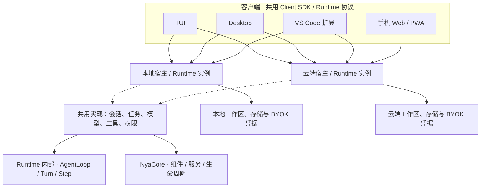
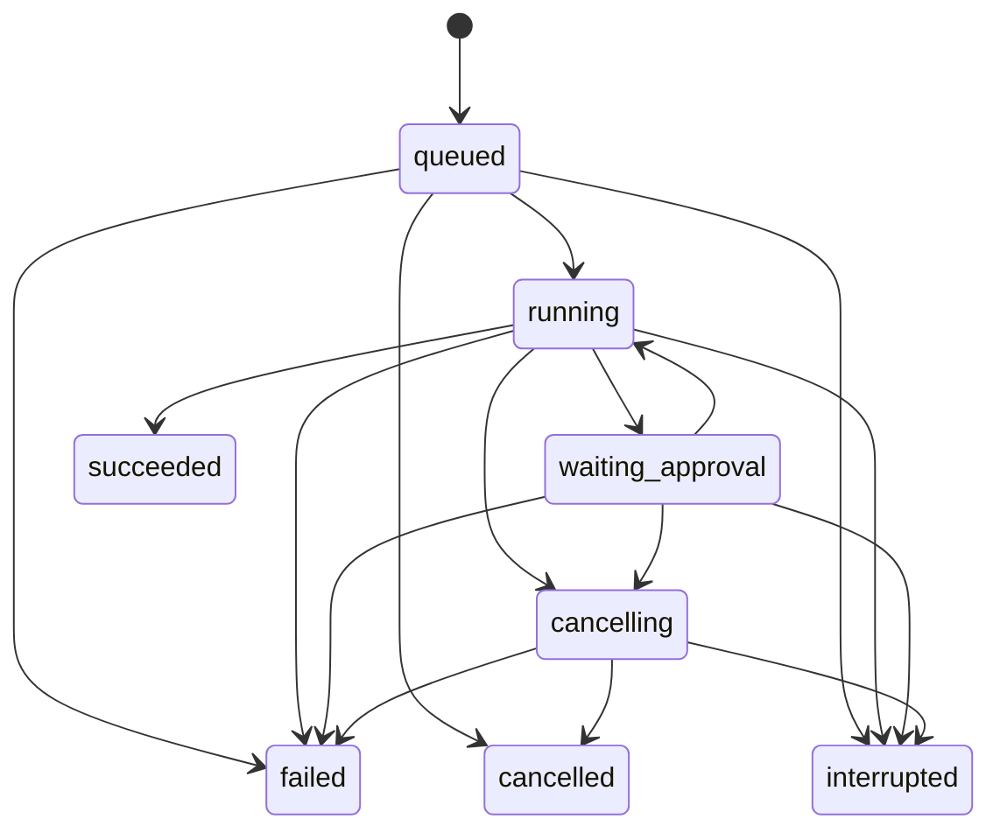

# Anybox Agent 产品架构

状态：目标设计。旧 harness 已删除，当前仅保留通用 Nya 应用基础，Runtime 从零制作。日期：2026-09-06。

本文确定组件职责和开发边界。[协议草案](runtime-protocol.md)定义客户端与 Runtime 的交互；[Client SDK 设计](client-sdk.md)定义共享客户端能力；[开发计划](development-plan.md)定义产品实施顺序；[Runtime v1 制作计划](runtime-implementation-plan.md)把内核职责细化为 48 类组件及具体任务、依赖、事务和验收条件。

## 1. 产品目标与基本决策

产品由**客户端、Agent Runtime、运行宿主**组成。NyaCore 为 Runtime 提供组件、服务和资源生命周期；Anybox 在其上实现 Agent 产品能力。

| 已确认目标 | 架构安排 |
| --- | --- |
| TUI、Desktop 与 VS Code 扩展 | 三者均可连接本地或云端，共用 Client SDK 和 Runtime 协议；加上手机端共四类客户端 |
| 用户电脑上的本地 Runtime，支持 BYOK | 本地宿主运行 Agent，调用用户选择的模型服务 |
| 云服务器上的 Runtime，支持 BYOK | 服务端宿主运行同一套 Agent 核心，使用该用户配置的密钥 |
| 手机使用云端 Agent | 手机客户端连接云端 Runtime，支持会话、流式进度、审批和取消 |
| 框架开放 | 客户端协议、Runtime 嵌入 API、模型/工具/存储等扩展接口分别开放 |

本设计建议首版手机端采用响应式 Web/PWA，首版云端支持单用户自部署；这是便于落地的默认方案。原生手机应用和托管多用户服务可以沿用边界继续开发，不作为已确认的 UI 技术选型。

**本地与云端共用代码，但分别拥有任务、文件和凭据。** 选择 Runtime 就是选择任务的执行位置。连接同一个 Runtime 的多个客户端可以继续同一个会话；跨 Runtime 迁移、文件同步和本地设备桥接是另外的功能。

## 2. 总体结构



手机端经 SDK 连接云端。虚线表示代码复用；两个 Runtime 分别拥有进程、数据库和 Context。

| 层次 | 负责 | 主要边界 |
| --- | --- | --- |
| 客户端 | 输入、会话列表、内容展示、模型选择、审批、连接状态 | 通过 SDK 操作，不直接执行 Agent 或读取 Runtime 数据库 |
| Client SDK / 协议 | 请求、身份凭证传输、事件订阅、重连、错误映射 | 使用可序列化的数据，与 Nya 和 UI 框架解耦 |
| Runtime | 会话、任务调度、执行、工具权限、持久化、能力发现 | 与 TUI/Desktop/VS Code/手机界面无关 |
| 宿主 | 装配、配置来源、监听地址、身份认证接入、进程管理、退出期限 | 决定 Runtime 在哪里运行和使用哪些适配器 |
| NyaCore | Component、Service、Fiber、Effect 以及配套设施 | Agent 的业务语义由 Anybox 实现 |

## 3. NyaCore 六个包如何使用

| 包 | 在本产品中的位置 | 使用边界 |
| --- | --- | --- |
| `@nya/core` | Runtime 的公共组件运行基础 | 所有框架能力从公共入口导入，基础设施和业务使用同一应用 Context |
| `@nya/loader` | 装配受管组件、协调依赖和启停 | 管理组件实例；对外仅暴露经过授权的产品操作 |
| `@nya/include` | 宿主的 JSON 组件配置来源 | 管理部署配置，不存会话、消息、运行事件或密钥明文 |
| `@nya/hmr` | 显式开发模式 | 组件开发热替换；生产升级由宿主发布与重启处理 |
| `@nya/timer` | Runtime 的超时、期限检查、维护调度 | 取消未来调度后，还要显式等待已开始的异步任务 |
| `@nya/logger-console` | 本地和服务端宿主的可选日志输出 | 消费结构化日志；宿主单独采集日志，避免输出到 TUI 绘制区域 |

当前 `@anybox/application` 已装配六个包。目标 Runtime 保留这种框架集成，但允许宿主选择配置来源和可选设施；内嵌使用不必提供一个磁盘 JSON 文件。

组件、会话和包是三个不同概念：**组件按服务与生命周期划分，包按依赖和发布边界划分，会话等业务对象按数据模型保存。** 不需要把每个服务立即拆成一个 npm 包，也不需要为每条历史会话保留一个 Fiber。

## 4. Runtime 的九类职责域

下表保留产品层的职责域概览，名称不代表目前已经存在的导出，也不限定为九个实现组件。具体制作采用 [48 类组件划分](runtime-implementation-plan.md#5-48-类组件制作清单)：Agent 接口与驱动、收件箱、提示词、模型、工具和单次执行分别拆开；Gateway 位于内核之外。组件开始时可以放在同一个 `packages/runtime` 中。

| 职责域（概览名称） | 提供的服务与职责 | 注入的依赖 / 资源归属 |
| --- | --- | --- |
| `StorageComponent` | 事务、会话、消息、Run、事件、幂等记录、审批元数据 | 注入存储适配器；拥有自己创建的连接及迁移锁 |
| `CredentialsComponent` | 密钥写入/轮换/删除、返回元数据、按身份和用途解析引用 | 注入 SecretBackend；只向获准的执行路径提供所需密钥 |
| `WorkspaceComponent` | 工作区标识、文件操作、执行环境、产物存取 | 注入文件/执行环境适配器；拥有句柄、受管子进程和临时资源 |
| `ModelsComponent` | 模型与提供商注册、能力发现、模型适配器获取 | 依赖 Credentials；拥有模型客户端，按版本给 Run 提供使用句柄 |
| `ToolsComponent` | 工具注册、参数校验、工具调用与结果规范化 | 依赖 Workspace、Credentials；登记执行中的调用与取消/等待机制 |
| `PolicyComponent` | 用户权限、工具授权、审批规则、运行限制 | 使用受信身份和工作区上下文；审批结果由存储保留 |
| `SessionsComponent` | Agent Profile、会话、消息读取、版本控制 | 依赖 Storage；是持久数据服务，不启动 Agent 循环 |
| `RunsComponent` | 接受请求、排队、启动/取消、审批推进、事件落盘、运行恢复检查 | 细分为 RunCoordinator、RunScheduler 等；RunScope 位于 AgentInstance 所拥有的资源子树内 |
| `GatewayComponent` | Runtime API 的网络映射、身份认证、订阅、限流和输入校验 | 调用当前服务；拥有监听 socket 和客户端订阅，不拥有 Run |

职责再作三点约定：

1. `SessionsComponent` 负责会话读写规则；开始 Run 时，用户消息、Run、会话版本、首个事件和幂等记录通过 Storage 的**同一事务**写入。
2. 运行职责域中的 `RunCoordinator` 是 Run 状态的唯一协调者。AgentLoop 和工具报告执行结果，Gateway 转交命令；Turn、Step 和 Inbox 各自拥有内部状态修改权，通过同一日志/事务设施提交。
3. 模型注册表的具体条目、Agent Profile、工具描述和消息结构可以是普通数据。提示词构造、消息归并、工具 schema 转换等逻辑优先写成纯函数。

### 4.1 Runtime 内的执行与调度分工

AgentLoop、Turn、Step 负责一个 Run 内部的执行：构造上下文 → 调用模型 → 接收输出 → 请求执行工具 → 追加工具结果 → 再调用模型 → 结束。它们接受运行限制、取消信号，以及模型、工具、检查点/事件接口。

执行算法与 Nya 生命周期包装共同在 `packages/runtime` 内从零实现；纯状态规则可以放入 domain 模块。提示词、上下文和工具管线经独立服务接入，不另建旧 harness 的兼容层。

RunCoordinator 和 RunScheduler 协调接受、排队、认领与终态；RunScope 管理本次执行资源。其他独立组件负责工作区、凭据、记录、授权和订阅，关闭时按所有权等待执行结束。模型 SDK 的格式转换放在模型适配器中，UI 的消息渲染放在客户端。

首版支持一次运行中的多步模型与工具循环；多 Agent 协作、工作流编排和长期定时自动化是后续能力。不要提前把一个 Run 的循环做成分布式调度系统。

### 4.2 一次工具调用的路径

```text
Step 中的模型请求产生工具请求
  → Tools 校验注册项和参数
  → Policy 检查身份、工作区、权限及审批
  → 如需审批：Runs 保存审批并进入 waiting_approval，客户端展示
  → 获准后：Workspace 中的执行器执行，登记取消和完成句柄
  → 先保存调用结果与事件，再交回 Step
  → AgentLoop 推进下一 Step，由 ContextAssembler 组装后续模型上下文
```

审批绑定 `runId + toolCallId + 参数摘要 + 工作区 + 期限`。修改参数后需要重新决策；已有副作用不能通过“取消”撤销。拒绝审批可作为工具被拒绝的结果交回模型，审批超时则按运行策略结束任务。

## 5. 代码与包结构

以下是目标目录，按开发阶段创建，避免先生成大量空包。

```text
apps/
  runtime-local/                 本地后台进程入口、发现、启动和关闭
  runtime-server/                服务端入口、部署配置、认证接入
  tui/                           终端交互客户端
  desktop/                       桌面原生宿主与界面
  vscode/                        VS Code 产品扩展与独立 VSIX 交付
    src/extension/               扩展宿主入口、SDK 连接、编辑器 API
    src/webview/                 会话与审批界面
    src/bridge/                  扩展内部的消息类型、校验与操作白名单
  mobile-web/                    手机响应式 Web/PWA（首版建议）

packages/
  protocol/                      JSON 类型、运行时校验、版本和事件契约
  client/                        SDK、HTTP 传输、事件归并与重连
  runtime/
    src/spi/                     适配器契约和服务接口
    src/components/              长期组件与每次运行的 Run 组件
    src/domain/                  数据规则、状态机和事务用例
  adapters/
    src/models/                  模型服务适配
    src/storage/                 持久化实现
    src/credentials/             本地与服务端密钥后端
    src/workspaces/              本地文件、云工作区、执行器
    src/tools/                   文件、命令、外部工具协议等实现
  gateway/                       HTTP 路由、事件流、认证接入接口
  application/                   现有通用 Nya 装配；后续接入 Runtime 默认组合

deploy/runtime-server/           镜像和自部署样例，随服务端阶段增加
docs/                           设计、协议、实施与部署文档
examples/                       当前为无网络组件宿主；后续增加 Runtime 有限示例
```

依赖约束：

```text
客户端 UI → client → protocol
VS Code Webview → 扩展内部消息桥 → Extension Host 中的 client → protocol
宿主入口 → application → runtime + gateway + 选定 adapters + Nya 配套组件
gateway → runtime 的门面接口 + protocol
runtime → protocol + @nya/core（按需 Timer）
adapters → runtime/spi + 必要的第三方库
```

- `protocol` 不导入 Nya、Node、UI 框架；它只表达线上数据和校验规则。
- `client` 不导入 `runtime`、模型 SDK 或文件系统。浏览器与 Node 共用契约；原生桥接可作为可选 Transport。
- `runtime` 不导入具体 adapter。`@anybox/runtime/spi` 是独立公共子入口，只依赖接口定义，导入时不启动 Runtime。
- `application` 是组合根，允许依赖具体实现；不要让业务组件反向依赖它。
- 默认模型或存储适配器先按目录组织，需要独立版本或引入较重依赖时再拆包。Desktop、VS Code Webview 和手机 Web 界面出现明确复用后再提取 UI 共享包，编辑器 API 留在 VS Code 扩展中。
- 各端有独立构建配置；不要把根目录的 Node 类型配置直接当作浏览器包的配置。增加 `apps/*` 时同步更新 workspace 和构建依赖顺序。

## 6. 两种运行宿主

### 6.1 本地宿主

TUI、Desktop 或本地 VS Code 扩展通过本地宿主管理接口发现/启动一个当前用户的后台 Runtime，再用 SDK 连接。Runtime 的实例身份、数据目录和启动锁应明确；连接前进行身份与协议握手，不能仅凭某个端口存在就认定它是本产品。远程编辑器场景的启动位置见 6.4 节。

默认只监听回环地址，并使用当前用户可访问的启动凭证与来源校验。Desktop 的原生部分负责进程管理和系统能力；界面层不加载 Nya 或模型密钥后端。

关闭会话窗口、退出 TUI、VS Code 重载窗口/停用扩展、结束事件订阅，仅断开客户端。显式“停止本地 Runtime”由宿主协调取消/等待后退出，并显示对其他客户端在途任务的影响。实现阶段要验证后台进程确实独立于窗口寿命；现有 `examples/host.mjs` 的 EOF 关闭行为只用于示例，不能原样作为产品后台进程。

### 6.2 云端宿主

首版提供一个可独立启动和容器化部署的服务端程序，包含相同 Runtime 核心、HTTP Gateway、持久化存储和云工作区。用户可以自部署，然后从 TUI、Desktop、VS Code 扩展或手机连接它。

首个部署版本采用单实例写入，持久数据与容器生命周期分离，并具备 TLS 接入、身份认证、健康/就绪检查、数据迁移和备份恢复流程。具体数据库及服务框架在实现相应适配器时选定，不影响公共协议。

如果提供托管多用户服务，增加账号/工作区路由和隔离的 Runtime worker。身份、存储权限和工具执行都必须按工作区校验；能执行任意代码的工作区需要进程/容器等执行隔离。不能把 Nya 的 `Context.isolate()` 当作用户或系统安全隔离。

需要横向扩容时再实现持久队列、任务归属租约和防止旧 worker 继续写入的版本校验。未实现这些能力前，不部署多个调度器共同消费一份运行数据库。

### 6.3 能力由执行位置决定

| 使用方式 | 执行位置 | 默认可访问的工作区 |
| --- | --- | --- |
| TUI / Desktop / 本地 VS Code → 本地 Runtime | 用户电脑 | 用户明确授予的本地目录 |
| TUI / Desktop / VS Code → 云端 Runtime | 云服务器 | 云工作区和已上传的文件 |
| 手机 → 云端 Runtime | 云服务器 | 同一个云工作区 |

云 Runtime 访问用户电脑上的文件需要单独的设备桥接或上传功能。Runtime 返回 capabilities，客户端按能力展示文件、工具和审批入口，不从“本地/云端”标签推断所有功能。

### 6.4 VS Code 扩展与编辑器集成

VS Code 扩展是第四类产品客户端，连接上述职责域及细分组件组成的 Runtime。首版采用侧栏 Webview、命令和编辑器操作，运行链路为：

```text
侧栏 Webview / 原生命令
  → 扩展宿主中的受限消息桥与编辑器集成
  → 同一 Client SDK
  → 选定的独立 Runtime
```

Webview 与扩展通过消息传递交互。本设计把 SDK 网络连接放在扩展宿主中，Webview 只接收展示数据并提交受校验的操作；不把任意 URL、文件路径或 VS Code 命令作为可调用入口。[VS Code Webview API](https://code.visualstudio.com/api/extension-guides/webview)

VS Code 的扩展宿主可以位于用户电脑、远程机器或容器，`extensionKind` 会影响运行位置。首版按工作区扩展设计，声明 `extensionKind: ["workspace"]`，分别验收普通桌面、Remote SSH 和 Dev Containers；纯浏览器 `vscode.dev` 支持另设 browser 入口与验收，不视为自动兼容。[VS Code Extension Host](https://code.visualstudio.com/api/advanced-topics/extension-host)

| 编辑器场景 | 建议连接或启动的 Runtime | 工作区边界 |
| --- | --- | --- |
| 桌面 VS Code + 本地目录 | 用户电脑上的独立 Runtime | 映射到已授权的本地工作区 |
| Remote SSH | SSH 机器上与工作区同侧的 Runtime，或选定的云端服务 | 不把远程路径解释为用户电脑路径 |
| Dev Containers | 容器内与工作区同侧的 Runtime，或选定的云端服务 | 容器路径和宿主机路径分别映射 |
| 任意上述场景 → 云端服务 | 显式选择的云 Runtime | 编辑器内容通过快照/上传交付，除非已有可验证的共享工作区映射 |

界面所在电脑、扩展宿主环境和选定 Runtime 是三个位置。尤其远程扩展与 Webview 中的 `localhost` 可能指向不同环境，因此使用扩展消息桥转发请求，并展示已验证的 Runtime 身份、执行位置和工作区映射。[VS Code 远程扩展指南](https://code.visualstudio.com/api/advanced-topics/remote-extensions)

首版编辑器能力包括发送选区/当前文档上下文、打开文件定位、查看差异和由用户触发接受修改。多根工作区按 URI 映射到 `{runtimeId, workspaceId, resourceRef}`，相同路径字符串不能证明是同一文件。未保存内容按带版本/摘要的快照提交；应用修改前再次校验文档基线，冲突时保留用户当前内容。

这些编辑器操作通过 VS Code 的工作区与文档 API 实现，遵循工作区信任和用户授权；它们不是云 Agent 可任意执行本机命令的桥。发送给 Runtime 的是通用内容或产物引用，公共 SDK/协议不导入 `vscode` 类型。

扩展的激活与停用只管理客户端资源；Agent 循环运行在独立进程中。伴随 Runtime 使用已验证的启动器与 Node 环境，不能把扩展宿主的内置 Node 版本视为 Nya 兼容保证。窗口重载后补读状态；如果机器或容器本身停止，则按 Runtime 中断规则恢复，不承诺任务脱离执行环境继续运行。

扩展用 `ExtensionContext.secrets` 保存 Runtime 登录凭证，模型 Key 通过专用写入流程保存到选定 Runtime。Webview 状态、工作区 settings 和聊天缓存不保存这些密钥。VS Code 的 SecretStorage 提供加密存储且不跨机器同步，因此连接列表同步不代表认证信息已迁移。[VS Code SecretStorage](https://code.visualstudio.com/api/references/vscode-api#SecretStorage)

## 7. 数据模型与配置归属

| 对象 | 关键字段或关系 | 保存位置 |
| --- | --- | --- |
| Identity / Workspace | 受信主体、工作区归属与访问权限 | 身份适配器 / Runtime Store |
| AgentProfile | 提示词、模型选择、工具集合、限制、revision | Runtime Store；每次 Run 固定其快照 |
| Session | workspaceId、标题、profileId、version | Runtime Store |
| Message | sessionId、runId、角色、内容块、工具关联、完成状态 | Runtime Store |
| Run | 请求快照、状态、限制、时间、终止原因 | Runtime Store |
| RunEvent | runId、单调递增 seq、类型、数据 | 与运行状态共享事务边界的事件表 |
| ToolCall / Approval | 参数摘要、调用状态、审批决定、结果/不确定性 | Runtime Store |
| Artifact | 内容类型、大小、工作区归属、内容引用 | 元数据在 Store；正文由产物存储适配器保存 |
| CredentialRef | 提供商、用途、owner、revision、脱敏展示信息 | 元数据在 Store；密钥由 SecretBackend 保存 |

模型、工具和 Profile 的有效版本在开始 Run 时确定。密钥不进入快照，仅保留引用；轮换对后续调用生效，撤销后禁止新的解析并按策略取消受影响的运行。

配置分为四类：宿主/组件部署配置由 Include 或嵌入参数提供；Profile、会话和 Run 由 Store 管理；密钥由 SecretBackend 管理；主题、快捷键和 Runtime 连接列表由客户端管理。普通会话 API 不开放任意文件路径、Loader 模块名或整份 Include 文档修改。

VS Code 的编辑器 URI 映射和视图状态属于客户端配置。选区、未保存缓冲区只有经用户触发提交后，才作为有来源说明的内容快照进入对应 Runtime 的会话；它们不自动成为 Runtime 可读取的文件路径。

## 8. Run、断线与关闭

一次 Run 是一次用户提交触发的执行。首版每个 Session 最多存在一个非终态 Run；再次提交返回 `SESSION_BUSY`，不同 Session 可以在全局并发上限内执行。



`queued` 已接受并落盘；`running` 执行中；`waiting_approval` 等待用户；`cancelling` 已接受取消但尚未结束；其余四种是终态。审批等待继续占用该 Session 的运行位置，全局槽位策略可以独立调整。

关键行为：

- `runs.start` 在持久化接受记录后立即返回 `runId`。业务执行和 HTTP 连接分离。
- 事件带顺序号，先落盘后推送；Nya 事件总线只负责进程内通知，不能替代可补读的事件记录。
- 客户端断线不会触发 Run 的 AbortController。用户显式取消通过 `runs.cancel` 传达；取消订阅只清理订阅资源。
- 取消与完成通过条件更新竞争。完成先提交则返回已有终态；取消先提交则执行器停止后记录取消结果，不再提交成功。
- 模型流、工具子进程和异步回调都必须有取消及等待路径。确认执行已结束后才记录 `cancelled`；副作用可能已经发生，需要保留结果。
- 首版进程崩溃后将上个实例遗留的非终态 Run 标记 `interrupted`，保留已提交输出和工具记录，不自动重放任务。工具执行结果不确定时明确标记，后续按需设计检查点恢复。

Runtime 正常关闭顺序：停止接收新任务 → 保留查询/订阅用于报告关闭 → 按宿主策略取消或等待 Run → 写入最终状态并结束执行资源 → 关闭订阅、Gateway、模型/工作区资源 → 关闭存储。产品默认采用取消并等待；需要发布排空时由宿主显式选择并设置期限。

这些先后关系必须通过组件依赖、资源归属和测试落实，不能只依赖安装代码的排列。库内不调用 `process.exit()`；超过期限的进程终止由宿主处理，下一次启动按中断恢复规则记录实际情况。

### 8.1 Nya 生命周期实现约束

- 每个 Runtime 实例有一个应用 Root；长期组件安装在该树内，AgentInstance 拥有局部资源子树，活动 RunScope 及 Turn/Step 是该树内实际的子 Component/Fiber。RunCoordinator 的状态控制权与 Fiber 资源所有权分开。`extend()` / `isolate()` 只改变 Context 视图，不能作为新的清理所有者。
- Run 组件在 `apply()` 中完成初始化、登记 Effect 并返回。协调器确认其 ACTIVE 后启动执行；初始化 Promise 和任务完成 Promise 分离。
- 清理中中止并等待执行循环，不能等待一个反过来依赖当前 Fiber 清理完成的 Promise。公开的终态完成通知由协调器在清理与持久化后发出。
- 外部请求每次获取当前服务；Run 内只持有归属于该次运行的句柄。不要跨组件重启缓存旧 Context 服务。
- 稳定模型/工具注册表内部的条目删除不会自动触发 Nya 依赖重启。注销必须停止新获取、取消并等待受影响任务，再销毁实现。第一版无需保证热更过程中的任务无中断。
- `await fiber` 和 `awaitIdle()` 表示生命周期协调完成，仍须检查就绪状态；它们不代表 Run 完成。
- 模型或工具业务失败归属于该 Run；关键基础设施失败会影响 Runtime 就绪状态。不能把每个 Run 的业务错误都升级为整个进程退出。
- Effect 清理失败应完整报告。框架没有替任意异步代码强制超时，宿主退出期限与库内清理承诺分开。

## 9. BYOK 与授权

BYOK 表示用户选择模型服务并提供自己的密钥，它与 Runtime 所在位置是两个独立选择。本地 Runtime 使用模型 API 时仍可能访问网络。

| 项目 | 本地 Runtime | 云端 Runtime |
| --- | --- | --- |
| 模型密钥 | 当前用户的本地凭据后端 | 当前用户/工作区的服务端凭据后端 |
| 模型请求 | 用户电脑发起 | 云 Runtime 发起 |
| 存储保护 | 系统凭据存储适配器；开发可注入环境变量 | 加密凭据后端，解密密钥独立于业务数据保存 |
| 客户端获得的信息 | 提供商、凭据 ID、是否可用、脱敏标签 | 同样仅返回元数据 |

用户连接云 Runtime 时，云执行器需要能够解析其模型凭据并调用提供商。UI 应明确当前连接的 Runtime 和凭据归属。设置密钥走专用受保护的写入操作，正常读取 API、会话事件、错误和日志均不返回密钥明文。

Runtime 登录凭证与模型 API Key 分开。Gateway 从登录凭证建立受信主体，并在所有读写、事件订阅、产物下载和审批操作中校验工作区权限；请求体传入的 owner/userId 不能建立身份。

工具权限在 Runtime 强制执行，审批界面只提交决定。操作审计保存关联 ID 和脱敏结果；模型输入输出等正文不默认进入框架诊断日志。

## 10. 开放扩展与可观测性

“VS Code 扩展”指编辑器中的产品客户端；“Runtime/Nya 插件”指安装进执行端的组件扩展。两者有独立的交付和权限边界。

开放三个独立入口：

1. **客户端入口**：版本化 HTTP/事件协议及无 Nya 依赖的 SDK，第三方可以实现其他终端、Web 或原生客户端。
2. **嵌入入口**：拟定的 `createRuntime(...)` 接受接口实现和配置，宿主选择默认装配或自行安装 Nya 组件。现有 `createApplication` 只提供通用装配和生命周期；Runtime 的业务 API 独立定义。
3. **扩展入口**：Model、Tool、Storage、Credentials、Workspace、Policy/Identity 等 SPI；扩展声明 ID、版本、配置 schema 和能力。框架运行生命周期由 Nya Component 包装。

进程内 Nya 插件按受信代码处理。开放安装接口不能承诺隔离恶意 JavaScript；非受信工具需要单独的进程/容器执行通道。扩展权限声明用于授权和可见性，不能代替实际隔离。插件不捆绑另一份 Nya Core，使用兼容的 peer 依赖，避免运行时身份分裂。

统一关联 `runtimeId / workspaceId / sessionId / runId / toolCallId`。运行事件用于用户历史与重连，框架日志用于诊断，指标用于运行数量、排队时间、模型耗时、错误和实际可取得的用量；三者用途分开。生产可接入其他日志输出，框架的内存日志缓冲和控制台输出不能替代持久审计存储。

## 11. 当前实现与目标的差距

| 能力 | 当前状态 |
| --- | --- |
| 六个 Nya 包装配、JSON 配置、开发 HMR | 已实现于 `packages/application` |
| 通用组件启动、失败清理、幂等关闭 | 已实现于 `packages/application` |
| 空配置启动/关闭示例、终端宿主示例 | 已实现；终端宿主不是完整 TUI 或后台服务 |
| Agent 实例、模型调用、运行取消与执行循环 | 待从零实现 |
| 真实模型流、工具循环、会话/Run 持久化 | 待开发 |
| 统一协议、SDK、本地后台进程、云端服务 | 待开发 |
| BYOK 凭据服务、权限、工作区隔离 | 待开发 |
| TUI、Desktop、VS Code 扩展、手机客户端 | 待开发 |

下一步从 Runtime 契约、Storage 与 SessionLog 开始制作，再完成“一份 SDK 连接本地与独立服务端 Runtime，运行可补读、可取消的模拟任务”的产品闭环，具体见[开发计划](development-plan.md)。

设计依据：当前 [application](../packages/application/src/index.ts)、[应用接口](../packages/application/src/types.ts)，以及相邻框架的 [兼容承诺](../../NyaCore/docs/compatibility.md)和 [Core 说明](../../NyaCore/packages/core/README.md)。
