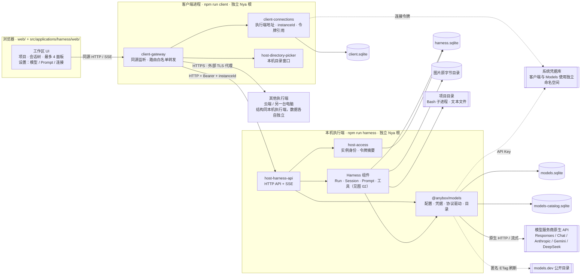
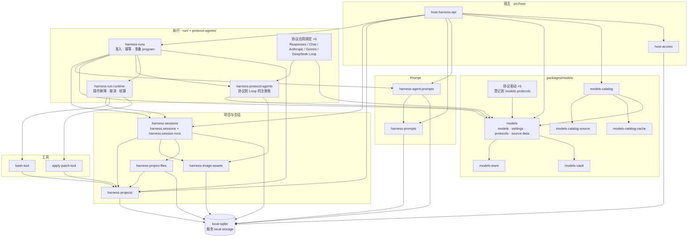
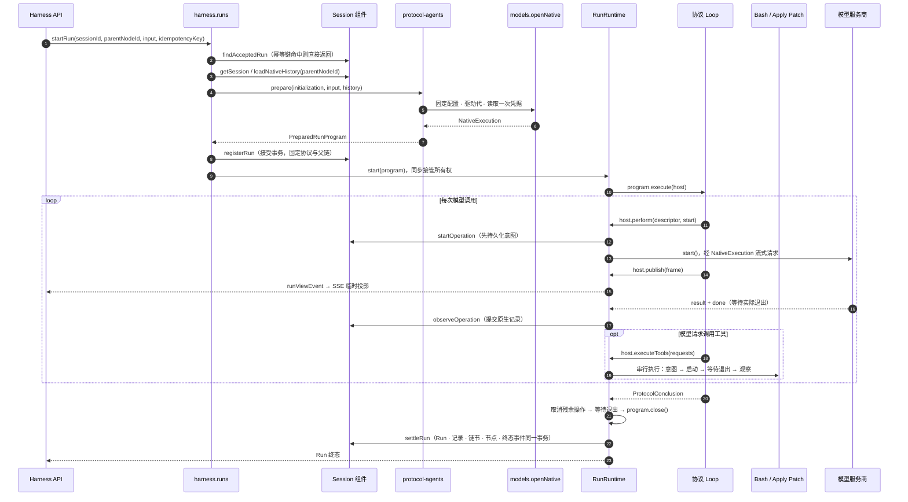

# AnyboxV2 多实例架构图

> 本页为历史架构快照；文中链接指向当前入口，图源节点和已导出的 SVG/PNG 保留绘制时的命名及结构。当前三层命名以 [命名规范](../naming.md) 为准。

> 当前装配已统一为 Responses、Chat Completions、Anthropic Messages 和 Gemini Interactions 四种协议。DeepSeek 使用标准 Chat，不保留旧驱动或协议别名；旧协议历史仅供查看，不能续接执行。下文及图中的独立 DeepSeek 驱动和五种绑定仅反映绘制当时结构。

> 此图记录 2026-09-29 的部署结构。通用应用注册、多标签、host.http 与 harness.http 的当前边界以[应用宿主设计](../products-v1.md)和[组件清单](../modules/README.md)为准。

[返回文档首页](../README.md) · [Anybox Harness 模块边界](../harness-module-boundary.md) · [组件清单](../modules/README.md)

核对日期：2026-09-29，对应提交 `fd53c6a` 的源码装配。三张图分别说明进程与外部资源、执行根内的组件注入关系，以及一次 Run 的执行时序。每个进程只有一个 Nya 根 Context；图中的子图只按职责分组，不表示子 Context、npm 包或独立服务。

同日较早的[单进程框架图](./anybox-current-framework-2026-09-29.md)记录多实例拆分前的装配，保留其历史语义。

## 01 · 进程与外部资源

一个客户端可以同时连接多个执行端。执行端之间不共享项目、Models、业务库或图片；客户端只保存连接记录，不安装执行服务。

- 网关每个请求固定连接版本、地址、凭据和期望 instanceId，不跨实例重试。关闭客户端只断开观察，不取消远端 Run。
- 业务库、Models 配置库和目录缓存库各有独占连接；API Key 和连接令牌只存系统凭据库。

## 02 · 执行根组件与注入关系

箭头 `A → B` 表示 A 通过 `inject` 依赖 B 所在组件提供的服务，图中画出执行根的全部注入关系。执行根共 30 个运行期组件：Models 11 个（含宿主的 DeepSeek 驱动扩展），Anybox Harness 16 个（协议绑定按已安装驱动各装一个），另有 `local-sqlite`、`host-access` 和 `host-harness-api`。客户端根另有 `local-sqlite`、`client-connections`、`host-directory-picker` 和 `client-gateway`。

- 协议语义只出现在 Models 驱动和对应 Loop 中；RunRuntime 与 Session 不解释 `stop_reason` 或原生结构。
- Models 的 `NativeExecution` 和 `PreparedRunProgram` 是运行对象，不是 Nya 组件，所以不出现在图中。

## 03 · 一次 Run 的执行时序

- 所有权交接点是 `RT.start()`：在它之前 program 由 Run 准入清理，之后由 RunRuntime 清理。
- SSE 投影只用于展示；最终内容以 `settleRun` 提交的持久记录为准。失败、取消和 interrupted 的 Run 不生成可继续的节点。

## 源码依据

- 进程装配：[执行端入口](../../src/entrypoints/harness-server-main.ts)、[客户端入口](../../src/entrypoints/client-main.ts)、[Models 装配](../../src/applications/harness/server-models.ts)、[harness server 组合根](../../src/applications/harness/core/index.ts)。
- 注入关系：各组件工厂的 `inject` 声明，入口见[组件清单](../modules/README.md)。
- 执行时序：[Run](../../src/applications/harness/core/run/component.ts)、[RunRuntime](../../src/applications/harness/core/run/runtime-component.ts)、[程序契约](../../src/applications/harness/core/run/program.ts)、[Loop 公共运行器](../../src/applications/harness/core/protocol-agents/shared.ts)。

组件、注入依赖或进程边界变化时，同步核对本文三张图。
