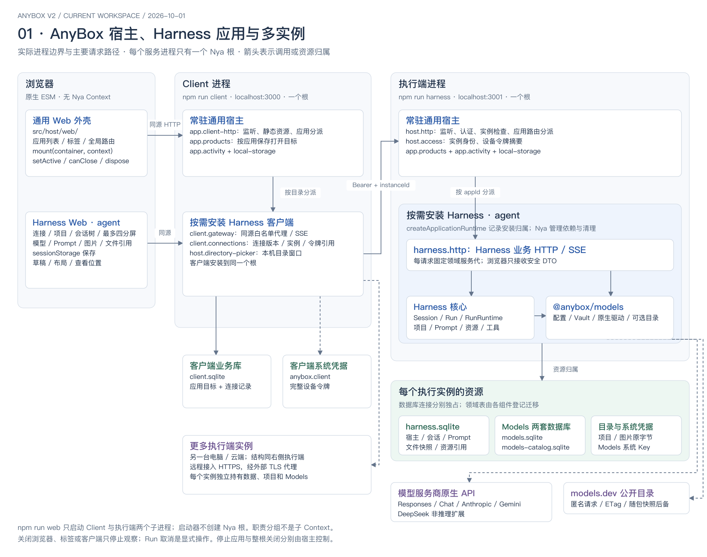
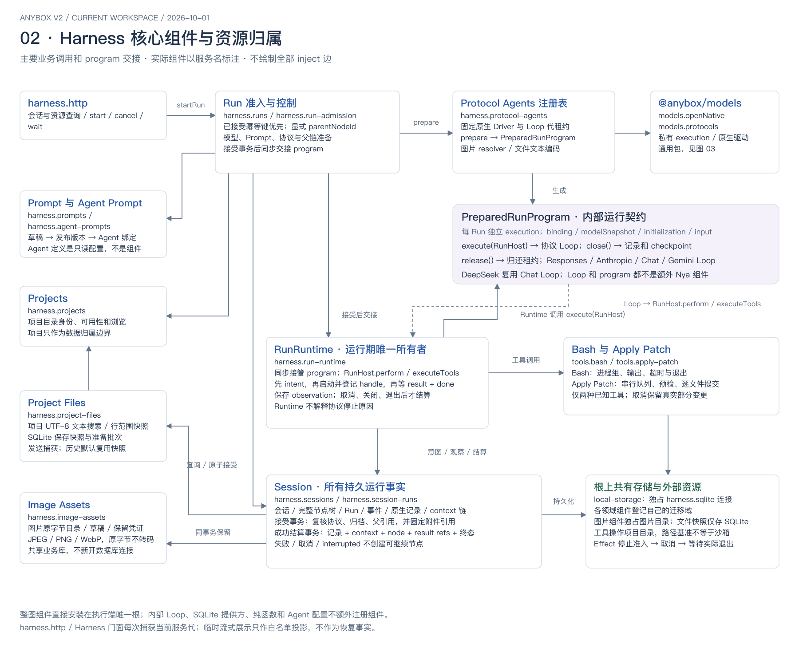
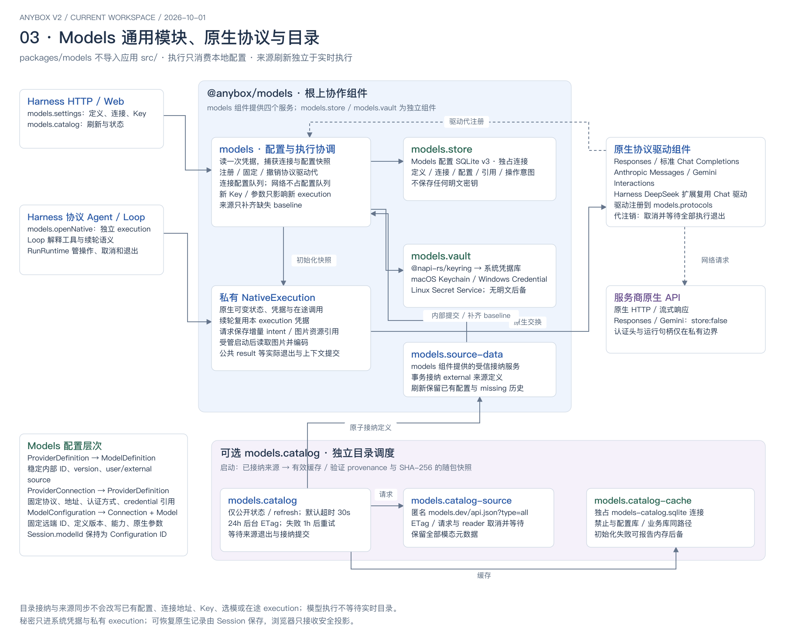
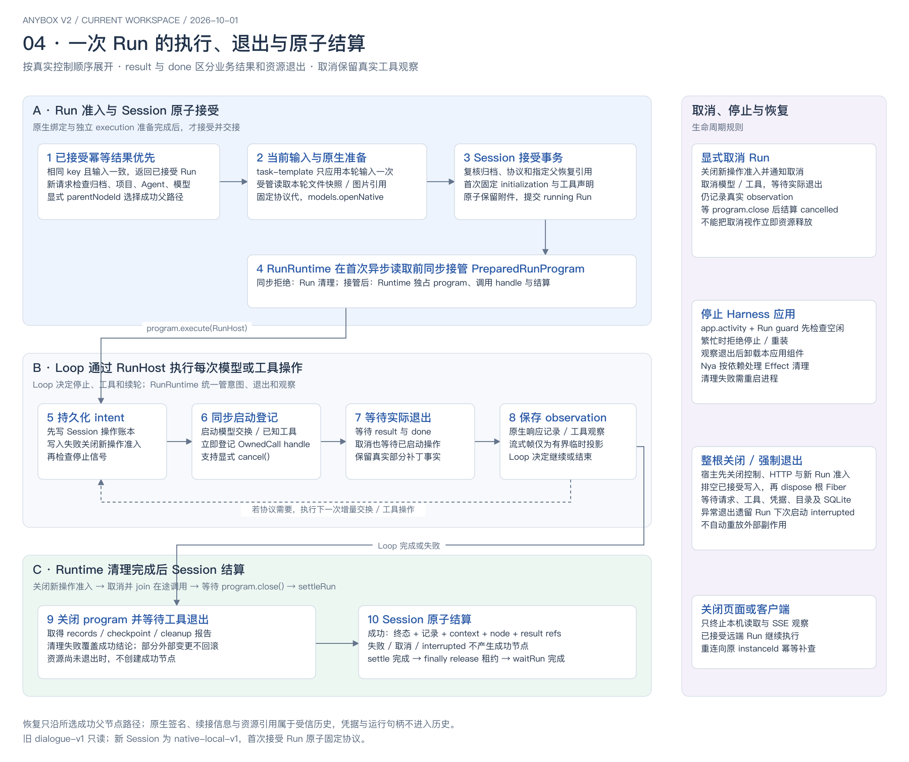

# AnyboxV2 当前架构图

> 本页为历史架构快照；文中链接指向当前入口，图源节点和已导出的 SVG/PNG 保留绘制时的命名及结构。当前三层命名以 [命名规范](../naming.md) 为准。

> 当前装配已统一为 Responses、Chat Completions、Anthropic Messages 和 Gemini Interactions 四种协议。DeepSeek 使用标准 Chat，不保留旧驱动或协议别名；旧协议历史仅供查看，不能续接执行。下文及图中的独立 DeepSeek 驱动和五种绑定仅反映绘制当时结构。

[文档首页](../README.md) · [组件手册](../modules/README.md) · [应用接入](../application-development.md) · [部署](../harness-server-deployment.md)

核对日期：2026-10-01。按当日工作区源码绘制，包含尚未提交的通用应用宿主调整；工作区的 HEAD 为 `2e53371`，图示并非仅描述该提交。正式应用目录目前只包含 Anybox Harness，稳定 ID 为 `agent`。

四张图依次展示进程与宿主边界、harness server 核心协作、Models 通用模块，以及一次 Run 的执行与退出。箭头表示主要调用、交接或资源归属，不是全量 `inject` 依赖图。分组框只表达职责；每个服务进程一个 Nya 根，组件全部安装在根上。

[可编辑 draw.io 源文件（四页）](anybox-architecture-2026-10-01.drawio)

## 01 · 宿主、应用与多实例

[矢量 SVG](anybox-architecture-2026-10-01-overview.svg) · [PNG](anybox-architecture-2026-10-01-overview.png)

`npm run web` 启动两个独立子进程：Client 和执行端。启动器本身不创建 Nya 根。浏览器外壳动态加载应用 Web 入口；客户端与执行端分别接收受信 `ApplicationRegistration[]`，通用宿主不导入具体应用。注册项、应用运行时安装归属和浏览器入口都是宿主契约，不是额外 Nya 组件。

| 边界 | 常驻能力 | 打开 Anybox Harness 后装配 |
| --- | --- | --- |
| 浏览器 | `src/host/web/`：应用列表、标签、全局路由、工作区 | `src/applications/harness/web/`：连接、项目、会话树、最多四分屏、Models、Prompt、附件 |
| Client 根 | `local-storage`、`app.products`、`app.activity`、`app.client-http` | `client.connections`、`host.directory-picker`、`client.gateway` |
| 每个执行端根 | `local-storage`、`host.access`、`app.products`、`app.activity`、`host.http` | Models 全套组件、harness server 核心、图片资源、`harness.http` |

浏览器请求先经过客户端通用监听器，再按应用目录分派到 Anybox Harness 网关。网关固定连接版本、地址、令牌和 `instanceId`，经白名单路由访问执行端。执行端通用监听器处理认证和应用分派，harness server 的业务 HTTP/SSE 属于 `harness.http`。通用业务路径为 `/api/client/v1/apps/:appId/...` 和 `/api/v1/apps/:appId/...`；旧 Anybox Harness 地址由注册项显式兼容。

客户端只保存连接元数据和自己的应用目标。每个执行实例独立持有业务库、Models 配置库、目录缓存库、图片目录、项目目录和系统凭据，不进行跨实例共享或同步。客户端关闭只中止观察，已接受远端 Run 继续执行。

## 02 · harness server 核心与资源归属

[矢量 SVG](anybox-architecture-2026-10-01-harness.svg) · [PNG](anybox-architecture-2026-10-01-harness.png)

| 真实组件 | 服务 / 职责 |
| --- | --- |
| `harness-prompts`、`harness-agent-prompts` | `harness.prompts`、`harness.agent-prompts`；草稿、发布版本、Agent 绑定 |
| `harness-projects` | `harness.projects`；项目目录身份、可用性和目录浏览 |
| `harness-project-files` | `harness.project-files`；文本搜索、内容快照、准备批次和保留凭证 |
| `harness-image-assets` | `harness.image-assets`；独占图片原字节目录、导入、读取、保留及回收 |
| `harness-sessions` | `harness.sessions`、`harness.session-runs`；全部会话、节点、Run、记录、事件和恢复事实 |
| `harness-protocol-agents` | `harness.protocol-agents`；原生驱动代与协议 Loop 配对、program 准备、图片 resolver |
| 五种 `harness-protocol-agent-<protocolId>` 绑定组件 | 各自固定驱动代租约；撤销时取消并等待该代 Run；不提供额外公开服务 |
| `harness-runs` | `harness.runs`、`harness.run-admission`；准入、幂等、准备、接受、取消与等待 |
| `harness-run-runtime` | `harness.run-runtime`；独占 program、在途 handle、操作账本、取消、退出与结算 |
| `bash-tool`、`apply-patch-tool` | `tools.bash`、`tools.apply-patch`；进程组和补丁队列各自归工具所有 |

`PreparedRunProgram` 是内部运行契约，协议 Loop 是普通异步函数，Agent 定义是启动时校验的只读配置。Session、Prompt 和 Agent Prompt 的 SQLite 实现属于各组件内部提供方，均不独立注册组件。

Session 统一查询和保存持久事实，Run 提供控制与临时展示，RunRuntime 统一管理操作与退出。Run 通过注册表准备独立 program；对应 Loop 直接消费原生结果、判断停止和续轮，通过 `RunHost` 请求模型或工具操作。DeepSeek 复用 Chat Loop，其他协议分别使用 Responses、Anthropic、Chat、Gemini Loop。

所有业务领域共享 `local-storage` 的独占 SQLite 连接，并在自己的组件 `apply` 中登记迁移。图片组件另有原字节目录；项目文件快照只使用既有业务库，不另开连接或文件目录。工具以项目目录为相对路径基准。根控制面和 harness server API 调用时取得当前服务代，组件通过 `deps` 使用本轮依赖快照。

## 03 · Models 通用模块

[矢量 SVG](anybox-architecture-2026-10-01-models.svg) · [PNG](anybox-architecture-2026-10-01-models.png)

`packages/models` 是独立通用 Nya 模块，不导入本项目 `src/`。其中 `models` 是一个组件，提供 `models`、`models.settings`、`models.protocols` 和受信 `models.source-data` 四个服务。执行根分别装配 `models.store`、`models.vault`、通用包的四种原生驱动、harness server 的 DeepSeek 扩展，以及目录 source、cache、scheduler；各组件按资源与替换边界协作。

模型配置分三层：统一 Provider/Model 定义，固定协议与账户的 `ProviderConnection`，可直接执行的 `ModelConfiguration`。`models.list/get/openNative` 消费执行配置，Session 的 `modelId` 为配置 ID。定义和配置保存在 Models 配置 SQLite；秘密只存系统凭据库。execution 私有捕获配置和凭据，一次初始化读取 Key，后续续轮复用该 execution 的凭据。

Models 的原生驱动负责传输与原生状态，harness server 的 Loop 负责 Agent 流程。Responses、标准 Chat Completions、Anthropic Messages 和 Gemini Interactions 位于通用包；DeepSeek 参数差异扩展位于 harness server，并复用 Chat 驱动。

可选 `models.catalog` 向 `models.catalog-source` 请求匿名 models.dev 目录，使用独立 `models.catalog-cache`，再通过 `models.source-data` 原子接纳统一定义并补齐缺失 baseline 配置。启动优先使用已接纳来源，再选择有效缓存或验证过的随包快照；普通构建和测试不下载目录。刷新不改已有执行配置，也不进入模型执行的实时必经路径。Models 配置库、目录缓存库与业务库不能共用路径或连接。

## 04 · Run 执行与结算

[矢量 SVG](anybox-architecture-2026-10-01-run-flow.svg) · [PNG](anybox-architecture-2026-10-01-run-flow.png)

Run 优先查已接受幂等键：相同 key 且输入一致时返回已接受 Run，输入不一致时拒绝。新请求随后解析当前配置、Prompt 和显式父节点。文件正文来自本轮快照，task-template 只处理本轮原始输入一次。注册表固定协议驱动代，打开独立 execution，生成 `PreparedRunProgram`。Session 接受事务复核归档、协议与父 context，并原子保留图片和文件引用。Runtime 在首次异步读取前同步接管 program；同步拒绝由 Run 清理，接管后由 Runtime 清理。

`perform()` 顺序是：持久化 intent → 检查停止 → 同步启动并登记 handle → 等待 result/done 实际退出 → 保存 observation。写入失败立即关闭新操作准入；取消仍保留真实工具观察和部分补丁事实。

结束时先关闭操作准入，取消并等待在途操作、工具和 program 退出，再由 Session 结算。只有成功且清理完成，才在同一事务提交 Run 终态、原生记录、context 链、完整节点、结果引用和终态事件；失败、取消或 interrupted 不创建可继续节点。协议代租约在资源退出与持久结算之后释放。流式展示只是有界白名单投影，不能作为恢复事实。

显式停止应用先检查活动和 Run guard，繁忙时拒绝；空闲后等待观察退出并卸载安装归属，依赖清理由 Nya 处理。整根关闭先关闭控制、HTTP 和业务准入，再排空并 dispose 根 Fiber。异常退出的遗留 Run 下次启动结算为 interrupted，不重放外部副作用。旧 `dialogue-v1` Session 只读，新 Session 使用 `native-local-v1` 并在首次 Run 原子固定协议。

## 源码与验证入口

| 图 | 主要依据 |
| --- | --- |
| 宿主与应用 | [启动器](../../src/entrypoints/serve.ts)、[执行宿主](../../src/host/execution.ts)、[客户端宿主](../../src/host/client.ts)、[注册契约](../../src/host/applications/registration.ts)、[Anybox Harness 注册](../../src/applications/harness/registration.ts)、[应用安装归属](../../src/host/applications/runtime.ts) |
| harness server 核心 | [应用装配](../../src/applications/harness/server-runtime.ts)、[核心组合与门面](../../src/applications/harness/core/index.ts)、[协议注册表](../../src/applications/harness/core/protocol-agents/registry.ts)、[Session](../../src/applications/harness/core/session/component.ts)、[业务存储](../../src/storage/sqlite.ts) |
| Models | [宿主装配](../../src/applications/harness/server-models.ts)、[通用组件](../../packages/models/src/component.ts)、[类型](../../packages/models/src/types.ts)、[私有 execution](../../packages/models/src/execution.ts)、[目录](../../packages/models/src/catalog.ts) |
| Run 流程 | [Run](../../src/applications/harness/core/run/component.ts)、[RunRuntime](../../src/applications/harness/core/run/runtime-component.ts)、[program 契约](../../src/applications/harness/core/run/program.ts)、[Session 接受与结算](../../src/applications/harness/core/session/sqlite-records.ts) |

行为验收入口为根 `npm run check`；重点测试为 `application-host.test.mjs`、`products-host.test.mjs`、`remote-harness-server.test.mjs`、`native-protocol-agents.test.mjs`、`conversation-tree.test.mjs`、`project-files.test.mjs`、`image-assets.test.mjs`，以及 `packages/models/tests/`。2026-10-01 当前工作区检查通过：709 项通过，13 项按门控跳过，0 项失败；跳过的真实系统凭据、真实部署或模型联网测试不表示已完成跨平台验收。

此前图示保留各自历史语义；当前宿主和应用边界以本图、源码及[组件手册](../modules/README.md)为准。
