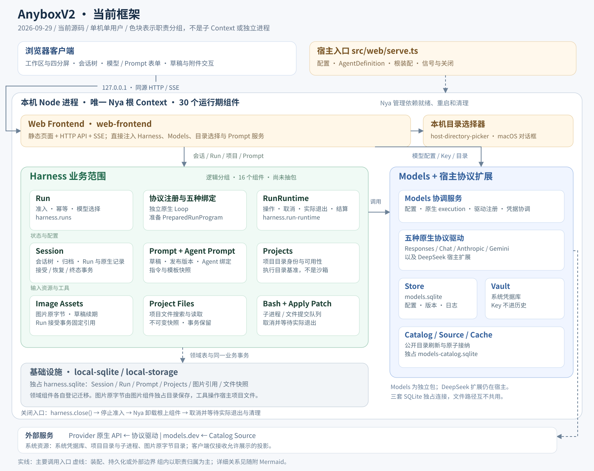

# AnyboxV2 当前框架图

> 多实例部署实现后，最新进程与接入边界见 [Harness 模块边界](../harness-module-boundary.md)与[多实例架构图](./anybox-architecture-2026-09-29-multi-instance.md)。此处保留当日原单进程组件图的历史记录。

[返回文档首页](../README.md) · [Harness 模块边界与目标目录结构](../harness-module-boundary.md)

核对日期：2026-09-29。图对应当前源码的实际装配，使用已初步认可的 Harness 归属进行逻辑分组。当前所有服务端组件仍在同一个 Nya 根中，尚未完成 Harness 抽包或远程连接；分组不表示新增 Context、服务进程或已经迁移的目录。

[SVG 矢量图](./anybox-current-framework-2026-09-29.svg) · [PNG 图片](./anybox-current-framework-2026-09-29.png) · [Mermaid 关系源码](./anybox-current-framework-2026-09-29.mmd)

## 阅读方式

- 概览图突出职责边界与主要调用入口，组内卡片不列出全部注入关系；Mermaid 源码补充主要调用、数据和资源关系。
- Harness 分组包含 16 个实际组件：Run、RunRuntime、协议注册与五种绑定、Session、Projects、Project Files、Image Assets、Prompt、Agent Prompt、Bash、Apply Patch。AgentDefinition 是宿主传入的只读配置，不单计组件。
- Models 分组包含 11 个组件：协调服务、Store、Vault、四种通用驱动、DeepSeek 宿主驱动扩展，以及 Catalog、Source、Cache。DeepSeek 扩展源码当前位于宿主，不据此归入 Models 包。
- Web、目录选择器与通用业务 SQLite 各为一个组件，合计 30 个运行期组件。H0 探针只用于验证，不画入正式运行路径。
- 三套 SQLite 分别归业务存储、Models Store 和 Catalog Cache 独占。图片原字节另由图片组件保管；文件快照正文在业务库。Models Key 只存系统凭据库。
- Models execution 和 PreparedRunProgram 都是运行对象，不是额外的 Nya 组件。Loop 解释原生响应；RunRuntime 通过受管操作执行模型或工具调用，等待实际退出后由 Session 提交持久事实。

## 一次 Run 的执行顺序

1. Web 接收请求，Run 优先查询已接受幂等结果，再校验 Session、项目、模型和 Prompt。
2. 协议应用绑定使用 Models 固定驱动代和 execution，生成 PreparedRunProgram；Session 在接受事务复核历史并保留附件引用。
3. Run 将 program 交给 RunRuntime。Runtime 执行 program；对应 Loop 通过 RunHost 操作契约执行 Models 或 Bash／Apply Patch 调用。
4. 每项操作先保存意图，再受管启动、等待 result/done 实际退出，最后保存真实观察。
5. 工具和 program 清理完成后，Session 原子提交终态、原生记录、恢复链与成功节点。Web 经 HTTP／SSE 交付公开状态和安全投影。

## 源码依据与维护

- [当前进程入口](../../src/entrypoints/serve.ts)与 [Harness 装配](../../src/applications/harness/core/index.ts)：根、组件安装与关闭入口。
- [Web 组件](../../src/host/component.ts)：API、静态客户端、SSE 和直接注入的服务。
- [Models 装配](../../src/applications/harness/models-startup.ts)：独立包、目录组件与 DeepSeek 宿主扩展。
- [Run](../../src/applications/harness/core/run/component.ts)、[RunRuntime](../../src/applications/harness/core/run/runtime-component.ts)与[协议应用绑定](../../src/applications/harness/core/protocol-agents/registry.ts)：准入、program 交接、运行与协议边界。
- [组件清单](../modules/README.md)与[协作总览](../harness-components.md)：资源、存储和清理规则。

本图是当前实现的记录；目标目录见独立的边界文档。组件或关键关系改变时，同步核对 SVG、PNG、Mermaid 和本文，不能仅修改图中标签。较早架构图保留各自历史语义，不覆盖其文件。
