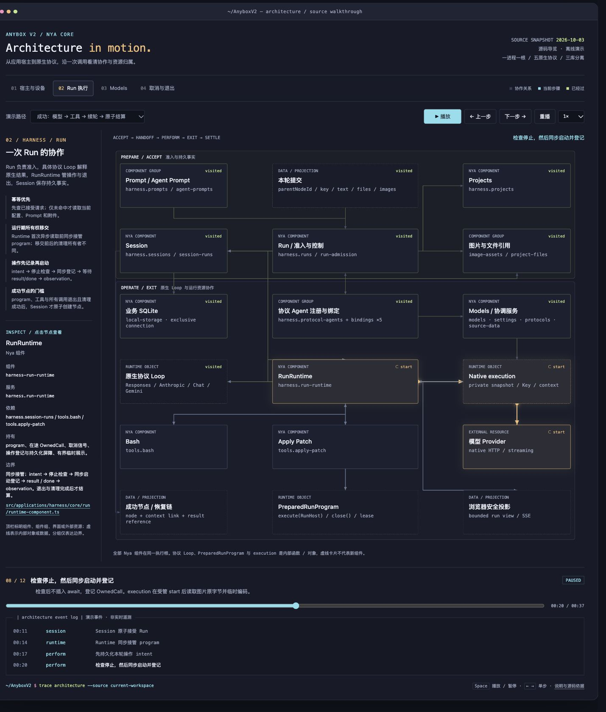

# Anybox 动态架构图

[打开交互架构图](./anybox-dynamic-architecture.html) · [文档入口](../README.md) · [组件手册](../modules/README.md)

这份架构图依据 **2026-10-03 当前工作区源码**绘制，参考终端窗口、等宽文字、彩色节点和流动连线的演示风格。它使用自包含 HTML、CSS、SVG 和 JavaScript，不需要安装依赖或启动服务，直接用浏览器打开同目录的 `anybox-dynamic-architecture.html` 即可离线查看。

图中的事件是按照源码执行语义编排的**演示时间线**，不连接正在运行的客户端、执行设备、模型服务或真实日志。时间、进度和状态用于说明协作过程，不能作为当前服务状态或测试结果的证据。

上图为绘制时的静态预览，保留命名统一前的截图。当前 Anybox、Anybox Harness 与 harness server 的名称及源码位置以交互 HTML 和[命名规范](../naming.md)为准；播放与交互请打开 HTML。

## 四个视图

| 视图 | 展示内容 |
| --- | --- |
| 宿主 | 浏览器界面、客户端进程根、执行设备进程根及其 HTTP 边界；应用按需安装、固定连接版本与实例身份、业务请求与 SSE 返回 |
| Run | 显式父节点与幂等键、Run 准备及接受事务、PreparedRunProgram 交接、协议 Loop、RunRuntime、模型与工具操作、Session 成功结算 |
| Models | 两条独立序列：原生 execution 使用已保存配置与私有凭据；目录刷新经来源、缓存和接纳端口补齐定义及基础配置 |
| 取消退出 | 四种场景：补丁取消保留已经提交的事实；关闭观察仅释放展示资源；整根关闭先停止准入，再取消并等待所属资源实际退出；运行中停止应用被 guard 拒绝 |

使用播放、暂停、重播、单步和速度控制查看事件推进，也可以点击时间线跳转到指定阶段。点击节点可查看职责、服务或内部对象身份，以及对应源码位置。

## 如何读图

图中的边表达调用、数据交接和资源退出顺序，是场景示意，**不是完整的 Nya `inject` 依赖图**。卡片中的分组、协议 Loop、PreparedRunProgram、原生 execution、存储提供方和浏览器控制器不会因此成为独立组件；实际组件与服务以组件手册和源码为准。

每个执行进程只有一个应用 Nya 根。客户端和执行设备属于不同进程，各有一个根；浏览器没有 Nya Context。Anybox Harness 能力直接安装在所属进程的根上，应用目录与安装辅助函数不建立额外 Context，项目和会话也不创建 Context。

客户端固定本次请求的连接版本和 `instanceId`，网关核对它们并生成认证头。执行设备核对实例身份和应用归属，再由 harness server HTTP 同步捕获本次业务服务代。请求不会因配置变化而改向另一设备，也不会跨实例重试。

Models 的原生执行从本地配置和凭据开始，**目录刷新不是 execution 的必经链路**。刷新只更新来源拥有的定义并补齐缺失基础配置，不改变已经保存的执行语义或在途 execution。Models 视图分别播放这两条序列，避免把实时目录网络请求画成模型调用的前置依赖。

取消表示停止后续操作并向资源所有者发出取消请求，结算仍须等待 `result` 与 `done` 所表达的实际退出。Apply Patch 已完成的文件提交不回滚，观察结果保留真实 `changes` 和 `pending`。关闭浏览器界面或 SSE 观察不取消远端 Run；整根关闭会通过各资源所有者取消并等待执行、工具、数据库和凭据操作。清理失败不能创建成功节点。

## 源码依据

- [客户端宿主](../../src/host/client.ts)：独立客户端根、常驻控制与 HTTP，以及整根关闭顺序。
- [执行宿主](../../src/host/execution.ts)：独立执行根、认证、应用目录装配和清理等待。
- [客户端网关](../../src/applications/harness/client/gateway.ts)：固定连接代、实例核对、业务白名单代理及流退出。
- [RunRuntime](../../src/applications/harness/core/run/runtime-component.ts)：program 资源接管、操作账本、取消、真实观察及终态等待。
- [Session 组件](../../src/applications/harness/core/session/component.ts)：接受与结算事务、原生记录、资源保留和成功节点。
- [Models execution](../../packages/models/src/execution.ts)：私有原生运行状态、受管操作与实际退出语义。
- [Models 目录服务](../../packages/models/src/catalog.ts)：刷新调度、来源接纳及关闭等待，与执行路径分离。
- [Apply Patch 组件](../../src/applications/harness/core/tool/apply-patch-component.ts)：串行队列、逐文件提交、部分事实和临时资源清理。

## 维护

四个视图的节点、连线、源码说明与演示事件保存在 HTML 内的 `scenes` 数据中。修改架构时先核对实际组件、服务、资源归属和执行顺序，再同步调整相应场景；新增内部对象须明确其身份，不能为了画图添加不存在的组件或 Context。

维护后直接打开 HTML，检查四个视图及播放、时间线和节点详情交互，并按项目约定运行 `npm run check`。涉及取消、生命周期或资源归属的源码变更，还应同步组件手册与行为测试。2026-10-03 本次根 `npm run check` 通过：900 项通过、13 项按门控跳过、0 项失败；真实系统凭据、模型联网及部署平台的门控跳过不表示完成相应平台验收。

本次浏览器验收覆盖四个视图、九条路径的单步/时间线/重播/暂停、倍速、流动粒子和节点详情；在实际 CSS 宽度 320、427、768、1024、1467 与 1920 像素下检查节点，没有横向溢出、节点文本裁切或节点重叠。静态核对覆盖 67 个演示步骤、全部节点/连线引用以及 67 个源码文件链接。
