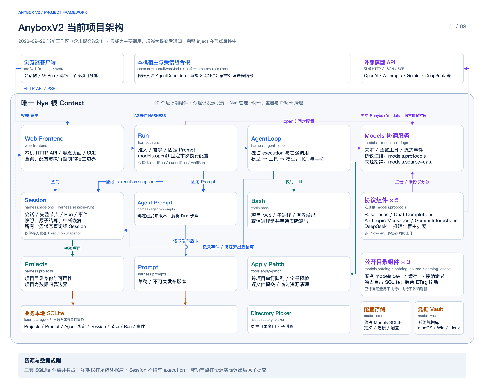
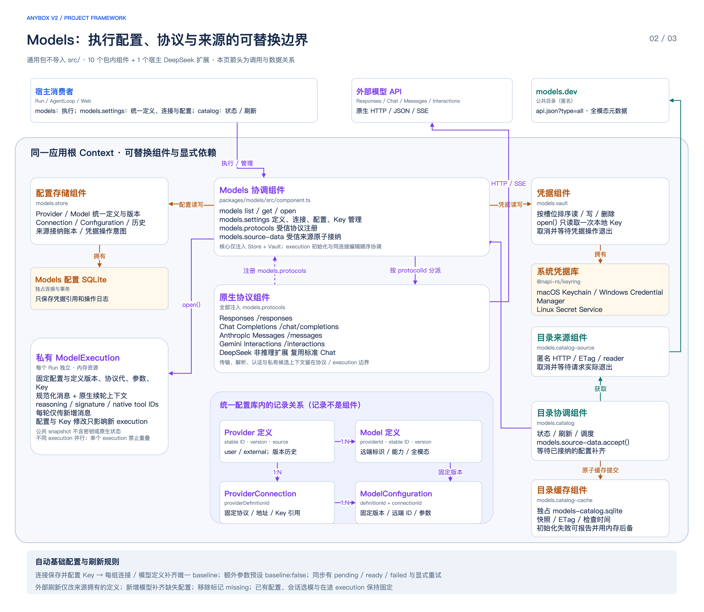
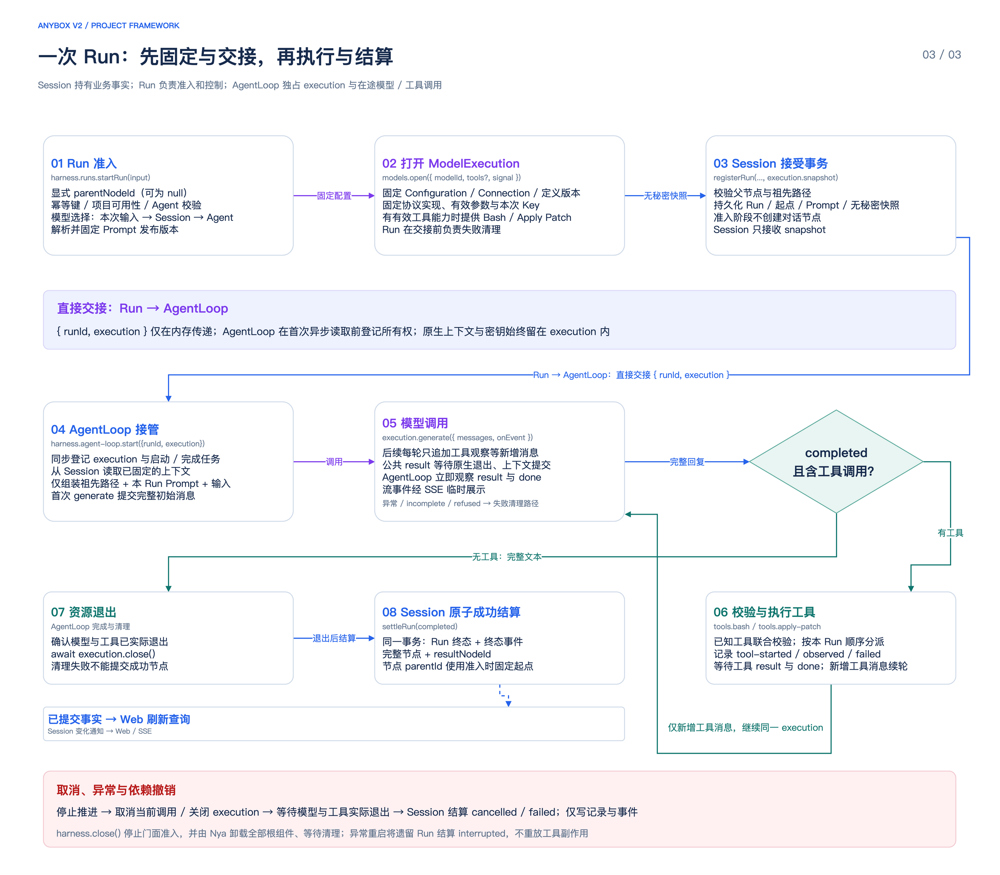

# 当前项目框架

> 本文图示保留原生协议迁移前的架构记录。当前调用接口、资源归属与持久化以 [Harness组件说明](../harness-components.md) 和 [原生协议设计](../native-protocol-agent-framework-design.md) 为准。

依据 2026-09-28 当前工作区源码绘制，包含当时未提交的改动。使用 draw.io 原生节点与连线，可独立编辑各组件、文本和连接；PNG 由本机 draw.io 导出。

[可编辑 draw.io（三页）](./anybox-current.drawio)

## 01 · 项目整体架构

本机宿主在同一个 Nya 根 Context 安装 22 个运行期组件。图中分组表示职责，不代表子 Context；组合根、AgentDefinition、浏览器客户端和 execution 不计为组件。箭头只展示主要调用，组件节点的 `source_file`、`provides` 与 `inject` 属性保存源码入口、服务和完整注入依赖。

## 02 · Models 模块与配置关系

通用包提供 10 个组件，宿主另安装 DeepSeek 非推理协议扩展。Models 核心只注入配置存储与 Vault；目录经 `models.source-data` 接纳定义，已有 execution 的运行不依赖实时目录。配置库、目录缓存库与业务库各有独占 SQLite 连接，密钥由系统凭据库保存。

Provider/Model 定义带稳定 ID、版本与显式来源；Connection 保存固定协议、地址与私有凭据引用；Configuration 关联连接和模型定义，固定执行所需的远端 ID、定义版本、参数与能力。会话和 Run 的 `modelId` 是执行配置 ID。保存连接并配置 Key 后补齐唯一基础配置，已有配置与 execution 保持固定。

## 03 · Run 执行与资源结算

Run 固定 Prompt 与 execution，把无秘密 snapshot 交给 Session，再将 `{ runId, execution }` 直接交给 AgentLoop。AgentLoop 在首次异步读取前取得资源所有权，负责模型与工具循环。Session 持有业务记录与所有查询，不持有 execution 或调用句柄。

模型公共 `result` 在实际退出与候选上下文提交后结算；工具的 `result` 和 `done` 分别观察。成功节点、Run 终态、结果引用与终态事件必须在资源退出后原子提交。取消、失败与中断不创建节点；流式文本只作临时展示。

主要核对入口：[组合根](../../src/harness.ts)、[Web 宿主](../../src/web/serve.ts)、[Models 装配](../../src/web/models-startup.ts)、[组件职责清单](../harness-components.md)、[Models 独立模块](./models-module.md)、[Session 对话树](../session-conversation-tree.md)。H0 探针和旧凭据的兼容读取不属于图中正常执行链。
