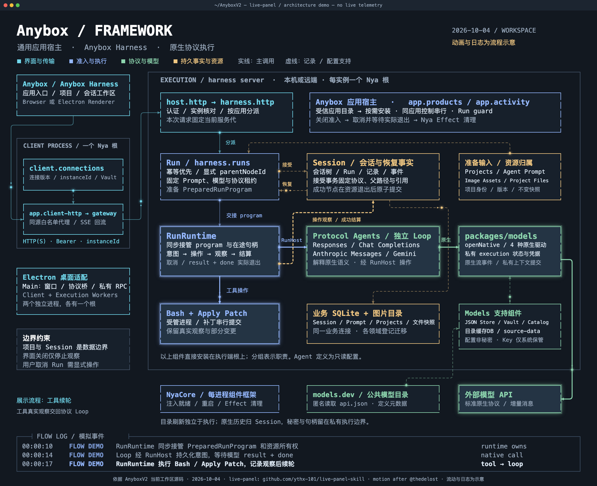

# Anybox live-panel 框架图

[播放动态网页](./anybox-framework.html) · [下载视频](./anybox-framework.mp4) · [下载 GIF](./anybox-framework.gif) · [编辑 JSON 配置](./anybox-framework.json) · [文档入口](../../README.md)

依据 **2026-10-04 当前工作区源码（包含未提交改动）**绘制，使用 [ythx-101/live-panel-skill](https://github.com/ythx-101/live-panel-skill) 的原始模板、渲染器和逐帧检查器。深色终端风格，画布 2160 × 1760，视频 28 秒、30 fps，输出 H.264 MP4 与自包含 HTML。网页可以离线直接打开，按窗口尺寸等比缩放。

GIF 从同一 MP4 转换，保留 2160 × 1760 分辨率和完整 28 秒，15 fps、420 帧、无限循环，约 15.1 MB。采用全局 256 色调色板、Bayer 抖动和变化区域优化；已逐帧解码验证尺寸、总时长、循环标记与全部帧，并检查抽帧文字和连线。



## 图中边界

- **展示端**：Anybox 外壳挂载 Anybox Harness 工作区，运行在浏览器或 Electron Renderer 中。
- **客户端进程**：一个独立 Nya 根，客户端 HTTP 经 `client.gateway` 代理到选定执行设备；`client.connections` 管理连接版本、实例身份和客户端凭据。客户端拥有自己的业务数据库与 Vault 命名空间。
- **执行端进程**：本机或远端每个实例有自己的 Nya 根。`host.http` 与 `harness.http` 分担认证、应用分派和业务入口；Anybox 应用宿主管理运行目标、活动 guard 与按需装配。
- **harness server**：Run 负责准入与准备；Session 持有会话、节点、Run、原生记录与恢复事实；RunRuntime 接管 program、在途操作、取消和实际退出等待。协议 Loop 解释原生语义并通过 RunHost 发起受管操作。
- **Models**：独立包提供本地执行配置、私有原生 execution、四种协议驱动与原生流事件。安全展示投影属于 harness server 的协议代理层。JSON 配置、目录缓存和系统 Vault 分担不同资源。
- **输入与工具**：Projects、Prompt、Agent Prompt、图片原字节与项目文件快照提供输入；运行工具为 Bash 和 Apply Patch。Session 的接受事务固定资源引用。

执行边界内的所有真实组件直接安装在该进程的根上。卡片是职责分组，内部 Loop、execution、Agent 定义和 SQLite 记录提供方不会因此成为独立 Nya 组件。项目与会话不建立子 Context。底部 NyaCore 卡片表示每个进程使用的组件框架，公共模型目录与外部模型 API 表示进程外部的网络服务。

实线表示主要调用路径，虚线表示记录、配置和资源支持；这是框架总览，**不枚举全部 `inject` 依赖**。`Protocol Agents → Models` 表示 program 内部原生交换，受管操作的意图、句柄登记和观察仍由 RunRuntime 的 RunHost 契约控制。Session 连到业务存储的卡片汇总业务数据库与图片目录的资源归属，图片原字节由 Image Assets 保存。

## 动画含义

光点、节点高亮和滚动日志都是**演示**，没有连接运行中的 Anybox、模型 API、真实 Run 或监控数据。一个共享的 `seq` 时间状态机驱动高亮与日志，重复演示一条成功路径：固定设备 → 准入准备 → 接受事务 → 同步接管 → 模型交换 → 工具续轮 → 等待退出 → 原子成功结算。它不代表每个 Run 都调用工具，也不代表失败或取消会产生成功节点。

两条独立外部连线分别表示模型 API 调用与 `models.dev` 目录读取。目录服务在执行端根上运行，经来源、缓存和 `models.source-data` 接纳定义；执行使用已保存配置，不以实时目录刷新为前置步骤。关闭界面仅停止观察；用户取消需显式操作，组件卸载、依赖撤销和整根关闭也会取消并等待所属 Run。清理失败不能创建成功节点。

## 源码依据

| 内容 | 当前实现 |
| --- | --- |
| 界面与应用入口 | [宿主外壳](../../../src/host/web/client.ts)、[Anybox Harness 工作区](../../../src/applications/harness/web/harness-app.ts) |
| 客户端根与网关 | [客户端宿主](../../../src/host/client.ts)、[应用客户端装配](../../../src/applications/harness/client/runtime.ts)、[白名单代理](../../../src/applications/harness/client/gateway.ts) |
| 桌面进程边界 | [桌面入口](../../../src/entrypoints/desktop-main.ts)、[worker 入口](../../../src/entrypoints/desktop-worker.ts)、[运行边界](../../desktop-runtime.md) |
| 执行根与按需安装 | [执行宿主](../../../src/host/execution.ts)、[应用运行时](../../../src/applications/harness/server-runtime.ts)、[核心组合](../../../src/applications/harness/core/index.ts) |
| Run / Runtime / RunHost | [Run](../../../src/applications/harness/core/run/component.ts)、[RunRuntime](../../../src/applications/harness/core/run/runtime-component.ts)、[program 契约](../../../src/applications/harness/core/run/program.ts) |
| Session 接受与结算 | [Session](../../../src/applications/harness/core/session/component.ts)、[事务与恢复记录](../../../src/applications/harness/core/session/sqlite-records.ts) |
| 原生 Loop 与展示投影 | [协议绑定](../../../src/applications/harness/core/protocol-agents/registry.ts)、[交换与投影](../../../src/applications/harness/core/protocol-agents/shared.ts) |
| Models 与目录 | [Models 装配](../../../src/applications/harness/server-models.ts)、[四个公共端口](../../../packages/models/src/component.ts)、[execution](../../../packages/models/src/execution.ts)、[catalog](../../../packages/models/src/catalog.ts) |

更完整的组件依赖、契约与清理说明见 [组件手册](../../modules/README.md)。配置中的 `_sources` 保存上述源码路径；`_node` 与 `_edge` 是绘图标识，不是新增服务。

## 编辑与复现

修改 [anybox-framework.json](./anybox-framework.json) 中的卡片、路径和状态机，然后在项目根目录执行以下命令。依赖 Python 3.8+、Chrome/Chromium 和 ffmpeg；Python 渲染器只使用标准库。macOS 可使用下面的 Chrome 路径，其他环境改为实际路径。

```sh
python3 docs/architecture/live-panel/engine/scripts/render.py \
  --config docs/architecture/live-panel/anybox-framework.json \
  --out docs/architecture/live-panel/anybox-framework.mp4 \
  --html-out docs/architecture/live-panel/anybox-framework.html \
  --crf 19 \
  --chrome '/Applications/Google Chrome.app/Contents/MacOS/Google Chrome'

python3 docs/architecture/live-panel/engine/scripts/check_frames.py \
  --config docs/architecture/live-panel/anybox-framework.json \
  --out-dir /tmp/anybox-live-panel-check \
  --repeat \
  --chrome '/Applications/Google Chrome.app/Contents/MacOS/Google Chrome'

ffmpeg -y -i docs/architecture/live-panel/anybox-framework.mp4 \
  -filter_complex '[0:v]fps=15,split[v][p];[p]palettegen=stats_mode=diff:max_colors=256[pal];[v][pal]paletteuse=dither=bayer:bayer_scale=3:diff_mode=rectangle' \
  -an -loop 0 docs/architecture/live-panel/anybox-framework.gif

npm run check
```

`ffmpeg` 不在 PATH 时为渲染命令追加 `--ffmpeg /实际路径/ffmpeg`。更换字体后重新检查；更换画幅须重排 JSON 坐标。HTML 由原始模板嵌入配置生成，不手改生成文件；维护动画前阅读 [motion-grammar](./engine/references/motion-grammar.md) 和 [config-schema](./engine/references/config-schema.md)。

本次逐帧检查覆盖 124 个时间点，未发现文字越界、文字重叠或卡片重叠；4 个预览时间点在跳转后重放均没有可见像素差异。已检查 PNG、实际浏览器页面及视频抽帧；FFmpeg 完整解码 840 帧无错误，确认 H.264 / yuv420p、2160 × 1760、30 fps、28 秒和静音 AAC，文件约 2.7 MB。HTML 内嵌配置与 JSON 完全一致，MP4 已启用 fast-start。

GIF 导出后根 `npm run check` 通过：类型检查、构建与资源边界校验成功，1084 项测试中 1073 项通过、11 项按门控跳过、0 项失败。跳过项不代表真实模型联网、系统凭据或平台验收已完成。本次只新增绘图产物、原样 Skill 引擎及文档导航，未修改业务实现。

## 来源

[live-panel Skill](./engine/SKILL.md) 与最小引擎副本固定到上游 commit `8a70aa2c4e3fac68b40e2472407e32e2637a7a36`，原文件按 MIT [许可证](./engine/LICENSE)保留；引擎说明见 [engine/README.md](./engine/README.md)。本图布局与组件内容依据 AnyboxV2 源码新绘，动画语法来自该 Skill，原始动效灵感归 [@thedelost](https://x.com/thedelost/status/2105398038026195279)。相关署名也保留在画面页脚。
