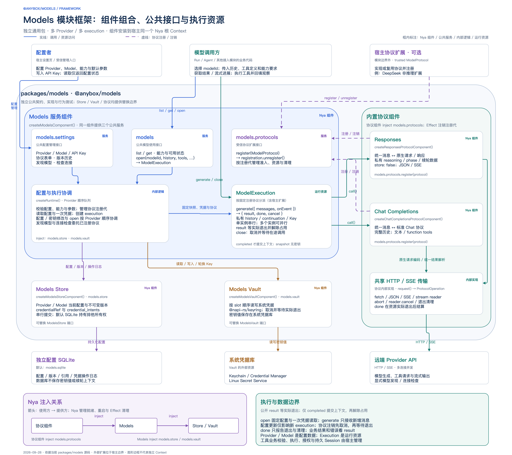
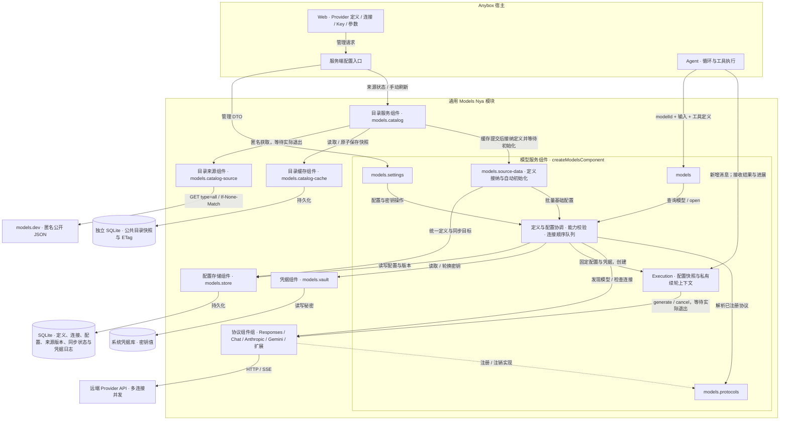
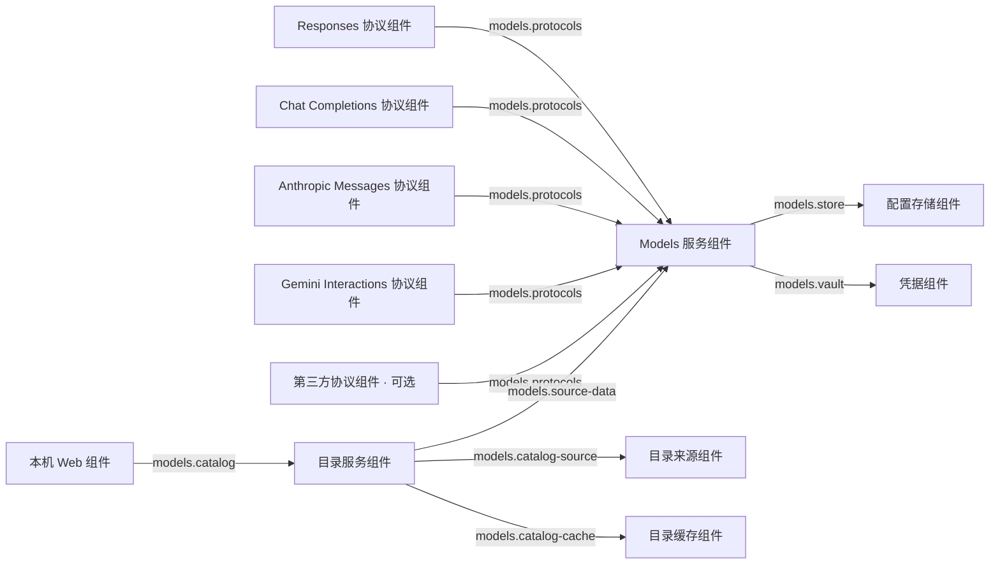
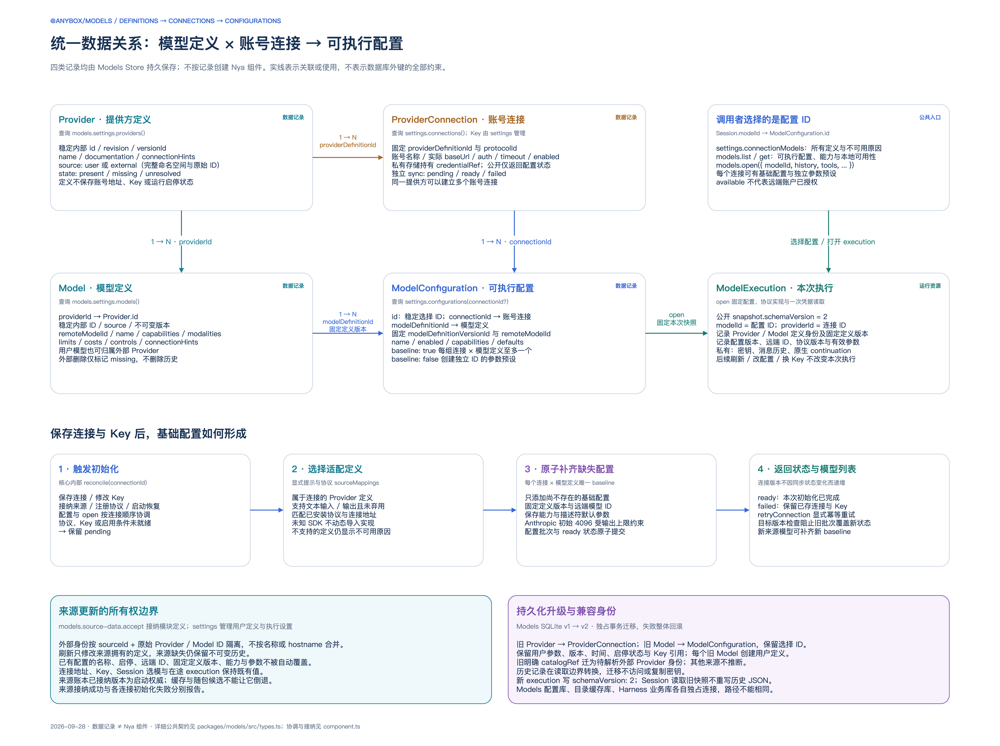
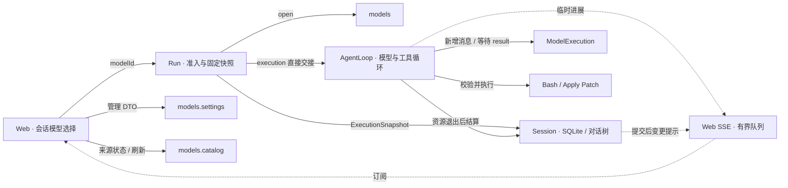

# Models 模块架构

> 本文图示保留原生协议迁移前的架构记录。当前调用接口、资源归属与持久化以 [Harness组件说明](../harness-components.md) 和 [原生协议设计](../native-protocol-agent-framework-design.md) 为准。

对应 `packages/models` 与当前 Harness/Web 接入的实际实现。实线表示调用或资源访问，虚线表示协议注册。图中的协议组件组包含可同时安装的多个 Nya 组件。

完整模块框架图保存在模块自己的文档目录：[高清 PNG](../../packages/models/docs/architecture.png) · [SVG](../../packages/models/docs/architecture.svg) · [可编辑 draw.io（两页）](../../packages/models/docs/architecture.drawio)。主图包含 10 个内置 Nya 组件：Models、Store、Vault、四种原生协议，以及可选目录的来源、缓存和目录服务。Models 核心提供四个服务端口，其中 `models.source-data` 是受信接纳端口，不是额外组件；目录通过它接纳统一定义并等待连接初始化。配置者选择 Provider 定义、保存连接与 Key，调用者选择稳定的执行配置 ID。主图标注实际 Nya 依赖、自动基础配置规则及执行资源边界；第二页展开定义、连接与执行配置的数据关系。

`models`、`models.settings`、`models.protocols` 和受信的 `models.source-data` 由 `createModelsComponent` 提供；可选目录的 `models.catalog` 由独立组件提供，依赖可替换的来源、缓存与核心定义接纳端口。模型执行不依赖公开目录。Execution 是模型服务组件内部的执行资源，不是额外的 Nya 组件；Provider、Model 也是数据记录，不按记录安装组件。业务 Session、工具业务校验、授权与执行由宿主管理。

## Nya 组件依赖

下图的箭头统一表示「消费者通过 inject 依赖提供方」，不是模型请求的数据流。

协议组件在 Effect 中注销自己的注册代；注销停止准入，取消并等待所属 execution、初始化、模型发现与连接检查退出。Nya 按依赖先清理消费者，再清理配置存储与凭据提供方。所有组件可以安装在同一个根 Context，无须为 Provider 或 Model 创建 Context。

目录来源拥有匿名 HTTP 请求与 reader；缓存独占第三个 SQLite 文件，关闭时等待已接受写入后释放连接；目录服务拥有刷新任务和计时器，Models 核心拥有统一定义与连接初始化。来源实际退出后，目录先原子提交缓存，再提交定义、来源账本与同步目标，最后等待各连接的配置批量初始化。晚到的取消不能撤销已接纳提交。Nya 先清理目录消费者，再清理来源、缓存与核心，核心不依赖目录，目录撤销不取消模型 execution。

## 统一来源数据与执行配置

数据关系与自动初始化流程：[高清 PNG](../../packages/models/docs/architecture-data-flow.png) · [SVG](../../packages/models/docs/architecture-data-flow.svg)。可编辑源位于同一 draw.io 文件的第二页。

| 数据 | 保存内容 |
|---|---|
| Provider / Model | 模块统一定义、来源、元数据及不可变版本 |
| ProviderConnection | 固定协议与 Provider 定义、账号、地址、认证与私有 Key 引用 |
| ModelConfiguration | 稳定选择 ID、连接与模型定义、固定定义版本、能力和参数 |
| RunnableModelSummary | 根据配置、连接和已注册协议计算可用性 |

来源消费 `https://models.dev/api.json?type=all`，归一成与用户定义相同的 Provider/Model。外部身份按完整来源键去重，不按名称或 hostname 合并；`user` 模型可归属外部 Provider。填写连接 Key 保留定义来源。未知 SDK 标签不动态导入，未知能力、缺失推理模式不推断。全模态元数据保留，自动配置只接纳明确适配文本契约和连接协议的定义。

主流程是选择 Provider → 配置连接与 Key → 保存并启用 → 返回模型列表。核心在连接保存、Key 修改、来源提交、协议注册和启动恢复时幂等补充基础配置；同一模型可另建 `baseline: false` 参数变体。已有名称、参数、能力与启停状态不被刷新覆盖，来源移除仅标记缺失，已有配置继续使用固定定义版本。

同步状态单独保存 `pending/ready/failed`、目标版本与已同步版本，不增加用户连接版本。Key 保存后批量初始化失败仍返回连接与失败状态，提供重试。配置批次与状态原子提交，目标版本检查防止并发刷新被旧初始化覆盖。`available` 表示本地就绪，远端授权由实际请求确认。

统一配置库的来源账本为启动权威，只接纳更新缓存/随包候选；较旧数据不倒退，时间相同但版本不同保留已接纳数据并清空 ETag 请求完整确认。旧 schema 1 缓存经验证只读转换，新格式为 schema 2。随包 JSON provenance/SHA-256 和显式 `catalog:update` 保持。24 小时刷新、一小时重试与 30 秒来源超时保持，公开缓存可报告内存后备，Key 仍必须使用系统 Vault。

配置 SQLite 在独占事务中迁移 v1 → v2。旧 Provider/Model 分别转成连接/执行配置，选择 ID、版本、地址、Key 引用和用户参数保留。每个旧 Model 建独立用户定义；旧明确 `catalogRef` 转成外部 Provider 未解析身份，来源接纳后按完整键补全。历史原始记录保留，仅在读取边界转成新视图；失败整体回滚、重复启动幂等。迁移不访问 Key。

## 一次模型调用的边界

1. Agent 用 `modelId` 打开 execution；模块读取 ModelConfiguration、ProviderConnection、固定定义版本、有效参数与密钥，并固定协议实现版本。
2. 每轮只传新增消息；协议组件编码请求、解析 JSON/SSE，并返回结果和候选续轮状态。
3. Execution 等待底层 `done`，确认成功且未取消，提交上下文、释放本轮占用，再成功返回公共 `result`。
4. Agent 校验并执行工具，把结果传回下一轮；execution 不执行工具，也不保存业务 Session。

配置或密钥变更只影响新 execution。SQLite 不保存密钥值；Agent、前端 DTO 和执行快照也不接收密钥。流式事件只是临时进展，宿主可用 `createModelEventQueue` 有界转发；它是辅助函数，不是 Nya 组件。

Responses 私有保存 reasoning、加密内容和 phase；Anthropic 保存完整有序内容块、thinking 签名与 redacted thinking；Gemini 保存原生步骤、thought 摘要与签名。两套新协议把原生工具 ID 留在续轮上下文，公共 ID 在增量与最终结果中保持一致。新增消息只在实际退出成功后写入私有上下文；Session 只保存文本契约与模型选择，重开 execution 不恢复进程内原生状态。

当前执行契约包含文本、用户定义函数工具，以及 Chat/DeepSeek 显式声明的本地图片输入；Responses、Anthropic、Gemini 的有效图片能力仍为 false。图片读取端口按 execution 固定，原生记录只保存资源引用，实际请求在 start 后编码。完整设计见 [图片输入链路](../multimodal-image-input-design.md)。参数省略保留原生 API 默认值；描述符的 `defaultValue` 用于初始化表单和自动基础配置，保存的值才进入执行快照。Anthropic 必须显式保存 `max_tokens`（默认 `4096`，受模型输出上限约束），使用固定版本头与通过 `x-api-key` 传入的 workspace-scoped API key；Gemini 使用原生 Interactions、`x-goog-api-key` 和 `store: false`。各协议支持的推理控制与约束见模块 README。

源码入口：[公共契约](../../packages/models/src/types.ts)、[目录契约](../../packages/models/src/catalog-types.ts)、[目录服务](../../packages/models/src/catalog.ts)、[目录来源](../../packages/models/src/catalog-source.ts)、[目录缓存](../../packages/models/src/catalog-cache.ts)、[模型服务](../../packages/models/src/component.ts)、[执行上下文](../../packages/models/src/execution.ts)、[配置存储](../../packages/models/src/store.ts)、[系统凭据](../../packages/models/src/vault.ts)、[协议组件注册](../../packages/models/src/protocols/shared.ts)。独立宿主的根组件装配示例见 [模块 README](../../packages/models/README.md)。

## Harness 与 Web 接入

Models 配置库、目录缓存和 Harness 业务库分别持有独立 SQLite 连接与资源所有权。宿主的 `ANYBOX_MODELS_CATALOG_DATABASE` 默认位于 Models 配置文件旁的 `models-catalog.sqlite`，三个路径不得相同。会话只保存所选 `modelId`，Run 固定版本快照；切换会话模型、编辑配置、目录刷新和轮换密钥都不改变已打开的 execution。Web 同时安装 Responses、标准 Chat Completions、Anthropic Messages、Gemini Interactions 和宿主的 DeepSeek 非推理扩展。没有有效工具能力时允许纯文本调用。

新的 execution 快照包含 `schemaVersion: 2` 与定义身份；`modelId/providerId` 继续表示执行配置/连接。Session 读取兼容旧快照，不改写已有选择或历史 Run JSON。Web 选择器按连接分组；删除 Key 或停用连接使该组新执行不可用。旧 `ANYBOX_LLM_*` 初始化检查连接与执行配置数量，公共定义不会阻止兼容导入。
