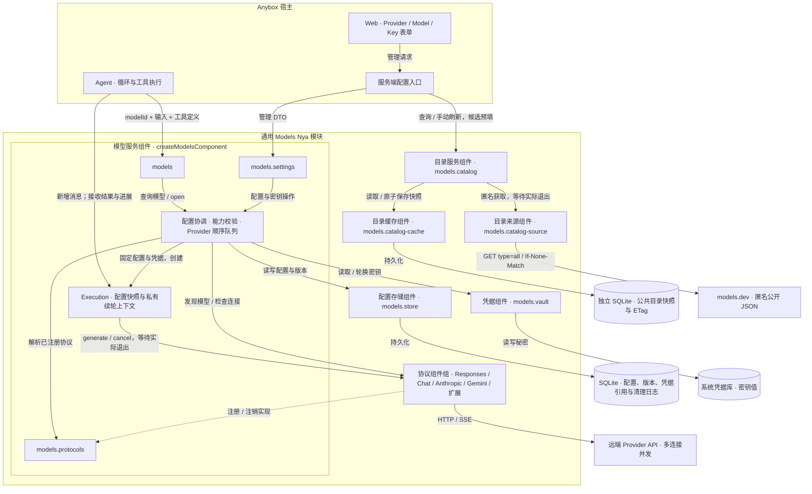
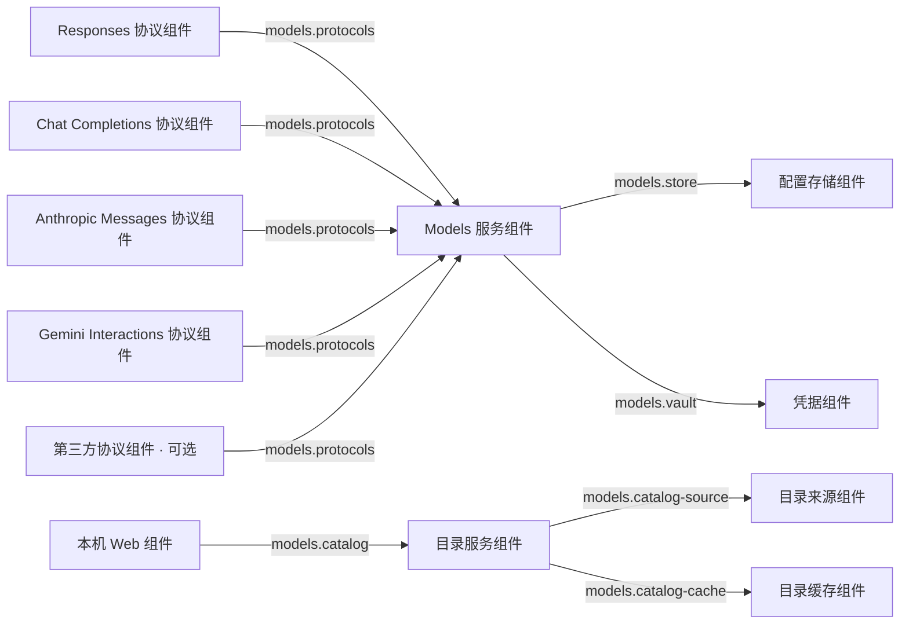

# Models 模块架构

对应 `packages/models` 与当前 Harness/Web 接入的实际实现。实线表示调用或资源访问，虚线表示协议注册。图中的协议组件组包含可同时安装的多个 Nya 组件。

核心执行与配置框架图保存在模块自己的文档目录：[高清 PNG](../../packages/models/docs/architecture.png) · [SVG](../../packages/models/docs/architecture.svg) · [可编辑 draw.io](../../packages/models/docs/architecture.drawio)。图中区分配置者、模型调用方、宿主协议扩展，以及组件、公共服务和内部执行资源；底部单独说明 Nya 注入方向。下方 Mermaid 图同时展示当前的可选公共目录和全部原生协议组件。

`models`、`models.settings` 和 `models.protocols` 由 `createModelsComponent` 提供；可选目录的 `models.catalog` 由独立组件提供，并只依赖可替换的来源与缓存服务。模型执行不依赖公开目录。Execution 是模型服务组件内部的执行资源，不是额外的 Nya 组件；Provider、Model 也是数据记录，不按记录安装组件。业务 Session、工具业务校验、授权与执行由宿主管理。

## Nya 组件依赖

下图的箭头统一表示「消费者通过 inject 依赖提供方」，不是模型请求的数据流。

协议组件在 Effect 中注销自己的注册代；注销停止准入，取消并等待所属 execution、初始化、模型发现与连接检查退出。Nya 按依赖先清理消费者，再清理配置存储与凭据提供方。所有组件可以安装在同一个根 Context，无须为 Provider 或 Model 创建 Context。

目录来源拥有匿名 HTTP 请求与 reader；缓存独占第三个 SQLite 文件，关闭时等待已接受写入后释放连接；目录服务拥有已发布快照、刷新任务和计时器。来源请求实际退出后才接纳原子缓存提交，提交成功后发布新快照；提交已经开始时，晚到的取消不能撤销它。Nya 清理目录消费者后再清理来源与缓存，目录依赖撤销不取消模型 execution。

## 目录数据与本地配置

来源固定消费 `https://models.dev/api.json?type=all`，把上游字段归一为自有只读契约。缓存按规范化来源 URL 隔离。启动先读有效缓存，否则使用随包发布、经过 SHA-256 与 provenance 校验的快照；首次或超过 24 小时的检查在后台刷新，ETag 命中更新检查时间，失败保留旧快照、一小时后重试，默认请求超时 30 秒。缓存不可用时可用可观察的内存后备，目录状态会报告持久化和错误；这不改变凭据的系统 Vault 要求。

`catalogRef: { sourceId, providerId }` 是本地 Provider 的可空来源引用，本地 ID、远端模型 ID、地址、参数和密钥仍由 settings 保存。用户选择目录候选并确认保存后才形成配置；刷新不改写本地记录。目录可保留所有模态、价格和上下文信息，执行选模使用文本筛选。未知 SDK 标签不触发动态导入，只有已安装协议和已知连接提示能生成预填候选，其他条目仍可手动配置。目录 `controls` 是能力建议，不能替代运行时显式的 reasoning modes、efforts 与 budget 声明。

## 一次模型调用的边界

1. Agent 用 `modelId` 打开 execution；模块读取 Model、Provider、有效参数与密钥，并固定协议实现版本。
2. 每轮只传新增消息；协议组件编码请求、解析 JSON/SSE，并返回结果和候选续轮状态。
3. Execution 等待底层 `done`，确认成功且未取消，提交上下文、释放本轮占用，再成功返回公共 `result`。
4. Agent 校验并执行工具，把结果传回下一轮；execution 不执行工具，也不保存业务 Session。

配置或密钥变更只影响新 execution。SQLite 不保存密钥值；Agent、前端 DTO 和执行快照也不接收密钥。流式事件只是临时进展，宿主可用 `createModelEventQueue` 有界转发；它是辅助函数，不是 Nya 组件。

Responses 私有保存 reasoning、加密内容和 phase；Anthropic 保存完整有序内容块、thinking 签名与 redacted thinking；Gemini 保存原生步骤、thought 摘要与签名。两套新协议把原生工具 ID 留在续轮上下文，公共 ID 在增量与最终结果中保持一致。新增消息只在实际退出成功后写入私有上下文；Session 只保存文本契约与模型选择，重开 execution 不恢复进程内原生状态。

当前执行契约仅包含文本和用户定义函数工具，所有内建协议的有效图片能力为 false。参数省略保留原生 API 默认值；表单的 `defaultValue` 仅用于初始化可编辑输入，保存的值才进入执行快照。Anthropic 必须显式提交 `maxOutputTokens`（表单默认 `4096`），使用固定版本头与通过 `x-api-key` 传入的 workspace-scoped API key；Gemini 使用原生 Interactions、`x-goog-api-key` 和 `store: false`。各协议支持的推理控制与约束见模块 README。

源码入口：[公共契约](../../packages/models/src/types.ts)、[目录契约](../../packages/models/src/catalog-types.ts)、[目录服务](../../packages/models/src/catalog.ts)、[目录来源](../../packages/models/src/catalog-source.ts)、[目录缓存](../../packages/models/src/catalog-cache.ts)、[模型服务](../../packages/models/src/component.ts)、[执行上下文](../../packages/models/src/execution.ts)、[配置存储](../../packages/models/src/store.ts)、[系统凭据](../../packages/models/src/vault.ts)、[协议组件注册](../../packages/models/src/protocols/shared.ts)。独立宿主的根组件装配示例见 [模块 README](../../packages/models/README.md)。

## Harness 与 Web 接入

Models 配置库、目录缓存和 Harness 业务库分别持有独立 SQLite 连接与资源所有权。宿主的 `ANYBOX_MODELS_CATALOG_DATABASE` 默认位于 Models 配置文件旁的 `models-catalog.sqlite`，三个路径不得相同。会话只保存所选 `modelId`，Run 固定版本快照；切换会话模型、编辑配置、目录刷新和轮换密钥都不改变已打开的 execution。Web 同时安装 Responses、标准 Chat Completions、Anthropic Messages、Gemini Interactions 和宿主的 DeepSeek 非推理扩展。没有有效工具能力时允许纯文本调用。
