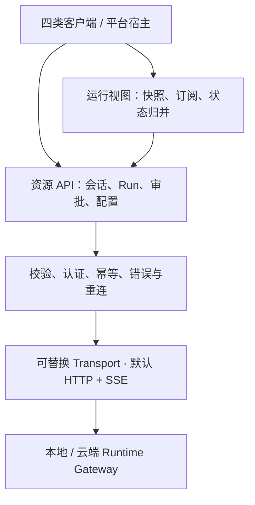

# Client SDK 能力与接口设计

状态：目标设计，尚未实现。日期：2026-09-06。对应包为 `@anybox/client`；线上数据契约见 [Runtime 协议](runtime-protocol.md)，产品边界见 [总体架构](architecture.md)。

## 1. 定位

Client SDK 是 TUI、Desktop、VS Code 扩展和手机客户端共用的 **Runtime 访问与状态同步层**。它把连接、会话操作、运行控制、流恢复和数据归并封装为稳定接口，让各端专注于展示、输入与平台集成。



Agent 循环、模型调用、工具执行、权限决策和任务持久化由 Runtime 完成。启动本地进程、系统密钥存储、选择目录和 VS Code 文档编辑由平台宿主完成；SDK 为这些宿主提供接口，并只管理自己的客户端资源。

## 2. 必须提供的能力

| 能力 | 建议接口 | 主要行为 | 阶段 |
| --- | --- | --- | --- |
| 连接与能力发现 | `connect`、`runtime.describe`、连接状态订阅 | 校验 Runtime 身份、版本、能力与限制 | P1 |
| Runtime 身份认证 | 注入 `AuthProvider` | 获取/刷新登录凭证，隔离账号状态；与模型 Key 分开 | P1 |
| 工作区与会话 | `workspaces`、`sessions`、`messages` | 列表分页、创建、读取、版本冲突；消息含结构化内容块 | P1，历史读取随 Store 接口完善 |
| 任务运行控制 | `runs.prepareStart/start/get/cancel/waitForTerminal` | 开始后返回 runId，显式取消，查询/等待终态 | P1 |
| 可靠事件订阅 | `runs.events` | 解析与校验、顺序检查、去重、补读、有限重连 | P1 |
| 可展示的运行视图 | `observeRun`、`getSnapshot`、`subscribe` | 将快照和增量归并成一致的消息、工具、审批与状态 | P1；数据类型随能力扩展 |
| 请求可靠性 | 类型化错误、重试策略、`PendingCommandStore` 端口 | 区分未发送、明确拒绝、结果不确定；复用同键同请求 | P1 |
| Profile 与能力配置 | `profiles`、`models.list`、`tools.list` | 模型/工具发现、可用性、Profile 版本更新 | P2 |
| 审批与 BYOK 管理 | `approvals.decide`、`credentials` | 提交审批；专用密钥写入和脱敏元数据读取 | P2 |
| 文件与上下文交付 | `artifacts.upload/download`、内容快照类型 | 传递附件、代码选区/文档快照与结果产物 | P2/P3 |
| 客户端生命周期与诊断 | Observer `dispose`、Client `close`、诊断回调 | 清理请求、流、监听器和退避计时器；提供脱敏关联信息 | P1 |

UI 可以依据 capabilities 隐藏不可用入口；服务端仍负责权限和输入校验。SDK 不根据“本地/云端”标签、某个按钮是否可见来决定授权。

## 3. 一个 Client 对应一个 Runtime 和认证分区

目标创建方式：

```ts
const client = createClient({
  endpoint,
  expectedRuntimeId,             // 已保存的连接应校验；首次连接可以尚未取得
  auth: authProvider,             // 平台注入的 Runtime 登录凭证提供者
  transport,                     // 可选，默认 HTTP + SSE
  pendingCommands,               // 可选，本地待确认命令的存储端口
  onDiagnostic: reportDiagnostic,
})

await client.connect()
```

创建对象不访问网络；`connect()` 完成身份/协议/能力握手，重复连接调用合并。业务接口使用成功握手后的身份；不兼容时在提交 Run 前失败。`runtime.describe()` 可以刷新运行信息，能力缓存仅用于体验，不能替代 Runtime 的实时检查。

连接状态至少区分 `idle`、`connecting`、`ready`、`unavailable`、`auth_required`、`incompatible`、`closed`。`ready` 表示已完成握手，不保证每条请求或每个事件流都持续可达；各 Run 视图单独报告流连接状态。

- Client 的 endpoint 和认证分区在实例内固定。切换 Runtime 或账号时创建/选择另一个 Client，不提供修改全局 endpoint 后继续复用旧状态的捷径。
- 缓存、待确认命令与订阅按 `runtimeId + authScope + workspaceId + resourceId` 隔离；异步回调还要检查当前 Client/视图代次，迟到结果不能写入新视图。
- `AuthProvider` 提供稳定的认证分区和当前凭证，只用于客户端隔离；服务端从认证结果建立真正的主体。刷新同一账号的凭证可以复用 Client，换账号需要新的分区。
- `runtimeId` 改变表示另一数据集：阻止旧命令重试和旧游标补读。`instanceId` 改变表示进程重启：重新握手并取快照，不自行把 Run 推断为失败或成功。
- Runtime 身份比对用于防止串接数据，不能替代 TLS、认证和受信端点配置。凭证绑定选定端点，禁止向其他源的重定向自动携带凭证。

认证失效时，同一 Client 的并发请求最多合并触发一次认证刷新；是否重发仍遵循每个操作的幂等规则。403 停止相关重连并使相关缓存失效。SDK 不自行弹出登录窗口，界面通过状态变化决定如何引导登录。

## 4. 资源接口与数据规则

资源 API 与协议对应，保持简洁：

```text
client.runtime.describe()
client.workspaces.list(...)
client.sessions.create/list/get(...)
client.messages.list(...)
client.runs.prepareStart/start/get/cancel/events/waitForTerminal(...)
client.profiles.list/get/save(...)
client.models.list(...)
client.tools.list(...)
client.approvals.decide(...)
client.credentials.list/create/rotate/delete(...)
client.artifacts.upload/download(...)
```

后几组方法随 P2/P3 实现，不能提前返回模拟成功。`runs.prepareStart`、`waitForTerminal` 和 `observeRun` 是客户端组合能力，不要求另增同名网络端点。

约定如下：

- 工作区和对象 ID 在调用参数中显式传递。分页返回条目与 nextCursor；SDK 可提供惰性迭代器，不默认把全部历史加载到内存。
- Profile 和 Session 的更新使用服务端版本；冲突返回结构化错误，不能自动覆盖或换一个新版本重试旧意图。
- 消息使用文本、工具、附件等内容块。SDK 保留通用模型数据，UI 决定 Markdown、代码高亮和差异如何显示。
- 模型与工具接口主要用于发现和配置；实际模型调用与工具执行经由 Run，由 Runtime 控制。
- BYOK 创建/轮换只在专用请求中短暂传递用户输入的密钥。读取只返回元数据；密钥不进入通用缓存、待提交命令、诊断或 Run 输入。
- 文件接口接收字节流/平台中立的内容对象及元数据，报告传输进度和取消结果；实际打开本机文件、文档 URI 映射留给平台层。

## 5. 提交可靠性与结果不确定

`runs.prepareStart(input)` 是本地准备操作：生成一次 `clientRequestId`，冻结输入、Session/Profile 版本及所属 Runtime/认证分区；配置了持久化端口时先保存再返回。`runs.start(command)` 发送该请求，也保留协议草案中直接传入完整请求的低层用法，后者由调用方负责请求键与原请求的保存。

请求重试必须是**同一个 Runtime、认证分区、工作区、会话、请求键和请求内容**。参数变化是新命令，不能冒用旧键；认证账号变化也不能把旧的待确认命令发送给新账号。

SDK 错误需要表达提交结果：

| 结果 | SDK 能确认什么 | 后续行为 |
| --- | --- | --- |
| `not_sent` | 本次尝试在本地校验或发送前取消阶段结束 | 只有从未发送过的新命令，才能据此确认没有服务端任务 |
| `rejected` | 本次尝试收到符合协议的明确拒绝 | 处理版本冲突、会话忙或权限问题，保留此前尝试的未知结果 |
| `unknown` | 请求发出后超时、断网、中止等待，或收到不能证明接受结果的代理错误 | 保留原命令，显示待确认，不能宣称 Run 未创建 |

以上首先描述单次发送尝试；同一命令此前已经出现 unknown 时，后续尝试未发送或被拒绝也不能证明原请求未被接受。例如重试前账号权限被撤销，应保留原提交结果未知，而非允许 SDK 自动换键新建任务。

结果不确定时，重试原命令可以找回既有接受响应，**也可能在原请求未到达时首次创建 Run**。因此，用户已中止提交等待后，SDK 停止自动重试；后续重新提交/恢复由调用方明确触发。尚未得到 runId 时，首版不保证“取消提交”等价于取消服务器任务。若以后需要这种保证，要在服务端增加按请求键记录取消意图的契约。

`PendingCommandStore` 是可选端口：默认只在当前 Client 内存中保存；需要窗口/应用重启恢复的客户端注入平台存储，并提供恢复列表。它可包含用户输入，必须由宿主管理保护、保留与清理策略；不包含认证令牌或模型 Key。错误与日志只输出命令引用，不能自动打印整个原请求。

公开错误按传输、认证、协议/身份不匹配、业务冲突、游标恢复和提交结果未知分类，并包含稳定的 code、可取得的 requestId/HTTP 状态及脱敏命令引用。客户端根据字段处理，不依赖错误消息文本；Run 执行失败则保留在业务结果中。

首版协议保留已接受请求的幂等映射，不自动过期。将来引入清理时，需先定义重放窗口、旧键拒绝和可确认的到期行为，再允许 SDK 恢复长期保存的命令。SDK 本身不承诺无限期离线发送。

重试按操作分类：

- 查询：对可恢复传输错误有限重试，受总期限、退避与调用方 signal 约束。
- `runs.start`：只有原键原请求允许有限重试；结果未知时保留恢复信息。
- `runs.cancel`、审批提交：依照协议中的幂等语义处理，遇到终态/决定冲突则读取当前结果。
- `sessions.create`、凭据写入、上传等未定义幂等键的操作：不默认重试写入。认证刷新成功也不改变这一限制。
- `retryable` 是错误提示，不是自动重试授权；用户请求开始新的 Run 必须产生新的明确意图。

## 6. 两层事件 API

### 6.1 低层：有序事件

`runs.events({ workspaceId, runId, after, signal })` 返回经过校验的 `AsyncIterable<RunEvent>`，适合日志消费、集成和高级客户端。它处理传输解析、事件大小限制、重复交付、有限重连和缺口补读。

它不渲染消息，也不把旧历史偷偷替换成一个新快照。游标过期、无法补齐缺口或核心事件不兼容时返回类型化错误，调用方决定恢复策略。自行维护业务投影的调用者，只能保存已经成功处理的连续序号。

### 6.2 高层：可直接展示的 Run 视图

常规产品界面优先使用：

```ts
const view = client.observeRun({ workspaceId, runId })
const unsubscribe = view.subscribe(() => {
  render(view.getSnapshot())
})

await view.ready
// 视图关闭时：
unsubscribe()
await view.dispose()
```

`observeRun` 返回视图句柄，创建后加载一致性快照并建立流；`ready` 代表首个有效视图可用，不代表 Run 完成。`getSnapshot()` 在加载阶段也返回明确的 loading 状态；订阅注册后先通知一次当前状态。SDK 不依赖 React、TUI 或 VS Code 的状态框架。

Run 视图至少包含：

```text
身份：runtimeId、workspaceId、runId
传输：loading / live / reconnecting / unavailable / closed、stale
业务：Run 状态、消息内容块、工具调用、待审批项、产物、用量
恢复：lastAppliedSeq、最近一次有效快照
错误：connectionError 与 Run 的结束原因分别保存
```

归并过程固定为：读取包含 `lastEventSeq` 的快照 → 从其后订阅 → 校验对象归属及 seq → reducer 应用连续事件 → 更新 `lastAppliedSeq` → 通知界面。SDK 可以批量通知界面，但不能丢弃业务事件。监听器抛错由客户端诊断隔离，不影响其他监听器或把已完成的归并重做一遍。

重连从最后成功应用的序号继续；游标过期时重新取快照，**替换**本地视图后再订阅，避免将完整文本追加到旧文本上。只有游标没有对应投影时同样重新取快照。认证、对象或协议校验失败不能伪装成空白成功视图。

Run 的 `running / waiting_approval / failed` 等业务状态与连接状态分开。手机断网时保留最后一次有权查看的状态并标为 stale；网络错误不能把 Run 改成 failed。服务器报告的终态才是业务结论。

`runs.waitForTerminal()` 可复用同一套观察机制，返回 succeeded/failed/cancelled/interrupted 中的一种终态结果；等待超时或等待 signal 中止只结束本地等待，不取消 Run。它不会仅因 SSE 连接关闭就判断任务完成。

## 7. 资源归属和释放

| 操作 | 影响范围 | 对 Runtime 任务的影响 |
| --- | --- | --- |
| 请求 signal 中止 | 本次请求及其后续自动重试 | 不执行任务取消；提交可能结果未知 |
| `unsubscribe()` | 当前监听函数 | 不改变 Run |
| `view.dispose()` / 事件迭代结束 | 当前视图/订阅、相关恢复计时器 | 不改变 Run，其他视图继续 |
| `client.close()` | 此 Client 的全部请求、视图与内部资源 | 不停止 Runtime，也不取消已接受 Run |
| `runs.cancel()` | 明确指定的服务端 Run | 请求取消，后续等待服务端终态 |

Client 和视图的释放都必须幂等。Client 关闭后拒绝新请求，不继续刷新凭证或后台重连；宿主注入的共享 Transport、AuthProvider 和存储后端默认归宿主所有，SDK 仅撤销自身注册的监听器和任务。

同一 Client 内多个视图可以共享一个底层流，但需要引用计数和独立订阅；不能让一个 Webview 关闭就清理其他视图。首版也可以每个视图独立订阅，保持相同的公开所有权契约。

## 8. 平台适配与开放入口

| 客户端 | SDK 放在哪里 | 平台层负责 |
| --- | --- | --- |
| TUI | Node 客户端进程 | 终端、快捷键、本地 Runtime 发现和启动 |
| Desktop | 根据应用设计放在原生宿主或受限渲染层，经接口调用 | 原生凭据、文件选择、系统集成和进程管理 |
| VS Code | Extension Host | 编辑器 API、登录凭证存储、工作区映射和 Webview 消息桥 |
| 手机 Web/PWA | 浏览器客户端 | 登录交互、前后台恢复、客户端存储和小屏 UI |

通用 SDK 只依赖协议类型及必要的标准 JS 能力，不导入 Nya、Node 文件系统、`vscode`、UI 框架或模型 SDK。Transport 注入网络请求/事件流能力；AuthProvider、PendingCommandStore 和诊断回调是其他主要扩展口。平台代码可以替换实现，无需修改 SDK 主体。

VS Code 桥使用 `viewId + requestId + connectionGeneration` 路由经过校验的客户端操作，返回 JSON 结果与有界的视图更新；不跨桥传递 AsyncIterator、AbortSignal、函数或凭证。桥消息是 SDK 的客户端适配，不能变成任意 HTTP、文件或命令执行通道。视图重建重新取得快照，迟到的旧代消息被丢弃。

默认 Transport 处理 HTTP/SSE 的传输格式与认证；协议校验和 Run reducer 独立于传输实现。替代 Transport 仍须保持幂等、顺序、错误和取消契约，不能因为用了本地 IPC 就省略 Runtime 身份和权限检查。

建议包内目录：

```text
packages/client/src/
  client.ts                     实例、握手、状态与关闭
  api/                          资源方法与版本化调用
  transport/                    请求、SSE、重试和中止
  auth/                         凭证提供接口与刷新协调
  commands/                     准备提交、幂等与待确认记录
  events/                       校验、序号与补读
  views/                        Run reducer、快照、观察句柄
  ports/                        存储与诊断等宿主接口
  errors.ts                     可判别的客户端错误
```

保持一个 SDK 包即可；框架专用 hooks、完整 UI 组件库、平台进程启动器按实际复用再增加，避免进入 SDK 的基础依赖。

## 9. 首批实现与验收

第一批实现连接/认证、会话基础操作、prepareStart/start/get/cancel、低层事件、高层 observeRun、结构化错误、幂等恢复和关闭。随后接入 Profile/模型/工具、审批、凭据、产物；完整端侧持久缓存按客户端需要增加。

验收应覆盖真实 HTTP 进程边界，而不只测试转发函数：

1. 接受后响应丢失，原命令重试只得到一个 Run；提交中止后明确返回结果未知，不偷偷创建新键重发。
2. 同一套 SDK 分别连接本地与服务端 Runtime；切换 Runtime、账号或视图后，旧响应/事件不能污染新视图。
3. SSE 在任意字节/UTF-8 分块处切开仍能解析；心跳、重复、缺口、过大帧和不兼容事件行为明确。
4. 快照与事件之间无缺口；游标过期后重建不会重复拼接文本；缓存只剩游标时不从空投影继续。
5. 断开、等待超时、关闭 Client 均不取消任务；显式 cancel 才触发服务端取消，且自然完成竞争结果正确。
6. 两个视图独立释放；Client 关闭后无 SDK 计时器/连接/监听器泄漏，宿主共享资源仍可使用。
7. 认证并发刷新合并，403 停止订阅并失效相应缓存；错误、诊断和通用暂存不含密钥。
8. 注入持久 PendingCommandStore 后可恢复原请求；没有注入时不宣称支持进程重启后的提交恢复。
9. VS Code 桥重建视图时拒绝旧代消息；浏览器与 Node 构建分别通过依赖边界和行为验证。

这些都是目标验收项。当前仓库尚未创建 `packages/client` 或 `packages/protocol`；既有 application 框架集成测试不能代替上述 SDK 合约测试。
