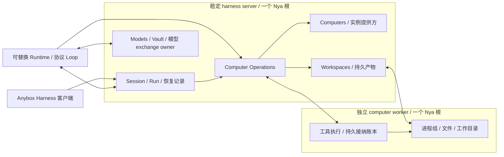
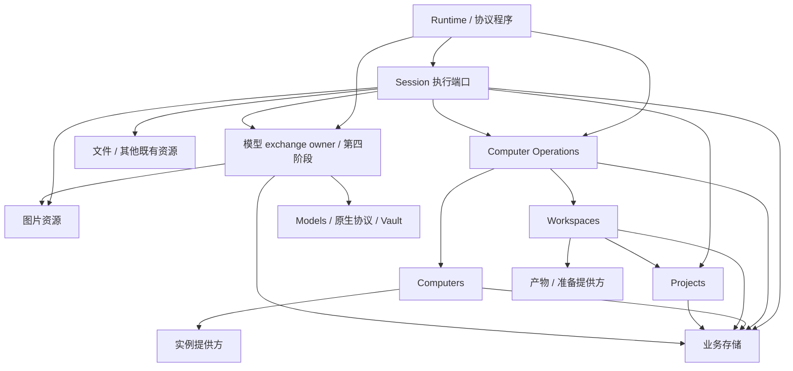
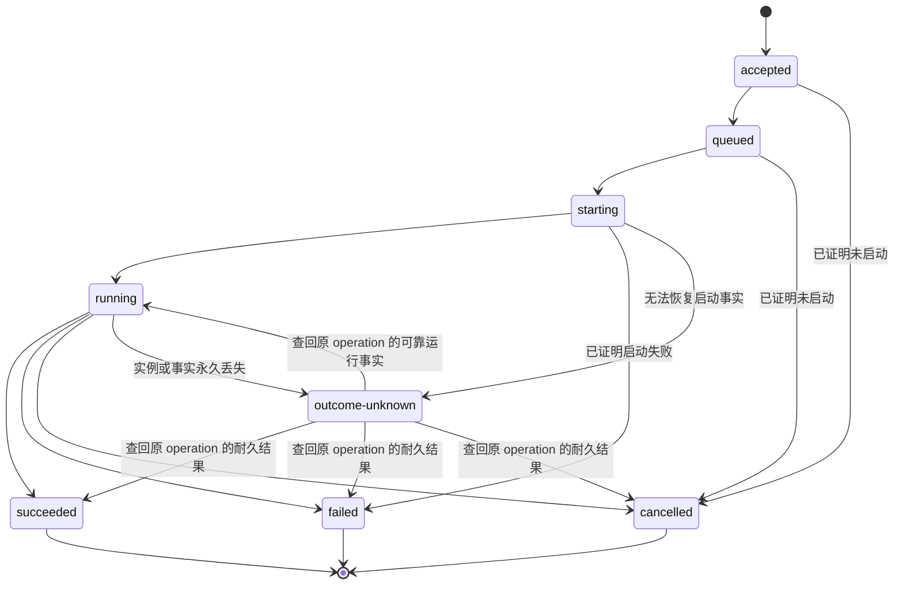
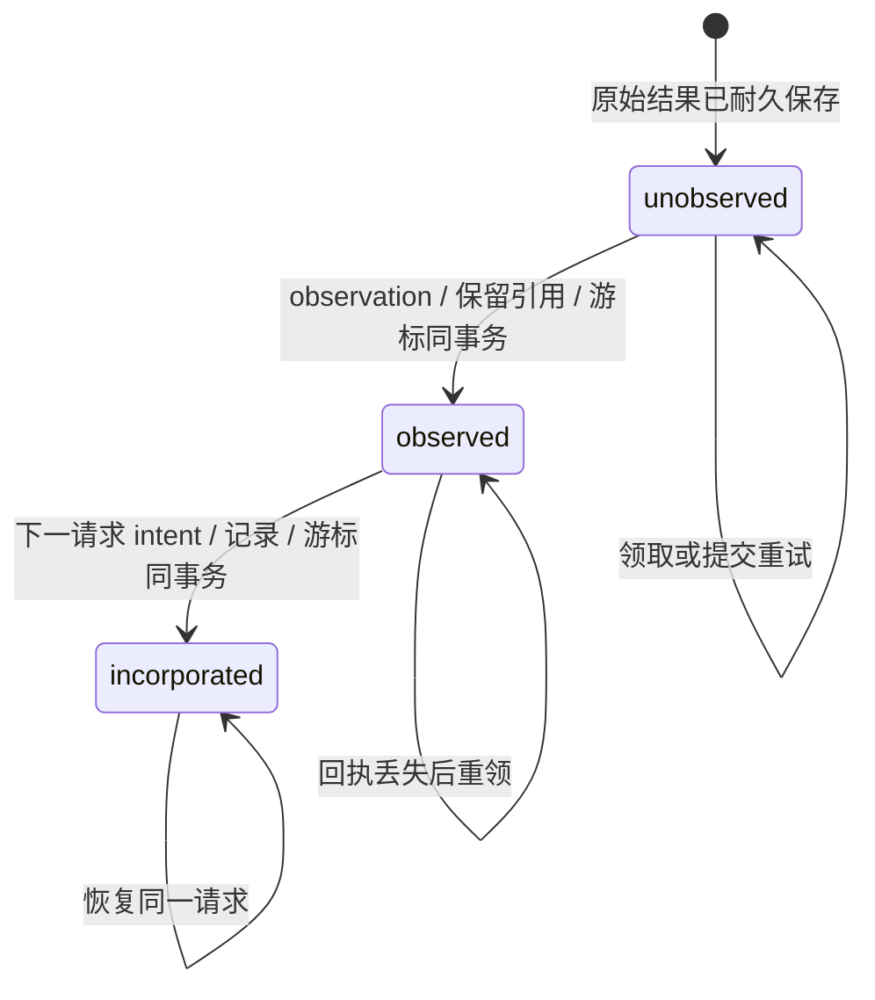
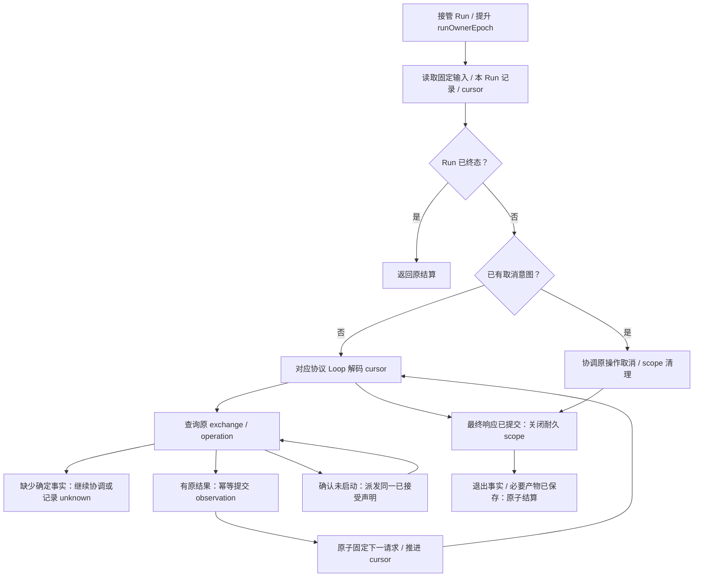

# Computer 资源抽象与演进设计

[文档首页](README.md) · [组件手册](modules/README.md) · [原生协议框架](native-protocol-agent-framework-design.md) · [宿主与应用边界](harness-module-boundary.md)

状态：**目标设计，待实施**。整理日期：2026-10-10。本文定义 Anybox Harness 的 computer 资源边界、持久提交协议与分阶段验收，不代表当前已有这些组件、接口或恢复能力。实际组件在实现时再建立源码、迁移及独立组件手册；本次仅新增本文并更新文档导航。

## 1. 目标、现状与部署边界

Computer 是智能体按需使用的执行资源。Agent 身份、Session、Run 与历史归稳定的 harness server；具体机器、工作目录和进程归执行提供方及 computer worker。创建 Session、模型请求及计划状态操作不要求分配 computer，Shell 和文件工具才声明计算资源需求。

目标分为三个可分别验收的能力：

1. 按需激活：持久接纳工具声明后，再复用、启动、创建或替换执行实例，并准备工作区。
2. Runtime 重启接续：已接受操作不依赖 Runtime 存活；新 Runtime 读取恢复记录，观察同一次执行，不重新发出命令。
3. 跨机器执行：同一 Authority 下保持项目、Session 和 Run 身份，通过更换工作区的执行绑定，让后续操作在其他机器执行。

当前实现已经将 Session 持久事实与临时执行句柄分开，并具有 [RunRuntime 操作屏障](../src/applications/harness/core/run/runtime-component.ts)。但工具仍由 Runtime 同进程直接调用，[进程组件](../src/applications/harness/core/tool/process-component.ts)持有内存 scope；[Session 启动恢复](../src/applications/harness/core/session/sqlite-records.ts)将遗留活动 Run 结算为 interrupted。当前多设备连接是不同完整 harness server 的访问入口，没有工作区同步或执行调度。本文不把这些现状描述为已实现的 computer 服务。

### 1.1 三种部署角色

| 角色 | 持有的权威状态与资源 | 重启边界 |
| --- | --- | --- |
| Authority：稳定 harness server | 稳定 instanceId、项目与 Agent 配置、Session/Run、原生记录、恢复游标、Models/Vault、computer 控制账本、已接纳结果与持久产物引用 | 保留数据库和产物即可重建控制状态；网络中的未保存结果仍须协调 |
| Runtime：可替换协议执行者 | 本代协议 program、owner 租约、临时展示、观察连接；第四阶段以前还持有模型 execution | 换代只释放本地资源和推进权限，不隐式取消已接受 computer 操作 |
| Computer worker：独立执行者 | 确切实例上的进程组、文件操作、工作目录、执行账本、输出、补丁队列和临时资源 | 不随 Runtime 消失；自身故障能否接管进程取决于执行监督能力，不能凭持久 ID 宣称已恢复 |

此图表达目标部署和调用方向，不表示全部组件已存在，也不表示跨进程能够直接 inject。初期 Authority 与 Runtime 留在当前进程、同一个根；worker 从第二阶段起必须在独立进程及独立服务生命周期中运行。第四阶段让 Runtime 独立部署，Authority 和模型 exchange owner 保持存活。每个进程一个 Nya 根，跨进程通过受信 API 和本地代理服务访问，不建立项目、Session、Run 或 computer 子 Context。

Authority 业务 SQLite 继续单实例排他持有，worker 和独立 Runtime 不直连它。worker 自己的执行账本使用独立持久存储。Runtime 与 worker 不能放在同一个会被共同终止的 service/cgroup 中；否则强杀 Runtime 仍会杀掉命令。

### 1.2 接续承诺的范围

第二、三阶段保证已提交模型响应之后的工具等待与结果消费接续。第四阶段通过独立模型 exchange owner 覆盖任意 Runtime 阶段的重启；该承诺要求 Authority、模型执行 owner 和相关 worker 仍能提供原执行事实。

跨机器首期迁移工作区并执行后续操作，不迁移正在运行的 OS 进程、管道或网络连接。执行机器永久丢失且无法取得结果时，保存 outcome-unknown，不自动重放可能产生过副作用的操作。任意 Shell 外部副作用不承诺 exactly-once；同 ID 去重只保证重传不会被当作新声明。

## 2. 资源抽象、身份与提供方

| 对象 | 持久身份及事实 | 不承担的职责 |
| --- | --- | --- |
| ComputerResource | computerId、环境规格、操作系统/架构、工具能力要求、提供方选择策略、activationRevision；可以尚无实例 | 不保存进程或 SDK 句柄，不解释原生模型响应 |
| ComputerInstance | computerInstanceId、computerId、instanceGeneration、提供方原始实例引用、健康与生命周期事实 | 不冒用替代实例的身份；与 Authority 的 instanceId 分开 |
| Workspace | workspaceId、projectId、模式、环境规格、持久 checkpoint/revision、产物保留规则 | 不把机器绝对路径当作跨机器身份 |
| WorkspaceBinding | workspaceId、确切实例及代次、workspaceEpoch、准备基线 revision、worker 本地路径和准备凭证 | 不允许按 computerId 在执行时重新解析当前机器 |
| ComputerOperation | operationId、runId、工具契约和参数摘要、资源需求、独立机器绑定、控制及执行事实、原始结果引用 | 不持有 Runtime 闭包；不直接推进 Session 或协议 Loop |
| ProcessRef | worker 分配的持久进程身份、Run scope、确切实例代次；模型 session_id 的受信映射 | 不表示可跨机器迁移的进程，不作为任意访问凭证 |

首期每个工作区默认使用一个逻辑 computer，多个 Run 可以共享其激活。Session 不拥有机器；按会话或按任务分配实例属于后续明确策略，不作为抽象的固定映射。

实例提供方负责检查、复用、启动、创建、停止和回收中实际支持的能力。固定本机/远端 worker 提供方与托管容器/VM 提供方使用同一资源边界，但回收固定设备租约不等于关闭或销毁用户机器。首期受信提供方随组合启动，不引入运行期工具插件注册。

SDK 类型、错误、认证句柄和连接留在适配器内。环境要求显式匹配工具语义；Linux、macOS、Windows 之间不自动翻译 Shell、路径或依赖。新增提供方不代表已有 Unix 工具获得 Windows 支持。

## 3. Nya 组件依赖与生命周期

下表的新增组件名和服务名是目标约定。当前 Projects、Session、Models 等组件继续按现有边界工作，实施各阶段时才调整其真实依赖。

| 目标组件 / 服务 | inject 的服务边界 | 资源所有权、准入与 Effect |
| --- | --- | --- |
| harness-computers / harness.computers | local-storage、受信实例提供方端口 | 拥有资源登记、激活任务、实例绑定、固定引用与回收计时器；停止新准入，停止本代调度并等待提供方调用真实退出，保留已提交任务供协调 |
| harness-workspaces / harness.workspaces | harness.projects、local-storage、产物和工作区准备提供方端口 | 拥有工作区版本、写租约、准备及 checkpoint；停止新操作，取消并等待本代文件、上传和数据库工作，不丢弃已发布事实 |
| harness-computer-operations / harness.computer-operations | local-storage、harness.computers、harness.workspaces | 拥有接纳账本、待派发记录、派发/查询/结果回收与取消协调；Effect 关闭本地泵和观察并等待退出，不把远端任务自动改为 cancelled |
| 既有 harness-sessions / harness.sessions、harness.session-runs | 现有项目/存储/图片/文件服务，新增 harness.computer-operations；第四阶段增加模型 exchange 事务端口 | 拥有 Run、原生记录、工具观察、恢复游标和 owner；关闭准入并等待已接受状态提交，仍是所有 Session/Run 查询边界 |
| 既有 harness-run-runtime / harness.run-runtime | harness.session-runs、harness.computer-operations、对应协议服务；第四阶段使用模型 exchange 端口 | 只拥有本代 program、租约、展示和观察；换代阻止本代推进，取消本地观察并等待退出；前期还须清理其本地模型 execution |
| harness-model-exchanges / harness.model-exchanges（第四阶段） | Models 公共原生服务、local-storage、既有图片资源服务 | 独占模型 execution、驱动租约、请求、原始响应及实际退出；Runtime 换代不卸载它；其自身关闭取消并等待实际模型操作退出 |
| computer-executor / computer.executor（worker 根） | worker 独占账本、工作区本地解析端口、实际工具端口 | 拥有执行接纳、进程 scope、输出与结果回传；停止领取，取消并等待本机资源，保存真实退出和清理事实后关闭 |

提供方拥有网络、凭据、挂载或文件资源时才是实际 Nya 组件；纯映射、选择策略、状态归约器和参数校验不另建组件。worker 根的工具实现只解析已固定的本地 binding，不读取 Authority SQLite，不依赖远端 Session 服务。

依赖箭头指向提供方；跨进程时对应本根代理服务。Projects 不依赖 Workspaces，Computers 不依赖 Operations，Operations 和模型 exchange owner 不依赖 Session/Runtime，避免事务接纳或结果通知形成依赖环。Computers 按自己持有的 pins/leases 决定可回收性，由 Operations 通过受信接口原子建立和释放固定引用，不反查队列。

组件从 apply 的 deps 使用本轮快照，宿主边界从根 context.get() 获取当前服务，不缓存跨重启引用。apply 初始化后返回；后台循环由 Effect 登记，取消并等待实际退出。Nya 管本根资源的依赖与清理，执行队列和恢复协议属于应用持久数据，不在组合根复制依赖图。

Run 准入与产品 busy/停止 guard 必须基于已接受 Run、未结清 scope 和持久控制状态，而不能只看 Runtime 的内存 Map。目标准入不以 Runtime 当前可用作为已接受 Run 的所有权；Runtime 缺席时，记录仍在，停止应用仍能识别忙碌或发起明确关闭。

## 4. 持久化边界与提交协议

### 4.1 数据与资源归属

| 边界 / 目标迁移域 | 保存内容 | 原子性及清理责任 |
| --- | --- | --- |
| Session / 既有 run-state 的后续版本 | 接受 Run 的固定输入/初始化/模型身份、父引用、操作意图、observation、原生记录、resume cursor、owner、终态和节点 | 使用现有业务连接；成功记录、节点、引用及终态仍同事务提交 |
| Computers / computers | 逻辑需求、激活声明、实例代次、资源 pins/leases、生命周期事实 | 组件登记自身迁移，不让通用存储解释领域数据 |
| Computer Operations / computer-operations | 不可变声明及摘要、待派发记录、机器绑定、取消意图、执行回执、原始结果元数据和消费标记 | 与 Session 使用同业务事务参与；不直接修改 Session 表 |
| Workspaces / workspaces | 工作区模式、revision、epoch、写租约、binding、manifest/checkpoint 及产物引用 | 元数据在业务库；发布引用前验证对应字节已经耐久保存 |
| worker 独占执行账本与输出存储 | 接纳回执、启动/进程绑定、stdin 操作、输出 chunk、调用结果、部分补丁事实、scope 清理 | 独立于 Authority 存储；不能与 Authority 建跨库事务 |
| 产物提供方 | checkpoint 文件和产物原字节、摘要、传输及保留凭证 | 字节先保存、指针后发布；未发布对象按保留凭证回收 |
| 模型 exchange owner / model-exchanges（第四阶段） | 已接受 exchange 声明、请求/响应原始记录、结果和退出事实 | 与 Session 接纳同样采用事务参与；execution、凭据和网络句柄只在私有边界 |

领域迁移的具体版本在对应实施阶段分配；本文不提前写迁移、不重写旧原生 JSON。Models JSON、目录缓存、Vault 与业务库的现有所有权不改变。worker 账本不能只保存 PID：PID 可复用，必须能证明原 operation 与实际进程/监督实例的绑定，否则恢复为未知结果。

Authority 确认原始结果及其引用耐久可读之后，worker 才可释放结果副本。图片继续保存不可变原字节：工具读图先回传并获得导入凭证，Session 再同事务 retain，worker 不持有 Authority 的事务对象。输出限制、截断和部分变更是结果事实；不能把尚在机器目录里的文件当作已持久化产物。

### 4.2 最小受信接口

| 端口行为 | 语义 |
| --- | --- |
| Computers.reserveIn / pinIn / releasePinIn / get | 同步参与业务事务，登记需求、固定确切实例或释放引用；释放不隐式取消其他使用者 |
| Workspaces.reserveIn / bindIn / releaseIn | 同步参与业务事务，登记逻辑需求、提交已准备 binding 与写租约、释放归属 |
| Workspaces.prepare / checkpoint / retire | 在事务外准备确切 binding、保存 checkpoint 字节和撤销实际写入能力；耐久元数据通过同步事务端口提交 |
| Computer Operations.acceptIn(tx, intent) | 同步参加 Session 的业务事务，接纳声明及待派发记录，不启动网络或工具 |
| Computer Operations.get / watch | 查询原 operation 或观察更新；watch 的 cancel/done 仅管理本地连接 |
| Computer Operations.requestCancelIn / closeScope | 持久接纳明确控制意图；closeScope 本身也有稳定 operation ID |
| Computer Operations.markObservedIn / markIncorporatedIn | 同步参加消费事务，记录原结果已观察/进入请求，重复相同事实返回既有提交 |
| Session 执行端口 claimRun / loadRunResume / commitResume | 校验 owner，读取固定输入、本 Run 事实与游标，提交原子推进；不暴露任意表写入 |

这些是目标行为契约，不是当前 API。提交工具仍通过 Session 执行端口复核 Run、工具声明、取消及 owner，再调用 acceptIn；Runtime 不绕过 Session 直接产生执行副作用。同步事务参与沿用既有 [图片 retainIn](../src/applications/harness/core/image/port.ts)与[文件快照 retainIn](../src/applications/harness/core/project-files/port.ts)的方式。等待者取消不等于远端执行取消，本地 OwnedCall.done 不等于远端 operation/scope 已退出。

### 4.3 五个提交边界

1. **声明接纳**：整个工具批次先校验。协议 Loop 固定批次及每个 operationId；Session 在同事务保存当前工具 intent、待派发记录和 resume cursor，Operations 经 Computers/Workspaces 的同步事务端口登记逻辑需求，提交后才允许派发。
2. **实例与执行绑定**：Operations 完成激活及准备后，在同一业务事务中首次固定 operation 的确切机器代、实例 pin、workspace binding 与写租约；提交后 worker 才持久接纳同 ID/摘要及绑定，再协调启动。不能向替代机器重发已经可能启动的操作。
3. **执行事实耐久保存**：worker 保存真实结果、调用退出、截断、部分变更和清理事实；回传 Authority 并取得耐久确认。远端存储失败时保留本地结果并继续回传，不重新执行工具。
4. **Session 观察提交**：在同业务事务内写 observation、保留资源引用、标记 observed、推进工具批次游标和限额。回执丢失后重复领取同结果，不新增事件或重复计数。
5. **下一原生请求固定**：Loop 生成对应协议的增量工具结果及资源引用；同事务保存请求 intent/记录、标记 incorporated 并推进游标。提交后才能开始该模型 exchange。

operationId 一经保存，恢复就复用它。不可变声明摘要覆盖工具契约、参数、工作区身份/基线和资源需求；授权、当前 Runtime owner 和交付次数不属于声明摘要。首次派发绑定单独持久固定，重试不能重解析目标。Authority 和 worker 均执行同 ID 同摘要返回原回执、不同摘要冲突。

这些事务不等待网络、实例启动、文件准备或上传；各组件只通过自己的同步参与接口写所属表。返回存活 ProcessRef 时，同事务保存进程/scope 映射并将 operation 的实例与工作区固定引用交给 scope，不出现先释放、后补 pin 的间隙。引用持续到实际 scope 退出及必要结果/产物耐久保存；取消和回收只读已提交的引用事实，不能用分离的异步 acquire/release 冒充原子保证。

worker 的“记录 starting → spawn → 保存进程绑定”存在非事务性窗口。实现必须通过稳定作业监督/查回机制识别原执行；没有证据时进入协调或 outcome-unknown，不能因为启动确认丢失就再次 spawn。控制请求、stdin 和 scope 清理也各自去重。

### 4.4 三层栅栏

| 字段 | 变化时机 | 校验边界 |
| --- | --- | --- |
| runOwnerEpoch | 同一 Run 被新 Runtime 接管 | 接纳新操作、提交游标、接纳新的 exchange 声明和结算都拒绝旧 owner；已接受操作由其独立 owner 启动或继续，不因租约失效取消 |
| instanceGeneration | 逻辑 computer 更换确切实例 | execute/stdin/cancel/prepare/checkpoint 固定原 computerInstanceId 与代次，不转向当前实例 |
| workspaceEpoch | 恢复、替换或移交工作区写权 | 阻止旧 binding 发布新内容 head；内容 revision 与写权 epoch 分开 |

Authority.instanceId 不随 Runtime 重启改变。worker 在同一机器重启时先识别原资源，不因进程重启自动冒充新机器代；身份无法证明时更换实例并协调旧操作。runOwnerEpoch 是本次调用授权，不进入 operation 声明摘要；新 owner 查询原执行保留原机器和工作区绑定。

原执行结果按 operationId、绑定和摘要接纳，不因旧 Runtime owner 失效而丢弃；只有当前 owner 可以据此推进 Run。旧实例迟到的结果可保存为原 operation 的事实，但不能覆盖新 workspace head。租约超时或 epoch 增加不能停止已运行 Shell：迁移必须证明旧写入已经退出，或由真实隔离机制撤销旧写入能力。

## 5. 按需激活与重启接续状态机

以下都是业务状态，与 Nya Fiber 的 ACTIVE/PENDING/FAILED 分开。某个资源激活失败不等于整个组件 FAILED；组件资源清理或初始化故障仍遵守 Nya 的失败语义。

### 5.1 激活与排队

只有接受计算机工具 operation 后才建立资源需求。Computers 按 computerId + activationRevision 共享一个持久 activationId，提供方复用、启动、创建或查回实例；Workspaces 再准备指定基线、辅助环境和授权。实例 ready 只表示机器可用，binding ready 才表示该工具可执行。

排队原因单独记录为激活、工作区准备或容量/写租约等待。激活声明、提供方幂等标识和结果用持久 CAS 协调，内存 Promise 合并仅是优化。创建已发生但回执丢失时查询同 activationId；迟到激活结果不能覆盖新修订的绑定。取消一个等待者不取消其他需求；长进程、已接受操作和未回收产物共同固定实例，需求全部退出后才能回收。

### 5.2 Computer operation 执行状态

| 状态 | 可依赖的事实 |
| --- | --- |
| accepted | Authority 已耐久接纳完整声明，不代表 worker 已启动 |
| queued | 等待资源、准备或容量；保存具体原因 |
| starting | 固定机器绑定，正在与执行端协调接纳及启动；确认丢失时查同一 operation |
| running | 执行端确认同一次调用已启动；当前联通性另存 |
| succeeded / failed / cancelled | 已保存可验证的调用结果与实际退出/清理观察；正常工具业务结果、执行器失败和取消分别表达 |
| outcome-unknown | 经过协调仍无法确定关键事实，禁止自动新建尝试和推进后续副作用 |

暂时断网只改变协调/可用性状态，不直接把 running 改为 failed 或 outcome-unknown。若后续找回原 operation 的可靠运行或结果事实，按原身份补齐状态并保留未知状态的审计记录，不创建新 attempt。已结算的 Run 不因补齐操作事实而重新开放或产生可继续节点。

工具操作 succeeded 表示取得符合工具契约的观察，不等于 Bash 退出码为零、补丁完整 applied 或 Run 成功。failed 必须保留已有部分结果和清理错误，不能把无法确认退出伪造成已清理。Codex exec 调用完成后进程仍可存活，其资源归耐久 Run scope；此图不表达该进程或 scope 已退出。

取消请求是独立、单调的控制事实，不以网络请求取消代替。执行端已观察取消时不再启动新工作；取消与启动并发时，保留真实启动及退出观察，Authority 不能仅因发出取消就宣布清理完成。

### 5.3 结果消费状态

unobserved 表示存在原结果但 Session 未观察；observed 表示原结果、资源保留、工具游标和额度已提交；incorporated 表示已进入固定的下一次增量原生请求，不代表网络调用已完成。取消、失败或最终清理无需把每个 observed 结果都送入模型，允许在 observed 结束并保留事实。

原始结果用摘要检测冲突。重复相同观察或请求固定返回原提交，不重复新增记录、计入输出或追加工具消息。Computer 完成、Session 观察、下一请求固定和 Run 成功是四个不同边界。

### 5.4 活跃 Run 恢复流程

原生 Run 的现有写入阶段仍是 active/terminal；[执行归约器](../src/applications/harness/core/run/execution.ts)中的 ready-model、model-in-flight 等阶段属于旧格式兼容读取，不恢复旧 writer。新增独立版本化 RunResumeRecord，使用 [Session 执行端口](../src/applications/harness/core/session/port.ts)提供 loadRunResume 和接管/提交入口，与成功父链 NativeHistory 分别建模。

恢复记录包含固定 Run 输入、初始化/工具声明、模型语义身份、父引用、本 Run 增量记录、稳定 exchange/operation ID、批次及消费位置、已计入的限额、取消/清理事实，以及协议 Loop 的不透明 cursor。Session 只保存和验证版本化信封，Runtime 管通用操作和 owner，协议 Loop 独占 cursor、工具结果编码及原生停止语义。

恢复不重新应用 task-template，不读取新 Prompt 替换已接受初始化，不重新选模或生成工具 ID。当前注册代只作为本代租约；持久协议身份按 protocolId、driver/Loop/记录兼容版本及模型语义验证。旧 generationId 保留审计，不能要求跨进程重启后仍相等；也不能绕过 historyScopeEpoch 或跨账户继续。

| 崩溃窗口 | 恢复动作 |
| --- | --- |
| Run 已接受、模型尚未提交 | 读取固定输入和游标，固定或提交同一 exchange；不重新接受 Run |
| 工具意图/待派发事务未提交 | 无可派发声明；按已保存模型响应和协议游标继续 |
| 工具声明已保存、worker 接纳回执丢失 | 查询或重传同 ID/摘要到原实例，禁止生成新命令 |
| 命令正在执行 | 新 owner 观察原 operation；owner 失效不取消它 |
| 原始结果已保存、Session 未观察 | 领取原结果，同事务提交观察、保留引用和游标 |
| observation 已提交、Runtime 未收到确认 | 返回原观察，从新游标继续，次数和额度只计一次 |
| 下一请求已固定、尚未证明是否发出 | 查询 exchange owner；第四阶段以前无法排除已发出时停止自动重发 |
| 取消已保存、退出未确认 | 继续取消协调，保持 cancelling，不恢复正常操作准入 |
| 最终响应或 scope 清理已完成、结算未确认 | 读取原关闭操作和结算记录，节点及终态只提交一次 |
| 原机器/执行账本永久丢失 | 保留已知输出、部分变更和 outcome-unknown；不重放未知剩余副作用 |

### 5.5 Codex 进程会话

worker 持久保存数字 session_id 到 ProcessRef 的映射，ProcessRef 固定实例、代次和 Run scope。每次 exec、write_stdin、输出查询及 closeScope 都有独立稳定 operationId；不能依赖组件重启后从 1 开始的内存计数恢复。

输出使用不可变 chunk 与 offset/cursor。每次调用返回的字节范围及结果固定保存，重复同 operation 返回同一次观察，不破坏性 drain 下一段输出，也不重复计入额度。stdin 接纳账本与实际管道写入之间仍有故障窗口；执行监督无法证明原写入时保存未知事实，不重写输入。

区分三个退出屏障：本地观察连接退出、工具调用资源退出、Run 进程 scope 退出。Codex 提前返回 session_id 后，scope 继续固定实例与写租约。正常 Run 完成提交幂等 closeScope，等待真实进程组清理并保存 tool-process-cleanup 观察之后才结算。

### 5.6 模型 exchange 的演进

第二、三阶段仍由现有 program/Runtime 持有模型 execution，只保证模型响应已提交之后的工具接续。请求已经发出而响应未提交时，不把悬空请求当作未发送；保留未决事实并停止自动重发。当前 [Models 恢复校验](../packages/models/src/execution.ts)要求可验证的完整原生记录，computer 服务不能修复丢失的响应流。

第四阶段由独立模型 exchange owner 接纳稳定 exchange、持有 NativeExecution/驱动租约并保存原始响应与实际退出。Runtime 仅观察同一次 exchange，Session 同事务接纳原生事实及 cursor。原 execution 的所有权从 Runtime 移交，不能两边同时 close/cancel；模型 owner 位于 Runtime 进程重启边界之外。

保持 packages/models 独立包和四种原生协议，Loop 仍解释原生结果，不恢复统一文本 API。恢复新 execution 时使用已接受语义快照和受信凭据解析，验证连接、模型、参数、协议及账户 epoch；不能静默改用当前配置。若模型 owner 自身丢失未保存响应且提供方无法查回，仍记录未知结果，不承诺任何进程故障下全程恢复。流式展示保持临时投影，不作为恢复事实。

## 6. 工作区、跨机器、关闭与兼容

### 6.1 两种工作区模式

| 模式 | 首期行为 |
| --- | --- |
| pinned-local | 旧项目默认，固定 worker 与其绝对目录；保留现有项目路径和共享目录语义，支持 Runtime 接续，不承诺目录跨机器迁移 |
| portable-managed | 用户显式启用，稳定 workspaceId、持久 manifest/checkpoint 和环境规格；本地路径仅是 binding，允许安全边界更换执行机器 |

Projects 保留业务身份及展示归属，Workspaces 保存内容和执行绑定。不同机器相同路径不代表同一项目；portable 的当前路径由 binding 给出，不通过改写旧项目路径冒充迁移。原有客户端 h:<instanceId>:<resourceId> 继续绑定 Authority，不因 computer 更换变成跨实例输入。会话跨 Authority 迁移不在本方案首期范围。

准入必须随模式区分：pinned-local 保留目录可用性检查，worker 分离后检查固定执行设备上的原目录；portable-managed 由 Projects 校验稳定项目身份，由 Workspaces 校验持久工作区及 checkpoint 元数据，不能要求 Authority 本机存在项目目录。Workspaces 读取 Projects 的身份元数据，Projects 不反向注入 Workspaces。创建 Session 和纯模型 Run 不要求 ready binding；计算机工具执行前才验证对应实例上的准备结果和写租约。

第三阶段也须检查项目目录浏览、搜索和新文件快照捕获的读取位置：读取当前文件时显式声明资源需求并固定目标 binding，不能继续读取 Authority 的同名路径。既有 Project Files 服务仍拥有不可变快照、保留凭证与业务迁移；复用已保存快照不激活 computer，读取提供方的依赖调整须保持与 Session/Operations 的依赖无环。

portable 首期每个工作区只允许一份可写 placement，按 Run 持有排他写租约直到长进程 scope 真正关闭。模型调用可并行，同父节点并发 Run 仍允许，但共享托管工作区的工具副作用排队。Session 对话树不自动成为文件系统分支；并行写工作区及自动合并留待独立设计。

checkpoint 明确保存所管理文件的原字节、未提交文件、生成物、必要文件属性和摘要；环境依赖由环境规格说明。不能只同步 Git commit 就宣称工作区可恢复。工作区外路径、系统安装状态和外部服务副作用不自动迁移；项目/工作区边界不等于文件系统沙箱。portable 中外部修改须验证基线并报告冲突，不能静默覆盖。

### 6.2 跨机器切换顺序

1. 暂停该工作区新操作，并固定切换意图。
2. 等已接受调用和所有长进程 scope 实际退出；无法证明退出或隔离时不移交写权。
3. 保存并校验 checkpoint、产物原字节和摘要，确认持久可读。
4. Authority 原子发布 checkpoint/revision，撤销旧 placement 写权并提升 workspaceEpoch。
5. 新实例恢复指定 revision，准备环境并验证新的 binding。
6. 新 binding 就绪后继续后续操作。旧机器的 stdin、取消和产物请求仍只能指向其原资源。

机器故障时最多从最后耐久 checkpoint 在新实例继续后续或明确新建的操作；已启动且结果未知的操作阻止自动推进，不在新机器补执行。checkpoint 上传后尚未发布就崩溃时，旧 head 仍有效，按同一发布声明协调，不把孤立上传当作新 head。

### 6.3 取消、Effect 与关闭

| 控制意图 | 必须执行的行为 |
| --- | --- |
| 客户端断开 / watch.cancel | 关闭本地观察并等待连接退出，不发送 Run 取消 |
| Runtime 换代 / 进程消失 | 阻止旧 owner 推进，清理本代本地资源；已接受 computer 操作继续，新的 Runtime 接管 |
| 用户取消 Run | Session 先持久记录取消，停止新操作接纳；执行端终止原操作并回传真实结果、部分变更及清理事实 |
| Run 正常完成 | 提交 scope 关闭，等待调用和进程资源退出、必要产物发布，保存清理观察，再原子创建成功节点 |
| worker 关闭 | 停止接纳，取消并等待本机作业/上传/临时资源，保存事实；不能报告进程退出但未观察退出 |
| 停止 Agent / 应用宿主 close() | 普通产品停止继续保守拒绝忙碌；明确整套关闭先持久取消并排空，再卸载本根组件。只重启 Runtime 使用不同控制意图 |

应用明确关闭不由 Runtime Effect 暗推断。宿主在卸载前发起持久取消并协调；各 Effect 只清理自己本代的实际资源。远端失联时不能宣称取消或清理成功：保留未决取消记录，按配置的关闭期限退出本地观察并报告未确认远端退出，close 聚合错误，禁止成功节点。恢复后继续处理未完成的取消和清理。

新 Run 的持续工作归属由持久账本保护，忙碌检查不随 Runtime Map 清空而消失。整根关闭仍阻止业务及控制新准入并等待已接受本地写入和实际清理；不会为了远端等待而遗留本地无主连接。

### 6.4 认证与兼容

worker 使用独立受信身份和执行授权；远端通过 TLS，凭据由对应系统 Vault/提供方私有保管。不能下发当前全权限设备 token。每个操作授权固定 Authority、worker、实例代次、工作区 epoch、operationId、工具契约/参数摘要和资源范围，授权期限约束接纳而非把超时当作已取消。

worker 没有模型 Key 和 Session 通用写权限，不接受浏览器任意 URL 或动态工具实现。第三方错误、认证头、凭据、SDK 句柄不进入历史；原生敏感 continuation 继续只在受信记录中保存，浏览器仍接收白名单展示。

保留现有 Session/Run/project ID、native-local-v1、NativeRunInput 和旧原生 JSON。新增的执行及 resume 信封独立版本化，known-tools-v1/tool-library-v1 继续读取，传输变化不机械升级模型工具声明。没有 worker 接纳凭证和新恢复信封的旧活动 Run 仍结算 interrupted；不得凭 tool-started 推断命令尚未执行或可重新接管。

实现时同步调整 Runtime/Session/工具/部署文档及生命周期测试，删除不再使用的活动执行路径。第四阶段的模型所有权移交不得与旧“Runtime 独占 execution”的描述并存。

## 7. 分阶段交付与验收

### 7.1 阶段退出标准

| 阶段 | 交付范围与接续承诺 | 必须通过的退出标准 |
| --- | --- | --- |
| 1：资源契约 | 实体、提供方、内部工具信封和按需需求；旧项目映射 pinned-local。进程内过渡实现不承诺进程崩溃后执行继续 | 创建 Session、纯模型 Run 和计划操作不激活 computer；计算机工具才准备资源；同声明冲突检测；旧项目/工具契约/历史兼容；依赖无环和本代清理等待 |
| 2：本机持久 worker | 独立 worker、两端接纳/结果账本、scope 与输出 cursor、Session 活跃 Run 恢复。保证已提交模型响应之后的工具等待接续 | Bash 运行时强杀 Runtime，副作用计数为 1，新 Runtime 取得原结果；接纳/消费确认丢失不重复执行或计数；旧 owner 被拒绝；Codex 会话恢复不重复 stdin；cancelling 继续清理；未保存模型响应明确未决；旧 Run 仍 interrupted |
| 3：远端与托管工作区 | 固定远端 worker、portable-managed、产物保存、排他写租约和安全边界移交；同一 Authority 跨机器后续执行 | 两台真实机器通过认证连接；A 产生未提交文件和产物并发布 checkpoint，A 退出后 B 校验字节/摘要并执行后续操作；旧 A 不能发布新 head；运行中 scope 阻止移交；不同 OS/工具能力不兼容时明确拒绝 |
| 4：独立模型 exchange | 模型 execution/原始响应移交稳定 owner，Runtime 独立部署；覆盖任意 Runtime 阶段，但不承诺执行 owner 故障后找回丢失网络流 | 模型流式请求中杀 Runtime，owner 继续并返回同一响应；响应保存/Session 接纳确认丢失仅提交一次；工具结果 incorporated 后不重复追加；清理/最终结算窗口重启只创建一个节点；账户 epoch 改变阻止不兼容续接 |
| 5：弹性提供方 | 按需容器/VM 的创建、恢复、共享激活、容量和闲置回收 | 并发冷调用共享一次激活；提供方创建成功但确认丢失能查回同实例；迟到激活不能覆盖新绑定；取消一个等待者不影响其他需求；已接受任务、长进程和未回收产物阻止提前回收 |

每个阶段同时维护对应实际组件手册和导航，并运行 npm run check。普通行为测试使用临时存储、内存凭据、受控模型和提供方，不在构建/测试中隐式创建云资源。真实两机及系统凭据验收单独记录设备、版本、故障注入与退出事实，模拟通过不代替真实跨机器验收。

### 7.2 故障注入矩阵

| 故障点 | 预期可观察结果 | 首次必验阶段 |
| --- | --- | --- |
| 工具声明事务提交前退出 | 无待派发副作用；恢复读取已提交协议事实 | 2 |
| worker 已接纳，Authority 未收到回执 | 重传同 ID 得到原回执，命令仅启动一次 | 2 |
| starting 后执行监督无法证明是否 spawn | 保留协调/unknown，不重新启动命令 | 2 |
| 原结果已保存，Session 消费前退出 | 恢复消费原结果，保留引用和观察原子提交 | 2 |
| observation 提交后确认丢失 | 事件、工具次数和输出额度各计一次 | 2 |
| stdin 写入或输出查询后确认丢失 | 返回原操作结果；无法证明原写入时不重写；输出范围不重复消费 | 2 |
| 取消已提交但 worker 断网 | cancelling/协调持续存在，不报告清理完成 | 2 |
| Apply Patch 部分提交后故障 | 保存可证明 changes/pending；未知剩余部分不自动重放 | 2 |
| 新 Runtime 接管，旧 owner 恢复网络 | 旧 owner 的新操作、游标提交和结算被拒绝，原执行事实仍可接纳 | 2 |
| checkpoint 上传后、发布前退出 | 旧 head 不变，同发布声明可恢复；孤立产物按凭证回收 | 3 |
| 机器替换后旧 worker 迟到 | 原结果仅归原 operation，不能操作新实例或覆盖新 head | 3 |
| worker 永久丢失且结果未知 | outcome-unknown，后续副作用停止，无自动新命令尝试 | 3 |
| 模型响应未保存且 Runtime 消失 | 阶段 2/3 明确未决；阶段 4 查询存活 owner 的原 exchange | 2、4 |
| 模型响应保存后、Session 接纳前退出 | 原生记录及 continuation 只接纳一次 | 4 |
| 工具结果 incorporated 后退出 | 重建原待提交请求，不重复追加工具消息 | 4 |
| scope 退出或成功结算后确认丢失 | 查回原清理/节点，成功节点只创建一次 | 2、4 |
| 提供方创建确认丢失、并发取消和迟到激活 | 查同 activationId，共享需求继续，旧修订不能覆盖当前绑定 | 5 |

以上验收同时检查数据库事实、执行计数、原始结果摘要和实际资源退出，不能仅以临时 UI 状态、Promise 返回或进程 PID 消失判断全部正确。

## 8. 实施及文档维护约束

本方案不要求新增 npm 包、修改通用宿主的领域分派边界或修改 NyaCore。实际实现继续位于 Anybox Harness 应用职责内，由 entrypoints 选择正式组合。只在阶段实施时创建已有实现需要的目录、组件及服务，不预建未来提供方、分支合并或多 Runtime 集群目录。

本次只保存跨组件目标设计及入口，不把规划组件加入当前模块组件清单。后续每个实际组件补独立 Markdown，明确工厂、服务、inject、资源和迁移归属、取消/退出、兼容边界与测试入口，并同步相关现状文档。

设计参考：[Tetral 文章中文译文](references/tetral-the-next-scaling-problem.zh-CN.md)。当前事实入口：[组件协作总览](harness-server-components.md)、[RunRuntime](modules/execution/run-runtime.md)、[进程工具](modules/tools/processes.md)、[Session](modules/sessions/session.md)、[Projects](modules/sessions/projects.md)、[业务存储](modules/infrastructure/local-sqlite.md)、[原生协议框架](native-protocol-agent-framework-design.md)及[部署边界](harness-server-deployment.md)。
