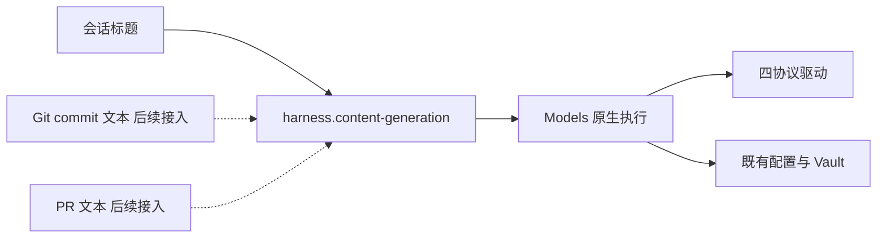

# Anybox Harness 通用内容生成设计

会话标题、Git commit 文本和 PR 文本都需要单次生成完整文本。本计划为这些功能提供同一个内容生成服务，复用现有 Models 的配置、系统凭据、原生协议和执行生命周期。状态为待实施；首个消费者是会话标题，Git 和 PR 功能在实际实现时接入。

公共服务负责模型选择、受控单次调用和资源退出；具体功能负责准备资料、提示词、内容校验、保存和失败处理。通用化不意味着用 Agent Run 执行生成，也不要求把 Session、Git 或 PR 领域放进 Models 包。

## 已有能力与缺口

| 能力 | 当前实现 | 计划处理 |
| --- | --- | --- |
| 模型、连接、参数与可用性 | `@anybox/models`、`models.settings` | 直接复用，不复制配置 |
| 系统凭据与协议代租约 | Models Vault、`models.protocols` | 直接复用，不新增 Key 管理 |
| 单次请求与完整结果 | `openNative → prepareExchange → start → result/done → close` | 直接复用原生执行 |
| 四协议 JSON 响应 | 四个原生驱动均已有非流式 JSON 分支 | 增加显式单次传输选择 |
| 公共文本生成调用 | 当前没有独立服务 | 新增宿主层内容生成组件 |
| 按用途选择模型 | 当前仅有新会话默认模型 | 新增内容生成设置，独立于 Session |
| 选模与设置交互 | `ModelsCatalog`、模型分组、不可用原因、CAS 草稿 | 复用现有 Web 实现方式 |

`start()` 不传 `onEvent` 可以只等待完整结果，但驱动仍可能发送流式请求。`requirements.streaming: false` 表示不要求流式能力，不表示禁用流式。当前四驱动根据 `capabilities.streaming` 设置 `stream`；不能为了本次调用而修改模型能力声明。

## 组件与业务边界

建议新增根上 Nya 组件 `harness.content-generation`，实现位于 `src/applications/harness/core/generation/`。它提供生成端口和内容生成设置端口，注入现有 Models、协议及业务存储服务，不依赖 Session、RunRuntime、Git 或 PR。



通用组件拥有有界队列、超时、取消信号、协议租约和独立 execution。它只接受文本，在无历史恢复、无本地工具和无搜索的条件下完成一次交换，返回完整正文与必要的白名单执行身份。原生记录、推理块、签名和凭据不进入返回结果。

每个协议分别构造请求并解释正常终态，可以抽取已有 Loop 中的纯构造和解析函数复用。不得复用 Agent 的工具循环、`RunHost.perform()` 或 `createExchangeRunner()`，也不创建临时业务 Run。工具请求、拒绝、截断、暂停或其他未正常完成的响应均返回明确失败，由消费者决定处理。

通用组件不保存一般生成任务或生成结果，不自动重放网络调用。Session 保存标题任务和名称；未来 Git、PR 功能持有自己的输入、草稿和操作状态。生成 commit 或 PR 的文本也不执行 Git 提交、推送或发布 PR。

首期在 Harness 内实现这一可复用组件，不增加 npm 包或未来业务目录。若以后另一个应用确实需要调用，可将不依赖 Harness 领域的执行部分提取为公共模块；用途设置和业务结果仍归各应用。

## 生成端口

建议提供受信内部调用，形状如下，具体类型名称在实施时沿用仓库约定：

```ts
generate({
  purpose: 'session-title',
  instruction: titleInstruction,
  input: firstUserText,
  signal,
}): OwnedCall<{
  text: string;
  modelId: string;
  settingsRevision: number;
}>
```

调用方提供用途和已经准备好的受限文本，公共服务解析该用途选定的模型。端口没有流式回调，保留 `cancel` 和 `done`；成功的 `result` 要等交换退出、execution 关闭和协议租约释放后才返回。

模型配置 ID 和设置修订号在生成准入时固定，排队期间更改用途设置不重新选模。Models 在 execution 打开时按现有规则捕获该配置的当前原生参数和凭据；随后修改只影响新 execution。首期仅接纳实际实现的 `session-title` 用途，新增功能时显式扩展受信用途清单，不建立动态工具或功能注册中心。

生成端口不直接暴露为可传任意提示词的公共 HTTP API。首期公开内容生成设置，标题消费方内部调用生成端口；后续消费者通过自己的业务入口准备资料并发起生成。

## 非流式传输

建议在现有 `prepareExchange()` 增加单次传输选项：

```ts
execution.prepareExchange(nativeIntent, {
  responseMode: 'complete',
})
```

这是计划新增的契约，当前尚不可用。原生驱动显式声明支持的响应模式，`NativeProtocol.prepare` 接收这次交换的交付选择；四个已有驱动在 `complete` 模式发送 `stream: false`，Chat Completions 同时不发送 `stream_options`，复用原有 JSON 响应校验。

未声明支持的扩展驱动保持原有默认行为，但收到显式 `complete` 请求时返回不支持错误，不能忽略选项后改用 SSE。传输选项不改模型能力、保存的生成参数、原生消息或历史格式；继续验证现有双向流式切换恢复兼容，按现有版本规则维护驱动兼容读取。

公共内容生成固定使用 `complete`，不订阅原生帧，也不增加内容生成 SSE。会话标题保存后的元数据变更通知是另一类能力，仍由 Session 和客户端管理。

## 设置与模型参数

在当前执行设备的 Anybox Harness 设置中新增“内容生成”分类。设置作用域是执行设备上的应用，不跟随当前 Session 或 Agent；客户端使用已有固定设备的 `hostApi` 和 `ModelsCatalog`。

| 设置项 | 选择 |
| --- | --- |
| 默认内容生成模型 | 明确选择一个已有 ModelConfiguration，或未配置 |
| 会话标题模型 | 使用内容生成默认模型、单独选择模型、关闭 |
| Git commit 与 PR 等用途 | 对应功能实现时再增加用途覆盖，首期不显示未实现入口 |

模型选择只保存配置 ID，不保存远端模型名作为身份，不复制 Provider、Key 或原生参数。用途选择采用明确的继承、指定和关闭状态。默认未配置且没有用途覆盖时，返回未配置；不静默借用会话模型。标题此时保留输入摘要，未来交互式生成则提示用户在设置中选择模型。

设置归通用生成组件持有，使用既有 `local-storage`、独立的 `content-generation` 迁移域和 CAS 修订号，不新增 SQLite 连接。Session 不读取该组件的表。保存时校验配置适用性，读取时保留失效引用并显示原因；失效配置不静默切换到默认值、其他 Provider 或账户。默认设置变化会影响使用继承选择的后续调用，覆盖选择保持独立。

选择器要求可用的文本生成配置、受支持的协议及完整响应模式，不要求工具、图片或流式能力。Responses 和 Anthropic 已启用服务端搜索的配置不适用于本服务，界面说明原因；运行时在 execution 的真实快照上再次校验，防止保存设置后参数被修改。搜索是否启用必须由对应协议检查参数中的服务端 `tools`，不能用 `capabilities.webSearch` 判断，因为该字段表示能力支持，未启用搜索时也可能为 true。

快速生成需要用户选择适合的模型和配置。复用现有高级参数预设，显式保存短输出、无搜索和受支持的推理参数；生成服务遵循保存参数，不根据品牌或地址猜测，不运行时强制改写推理或输出预算。关闭流式只改变交付方式，本身不能保证模型更快。

## 生命周期

组件 `apply` 初始化设置和队列后返回，资源登记在 Effect。所有调用在首次异步读取前登记所有者，先固定设置选择，再入有界队列；建议初始并发 2，默认调用截止时间 30 秒，排队纳入截止时间。输入大小和队列容量需设明确上限，拒绝结果不能影响已有调用。

成功、失败、超时或取消都等待实际退出，并执行 execution 关闭和协议租约释放。关闭准入同步阻止新请求、取消排队和活动调用；组件清理等待调用退出及已接受设置写入。协议注销或依赖重启按既有代租约取消规则处理，不缓存跨代服务引用。

通用组件提供类似现有 Run 准入的内部忙碌检查与冻结入口，由 `server-runtime` 接入应用停止 guard。停止或重新装配时同步冻结 Run 与生成准入，任一忙碌则释放已取得的冻结并返回忙碌；整根关闭先关闭两类准入，再由 Nya 取消并等待。标题任务的认领和最终持久提交仍需由标题消费者保护，不能因模型调用已返回而漏掉提交阶段。

## 对标题计划的调整

1. 标题组件只持有持久任务调度、摘要回退、标题校验、人工名称条件更新和通知。
2. 队列内的模型调用、四协议适配和 execution 清理由公共内容生成组件持有。
3. 删除 Session 内的 `titleModelId` 设置，统一使用内容生成默认和用途覆盖。
4. 首次 Run 接受事务只保存摘要、来源 Run 和唯一标题任务；模型选择在生成服务准入时固定，成功完成后标题任务记录返回的模型配置 ID 与设置修订号。失败和中断任务只记录固定失败类别，不要求保存完整执行审计；Run 和 Session 不依赖通用设置表。
5. 保留旧名称迁移、并发幂等、人工改名保护、归档只读和未打开会话列表同步等原计划。

## 实施与验收

先增加 Models 的完整响应传输契约，覆盖四协议实际 `stream: false`、Chat 请求字段、扩展驱动拒绝和 JSON 失败路径。再实现公共生成组件、设置持久化与 Web 选模，最后接入 Session 标题。

公共行为测试覆盖设置继承与覆盖、未配置及失效引用、用途关闭、搜索配置拒绝、排队时修改设置、打开 execution 时修改配置、有界队列、超时、取消后真实退出、协议注销、依赖重启、应用冻结失败恢复和整根关闭等待。标题仍验证并发首轮、幂等、晚结果、人工改名和归档竞态。实际实现组件后补组件手册和导航，最终运行 `npm run check`。

## 代码与关联文档

- [Models 原生端口](../packages/models/src/native-types.ts)与[原生 execution](../packages/models/src/execution.ts)
- [Models 配置与凭据捕获](../packages/models/src/component.ts)
- [原生流式及 JSON 行为测试](../packages/models/tests/streaming-defaults.test.mjs)
- [协议 Loop](../src/applications/harness/core/protocol-agents/registry.ts)
- [Web 模型目录与配置](../src/applications/harness/web/models-client.ts)
- [已有选模设置交互](../src/applications/harness/web/session-defaults-client.ts)
- [执行应用安装与停止 guard](../src/applications/harness/server-runtime.ts)
- [会话自动命名计划](session-titles-design.md)
