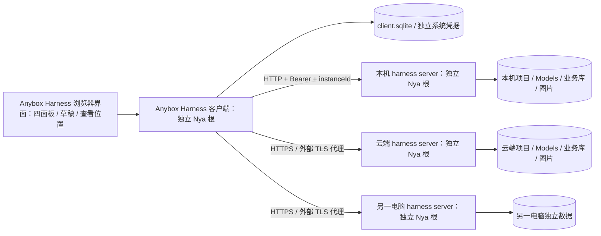

# Anybox 宿主与 Anybox Harness 应用边界

[文档首页](README.md) · [组件手册](modules/README.md) · [部署说明](harness-server-deployment.md)

Anybox 是 NyaCore 应用的宿主产品，Anybox Harness 是正式目录中的 Agent 产品，其通用服务端核心称为 harness server。服务端可部署在本地或远端，浏览器工作区、连接与网关归 Anybox Harness 客户端；完整规范见 [命名与边界](naming.md)。宿主与应用保持同仓库、同构建，通过独立目录、公开契约和资源所有权划分；不新增 Anybox Harness npm 包。Models 保持独立可复用包。

## 实际目录

```text
src/
  host/
    applications/                 注册契约、安装归属、目标与活动准入
    execution.ts, client.ts        显式接收应用目录的通用宿主装配
    access.ts                     实例身份与令牌摘要
    component.ts, http-server.ts   执行监听器、认证与应用分派
    client-http.ts, assets.ts      客户端监听器与外壳资源
    http-utils.ts, products-api.ts 通用 HTTP 辅助与应用管理接口
    web/                          应用列表、左侧应用入口、全局路由与 Web 契约
  applications/
    harness/
      registration.ts, assets.ts   Anybox Harness 注册入口与资源清单
      server.ts, server-runtime.ts harness server 组合入口与按需装配
      server-config.ts           harness server 配置校验
      server-models.ts           harness server Models 装配与旧配置迁入
      core/                      Agent、Prompt、Projects、Session、Run、工具与协议 Loop
      http/                      harness server 业务 HTTP/SSE 与 Models 管理路由
      client/                    连接、凭据、网关、目录窗口与客户端装配
      web/                       Anybox Harness 浏览器入口、控制器与视图
  entrypoints/                    正式应用目录、环境变量、进程信号与启动命令
  storage/port.ts, sqlite.ts       宿主公共业务存储端口与 SQLite 提供方
packages/models/                  通用 Models 模块及离线快照
web/index.html, style.css         Anybox 外壳模板与样式
web/apps/agent/                   Anybox Harness 模板、图标与样式
```

`src/host/` 不导入具体应用。通用宿主工厂显式接收注册目录，空目录仍可启动；`src/entrypoints/` 在宿主之外选择正式应用和默认配置。新增应用修改其自身目录与组合入口。Anybox Harness 可以依赖宿主公开的注册、运行时和 HTTP 契约，核心业务不依赖浏览器、客户端网关或进程入口。

前端外壳管理左侧应用入口及其管理浮层、全局路由和界面生命周期；窄条右侧只提供无装饰的挂载容器，全部布局由当前应用内部组件从顶边开始呈现。宿主不在右侧显示标题栏、标签栏、操作栏、通知或加载失败页。关闭界面和停止应用控制位于窄条底部，应用列表、状态及重载入口位于管理浮层。应用拥有自己的导航、内容、操作、模板和样式。Anybox Harness 直接挂载项目与会话工作区，侧栏保留一处设备选择和连接管理；模型与 Prompt 是工作区设置分类，设备 Agent 启停放在连接管理，不另设功能页面顶栏。安全展示 DTO、校验和解码位于 `core/view/` 等无 DOM 入口，浏览器只导入允许的纯函数和 type-only 契约，不引入 execution。HTTP DTO 不包含凭据引用、原生恢复记录、execution、租约和 result/done 句柄。Models 驱动负责原生传输，协议 Loop 决定工具与续轮，RunRuntime 管理操作、取消与退出。

## 进程与资源边界



每个进程一个应用 Nya 根，不增加模块、项目或任务子 Context。执行宿主常驻通用业务存储、访问管理、产品控制、活动准入和 API；打开该设备上的 Anybox Harness 时装配完整 Models、Prompt 与 Agent 执行能力。Models 包含现有目录，Prompt 包含 Agent Prompt 绑定，Agent 依赖两者并装配 Projects、Session、图片/文件、工具和执行闭环。客户端常驻自己的 SQLite、应用控制和 HTTP 外壳；打开 Anybox Harness 才安装连接、目录窗口和代理，不安装执行服务。选择远程 Agent 不启动本地执行。

API 监听器及请求由 `host-application-api` 独占，常驻入口只依赖宿主访问、产品控制及活动准入，业务路由按请求取得已启用能力的当前服务；Models 路由仍是内部函数。客户端监听器和静态页面由 app-client-http 独占；Anybox Harness 内部上传、连接和转发流由按需 client-gateway 独占，静态映射不是额外组件。依赖清理顺序由 Nya 决定。宿主 `prepareClose()` 同步关闭产品控制、业务、Run 与 HTTP 准入并等待控制和装配队列；`close()` 同时清理整个根与排空 HTTP 已受理写入、保留租约，避免先等待 Run 而延迟取消 Run。`installHarnessServerCore()` 返回的安装句柄 `close()` 只卸载该次安装的 harness server 核心组件，不关闭宿主提供的 Models、业务库、图片组件或整个根。运行期产品停用通过产品控制服务执行，忙碌时拒绝；直接 Run 服务同样检查关闭状态。网络连接 `dispose()` 只中止客户端读取和观察，不发远程取消或关闭命令。

## 身份、请求与状态

执行端业务库 `host-access` v2 保存稳定 instanceId、设备令牌摘要与可空受管 owner 元数据；旧 v1 令牌保持非受管身份。桌面本机配对仅撤销自己 owner 的令牌，公开列表不返回 owner 或秘密。所有设备令牌拥有相同单用户权限，Prompt 使用 `local-web-user`。客户端 `client-connections` v2 独占自己的数据库，并记录桌面本机连接 ID 与 instanceId 的归属，完整凭据由独立系统凭据命名空间保存，修改先登记意图再写凭据再提交引用，失败保留旧配置。

网关只接受已登记 connectionId 和公开路由白名单。每个请求捕获配置版本、地址、凭据及期望实例，不跟随重定向、不自动重试写入，不传递浏览器认证头。修改地址必须重新验证原 instanceId。客户端 ID 编码为 `h:<instanceId>:<resourceId>`；传输时在资源字段解包，正文与模型原生参数不改写。跨实例输入拒绝发送。

面板以资源身份固定设备，设置以当前显式选定连接固定设备；切换设置目标不改变已保存面板。SSE 按实例分组，单端错误只影响所属面板，离线时保留已存布局与 pending。项目文件读取发生在目标设备，图片上传和预览经所属连接网关。没有会话迁移、文件同步、跨实例重试、远程任意 URL 代理或执行调度。

## 迁移与验证

旧业务格式保持兼容；主机访问数据、客户端连接和应用打开目标分别拥有独立迁移域。SQLite 排他锁、旧无主锁处理、旧浏览器状态确认与发行物使用见[部署说明](harness-server-deployment.md)。测试入口为 `remote-harness-server.test.mjs`、`harness-client.test.mjs`、`deployment-boundaries.test.mjs` 和既有全部行为测试。`npm run check` 同时验证 Models 与应用。

应用新增、多应用切换和退出契约见[通用宿主设计](products-v1.md)与[接入说明](application-development.md)。通用层不导入 Anybox Harness 领域；浏览器外壳不静态依赖 Anybox Harness 模块，应用入口由目录动态加载。
