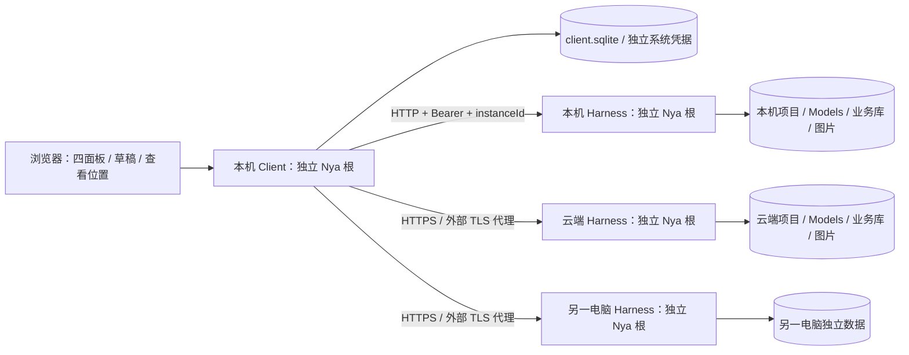

# Harness 模块边界与多实例接入

[文档首页](README.md) · [组件手册](modules/README.md) · [部署说明](harness-deployment.md)

本实现保持同仓库、同根构建，不新增 Harness npm 包。模块边界由目录、公开契约、进程和资源所有权共同表达。Models 保持独立可复用包。

## 实际目录

```text
src/
  harness/
    index.ts                      受信组合入口与整根关闭
    contracts.ts, api.ts, validation.ts 业务契约、公开 DTO 与无副作用校验
    agent/, prompt/               Agent 只读配置、Prompt 与绑定
    project/, project-files/      执行目录身份与有界浏览、文件快照
    session/, image/              历史、恢复、归档与图片资源
    run/, protocol-agents/        Run、Runtime、原生 Loop
    tool/, storage/port.ts        工具与存储端口
    view/                         安全展示类型与无 DOM 解码
  host/
    harness-main.ts               执行进程装配、离线授权、信号
    client-main.ts                客户端进程装配、信号
    serve.ts                      两个子进程的便捷启动器
    access.ts                     稳定实例身份与令牌摘要组件
    component.ts, server.ts        执行 HTTP/SSE 组件与路由
    models-api.ts                 Models 管理路由
    models-startup.ts              Models 装配和兼容导入
    deepseek-protocol.ts           宿主原生驱动扩展
    assets.ts, directory-picker.ts 静态映射、本机目录窗口
    client/connections.ts         连接记录、凭据意图日志
    client/gateway.ts             同源网关与客户端监听器
  client/                         浏览器控制器、视图和 HarnessClient
  storage/sqlite.ts               通用 SQLite 提供方
packages/models/                  独立 Models 模块及离线快照
```

执行域不反向依赖浏览器或宿主。安全展示 DTO、校验和解码位于 Harness 的独立无 DOM 入口；浏览器 type-only 依赖不引入 execution。HTTP DTO 不包含凭据引用、原生恢复记录、execution、租约和 result/done 句柄。Models 认证和原生协议驱动留在 Models；协议 Loop 决定工具与续轮，RunRuntime 仍只管理操作、取消与退出。

## 进程与资源边界



每个进程一个应用 Nya 根，不增加模块、项目或任务子 Context。Harness 进程安装 Models、通用业务存储、访问管理、图片、既有 Harness 组件和 API；客户端安装自己的通用 SQLite、连接组件、目录窗口和网关，不安装执行服务。

API 监听器及请求由 `host-harness-api` 独占，Models 路由只是其内部函数。客户端监听器、上传与转发流由 `client-gateway` 独占，静态映射不是额外组件。依赖清理顺序由 Nya 决定。`harness.close()` 首先同步关闭 Run 准入，再关闭整个执行根；直接 Run 服务同样检查关闭状态。网络连接 `dispose()` 只中止客户端读取和观察，不发远程取消或关闭命令。

## 身份、请求与状态

执行端业务库 `host-access` v1 保存稳定 instanceId 与设备令牌摘要。所有设备令牌拥有相同单用户权限，Prompt 使用 `local-web-user`。客户端 `client-connections` v1 独占自己的数据库，完整凭据由独立系统凭据命名空间保存，修改先登记意图再写凭据再提交引用，失败保留旧配置。

网关只接受已登记 connectionId 和公开路由白名单。每个请求捕获配置版本、地址、凭据及期望实例，不跟随重定向、不自动重试写入，不传递浏览器认证头。修改地址必须重新验证原 instanceId。客户端 ID 编码为 `h:<instanceId>:<resourceId>`；传输时在资源字段解包，正文与模型原生参数不改写。跨实例输入拒绝发送。

面板以资源身份固定设备，设置以当前显式选定连接固定设备；切换设置目标不改变已保存面板。SSE 按实例分组，单端错误只影响所属面板，离线时保留已存布局与 pending。项目文件读取发生在目标设备，图片上传和预览经所属连接网关。没有会话迁移、文件同步、跨实例重试、远程任意 URL 代理或执行调度。

## 迁移与验证

旧业务格式保持兼容；只有主机访问数据和客户端连接是新迁移域。SQLite 排他锁、旧无主锁处理、旧浏览器状态确认与发行物使用见[部署说明](harness-deployment.md)。测试入口为 `remote-harness.test.mjs`、`harness-client.test.mjs`、`deployment-boundaries.test.mjs` 和既有全部行为测试。`npm run check` 同时验证 Models 与应用。
