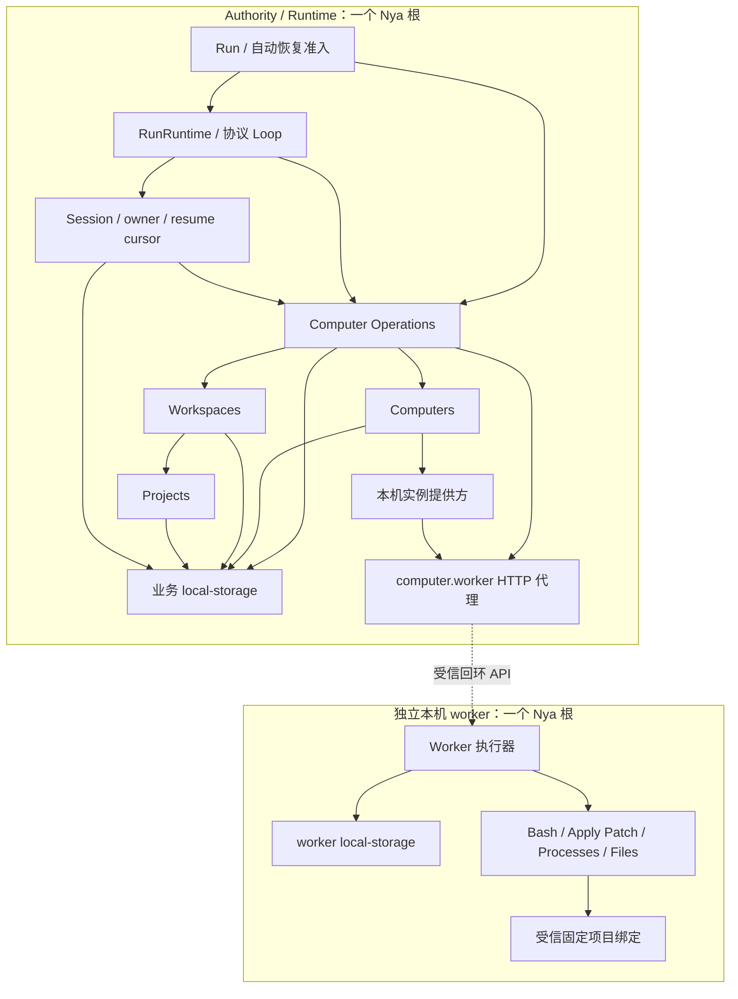
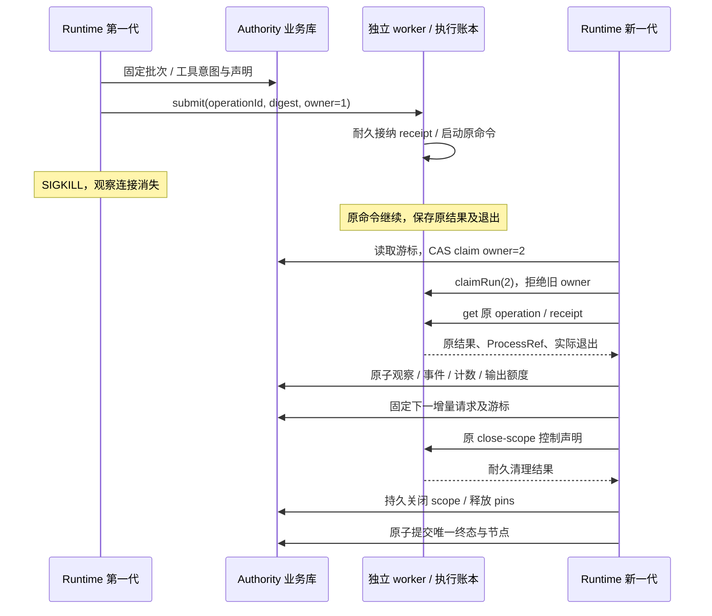

# Computer 资源模块

[返回组件手册](../README.md) · [资源设计与演进](../../computer-resource-design.md)

本模块实现 Computer 资源契约和独立本机 worker。Authority 与 Runtime 当前留在 harness server 的同一个 Nya 根；worker 使用独立进程及唯一根，持有工具和执行账本。模型响应已持久保存后的工具等待、结果消费及清理可以在 Runtime 重启后接续，正在等待未保存模型响应的 Run 仍明确 interrupted。

| 组件 | 服务 | 当前职责 |
| --- | --- | --- |
| [本机实例提供方](local-instance-provider.md) | `computer.instance-provider` | 按需确认独立 worker 实例，不创建或销毁用户设备 |
| [Computers](computers.md) | `harness.computers` | 逻辑资源、按需实例确认、共享激活和实例 pin |
| [Workspaces](workspaces.md) | `harness.workspaces` | 稳定项目映射、pinned-local 准备、scope binding 和归属释放 |
| [Computer Operations](computer-operations.md) | `harness.computer-operations` | 工具声明、两端接纳去重、固定绑定、结果回收和耐久取消/清理协调 |
| [本机 Worker 客户端](local-worker-client.md) | Authority 根的 `computer.worker` | 按需启动或查回独立进程，拥有本地 HTTP 观察 |
| [Worker 执行器](worker-executor.md) | worker 根的 `computer.worker` | 独占 worker 账本、工具 scope 和实际执行 |
| [Worker 固定项目绑定](worker-project-bindings.md) | worker 根的 `harness.projects` | 拒绝项目查询，只允许工具使用已固定 workspacePath |

创建项目、Session、纯模型 Run 和计划工具不准备计算实例或工作区。Shell 和文件工具才建立需求，并在执行前准备 binding。Session 通过同步事务端口接纳声明、owner 和 resume cursor；Operations 固定 placement 后派发到 worker。RunRuntime 不再直接 inject 四种工具服务，原进程内执行路径被独立 worker 取代。

下图节选当前 inject 依赖，箭头指向被依赖的服务；Session 的图片、文件等既有依赖省略。

worker 存活时，Runtime 进程 SIGKILL 不取消已接纳命令；新 owner 查询原 receipt/result，工具结果、事件、限额和成功节点按已提交事实推进。Codex session_id 仍绑定原 worker/Run，stdin 和输出领取按 operation ID 去重。worker 自身故障且无法证明执行事实时保留 outcome-unknown，不重放；没有新恢复信封的旧 Run 继续 interrupted。显式卸载 Runtime 组件、撤销依赖及正常关闭应用仍取消并排空所属 Run；idle worker 保持独立设备服务。

下图展示当前已持久保存模型响应后的接续窗口；两代 Runtime 分别装配 Authority，业务库始终只有一代进程独占。

本模块不提供跨机器迁移、portable-managed、checkpoint 或独立模型 exchange。模型请求已发出而响应未保存时停止自动重发；任意 Runtime 阶段接续属于第四阶段。验收与后续边界见[设计文档](../../computer-resource-design.md)。

实际 worker 保留 Unix 工具装配限制，Linux/macOS 可装配，本次仅 Linux 完成真实进程故障验收。Windows 纯模型、资源契约与受控 worker 测试不代表真实 worker（包括文件工具）已支持。
