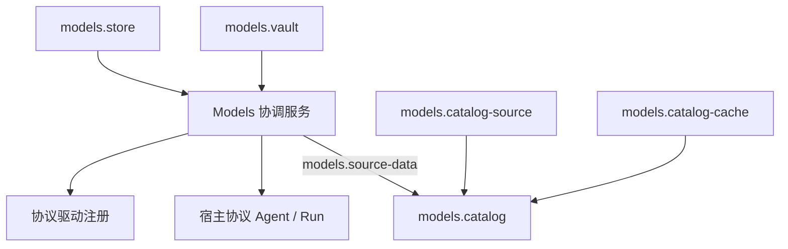

# Models 模块

[返回模块导航](../README.md)

Models 负责统一模型定义、账户连接、可执行配置、系统凭据、原生模型 execution 与可选目录刷新。通用实现位于独立包 [packages/models](../../../packages/models/README.md)，只从 `@nya/core` 公共入口使用组件机制，不导入 Anybox 的 `src/`。本目录另外收录宿主的 DeepSeek 协议扩展，因其职责属于同一模型接入模块。

## 组件与边界

| 组件 | 提供的服务或注册项 | 说明 |
| --- | --- | --- |
| [Models 协调服务](models.md) | `models`、`models.settings`、`models.protocols`、`models.source-data` | 查询、配置、来源接纳、协议代及 execution 所有权 |
| [配置存储](store.md) | `models.store` | 独占 SQLite、不可变版本、CAS、迁移与凭据操作日志 |
| [系统凭据](vault.md) | `models.vault` | 系统安全存储、按槽串行及实际退出等待 |
| [目录来源](catalog-source.md) | `models.catalog-source` | 匿名获取并规范化 models.dev 数据 |
| [目录缓存](catalog-cache.md) | `models.catalog-cache` | 独立 SQLite 缓存与可观察的内存后备 |
| [目录调度](catalog.md) | `models.catalog` | 启动来源选择、ETag 刷新、接纳及连接同步 |
| [Responses](responses.md) | 注册 `responses` | 原生请求、事件、结果与恢复编解码 |
| [Chat Completions](chat-completions.md) | 注册 `chat-completions` | 标准 Chat 文本、用户图片和函数工具协议 |
| [Anthropic Messages](anthropic-messages.md) | 注册 `anthropic-messages` | thinking、签名、工具与服务端搜索块 |
| [Gemini Interactions](gemini-interactions.md) | 注册 `gemini-interactions` | 原生步骤、thought、函数调用和结果 |
| [DeepSeek 扩展](deepseek.md) | 注册 `deepseek-chat-completions` | 宿主显式非推理策略，复用 Chat 驱动 |

协议驱动负责原生数据与 HTTP 生命周期；[执行模块](../execution/README.md)的协议 Agent Loop 决定如何响应工具调用、停止原因、拒绝和续轮。Models 不运行 Bash/Apply Patch，不决定 Run 成败，不存 Session 对话树，也不把原生结果转换成统一文本结果。

五种驱动均支持显式声明能力的 JPEG/PNG/WebP 用户图片：资源引用留在原生记录，字节只在受管 start 后读取并编码到临时 HTTP 请求。当前驱动为 2.1.0、记录为 v2，双读旧文本 v1；各协议的编码与兼容细节见独立文档。项目文件资料由宿主绑定编码为普通用户文本，Models 不新增文件读取服务或记录格式。Session 的归档状态也由宿主负责。

## 依赖与资源

箭头表示服务提供方向。组件全部安装在应用的同一个 Nya 根上；这是文档按职责组织的模块，不是新增 Context。各 `apply(ctx, config, deps)` 使用当前依赖快照，资源清理由 Effect 和 Nya 依赖顺序驱动。

模型配置数据库、目录缓存数据库和业务数据库分别独占连接且路径不可相同。Key 值仅在 Vault 与私有 execution 中存在。Models 保存非秘密引用与 `historyScopeEpoch`；原生增量记录交由受信 Session 保存。原生事件可能包含签名、加密 continuation 或工具 ID，浏览器只能消费宿主生成的白名单展示投影。

## 核心数据关系

`Provider` / `Model` 是带内部 ID、版本和来源的统一定义。来源可为 `user`，或包含来源命名空间与原始 ID 的 `external`。`ProviderConnection` 指向 Provider 定义，固定协议并保存本地地址、认证方式与凭据引用。`ModelConfiguration` 指向 Model 定义和连接，固定远端模型 ID、定义版本、能力和原生参数；Session 选模使用这个配置 ID。

保存可用连接后自动补齐适用文本模型的 baseline，每组连接/定义至多一个。额外预设使用 `baseline: false`。目录刷新只更新来源拥有的定义并补缺；已有执行配置与在途 execution 不被刷新覆盖。删除来源条目留下 `missing` 定义，已固定配置仍可执行。

## 装配与使用

包要求 Node.js 22.13+。当前宿主入口是 [installWebModels](../../../src/web/models-startup.ts)，一般装配关系为：

1. 安装 `createModelsStoreComponent({ path })`、`createModelsVaultComponent({ namespace })` 和 `createModelsComponent()`，等待 Nya 激活。
2. 安装需要的协议组件。没有驱动时仍可查看和保存非秘密配置，执行保持不可用。
3. 按需安装来源、独立缓存和 `createModelsCatalogComponent()`。目录故障不应成为已配置模型执行的实时依赖。
4. 用根控制面的 `context.get()` 获取当前 `models.settings` / `models`；配置连接后通过 `models.list()` 选择配置 ID。
5. 先获取协议代租约，再 `models.openNative({ modelId, lease })`；宿主记录 `prepareExchange()` 的意图后调用 `start()`，结束时等待 `execution.close()` 并释放租约。

关闭入口由应用拥有，当前为 `harness.close()`。它卸载根上组件；Models 停止准入、取消并等待初始化、请求、execution、来源接纳与配置写入退出，底层存储随后关闭。关闭后的门面不可复用；重新启动需重新装配。

## 维护与验证

新增驱动应实现公开的 `NativeProtocol` 并以独立组件注册；不按域名猜测协议，不按目录 SDK 标签动态载入代码。更换存储、Vault、来源或缓存应保留其公开服务契约和实际退出语义。通用纯函数与 execution、transport 等内部实现不是额外 Nya 组件，其行为分别归入所属组件文档。

模块检查：`npm --prefix packages/models test`。项目完整验收：`npm run check`。测试使用内存 Vault、模拟流和回环 HTTP，不代表所有真实平台凭据存储或线上服务已验收。

关联资料：[Models 架构](../../architecture/models-module.md)、[原生协议框架设计](../../native-protocol-agent-framework-design.md)、[目录验证记录](../../models-catalog-validation.md)。这些专题保留设计与验收背景，本目录按当前组件职责提供查阅入口。
