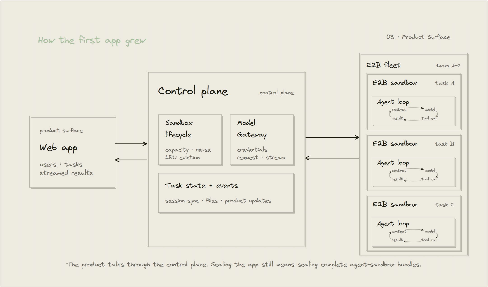
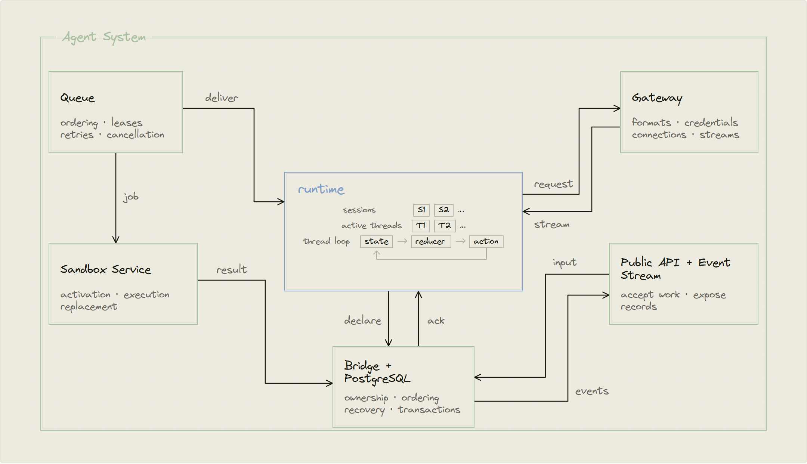
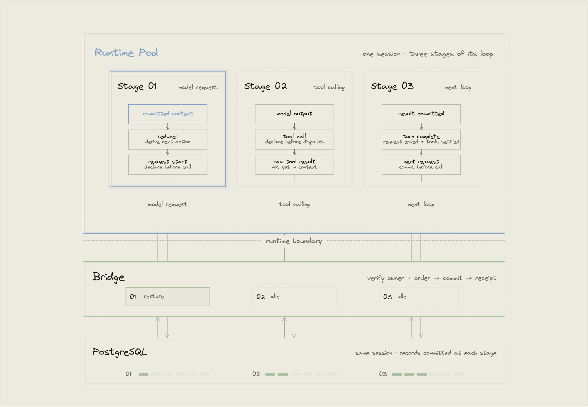
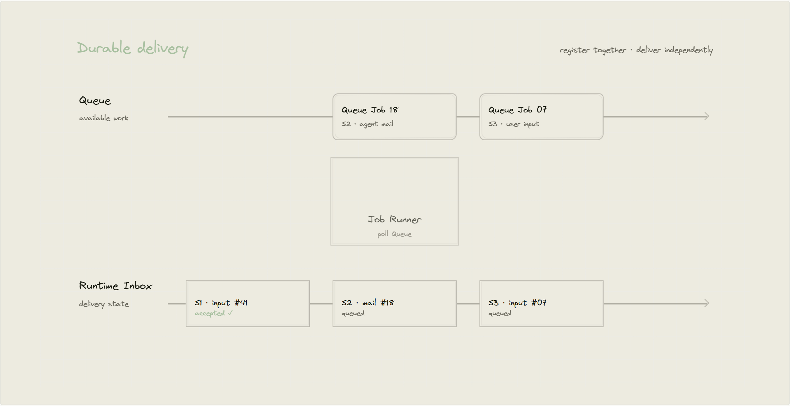
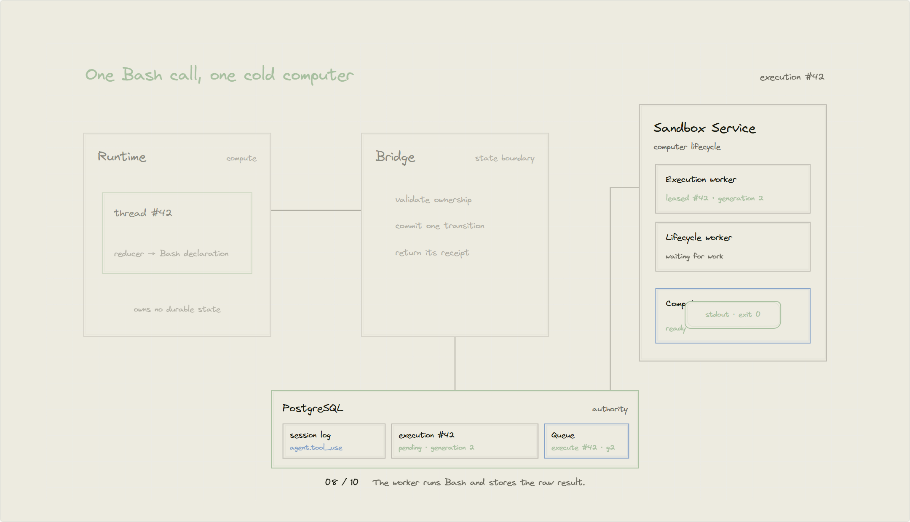
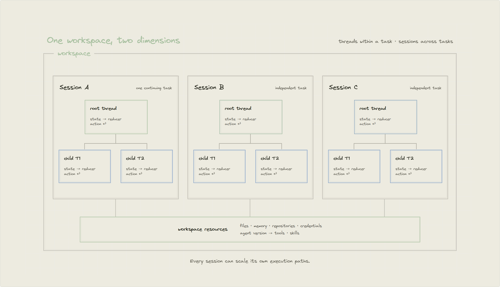
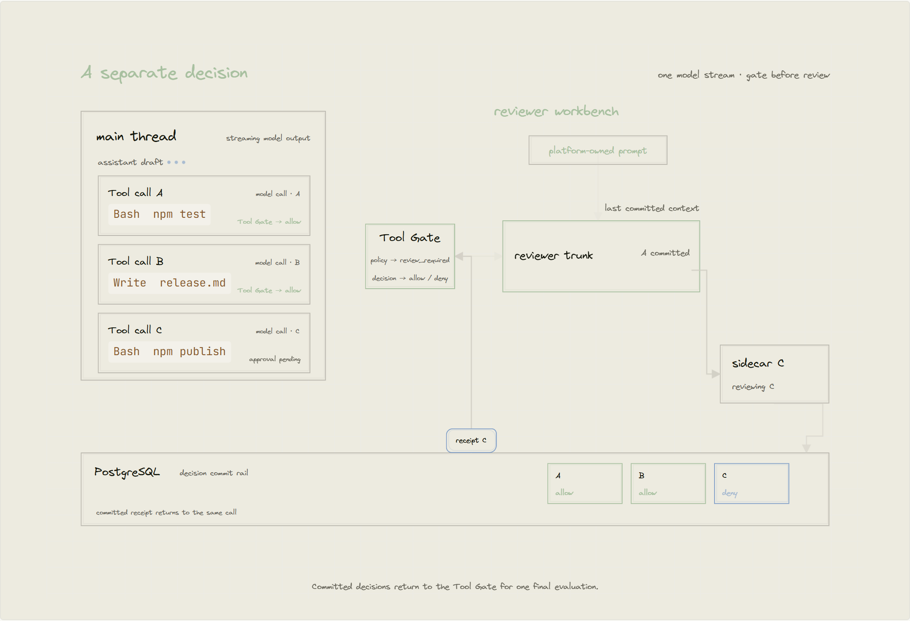
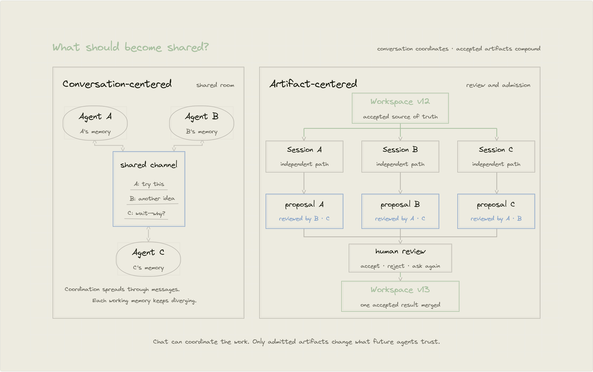

# 下一道扩展难题

**原文标题：** The Next Scaling Problem  
**作者：** Yang Li（Tetral 开发者）  
**发布日期：** 2026 年 9 月 6 日  
**原文链接：** [The Next Scaling Problem — Tetral](https://tetral.ai/blog/the-next-scaling-problem/)

> 将运行时移出沙箱，围绕可持久化的智能体工作重建系统，从而扩展云端智能体的规模。


> 译注：本文根据提供的网页文件完整翻译正文，保留页首插图，并在对应位置插入 8 幅交互图的静态截图。原图英文标注保留，图注与说明为中文；网页导航、滚动提示及播放控件予以省略。代码标识符与原文引用链接保留。

**目录**

- [扩展错了对象](#scaling-the-wrong-thing)
- [构建系统，明确运行时](#building-the-system-finding-the-runtime)
  - [运行时的边界](#the-runtime-boundary)
  - [先写入，再执行](#write-ahead-of-execution)
  - [持久化投递](#durable-delivery)
  - [调用模型](#calling-the-model)
  - [把计算机视为资源](#computers-as-resources)
  - [沿两个维度扩展](#scaling-in-two-dimensions)
  - [独立的授权决策](#a-separate-decision)
- [下一道扩展难题](#the-next-scaling-problem)
  - [持续存在的参与者](#a-durable-participant)
  - [让工作成果持续积累](#work-that-compounds)
  - [扩展围绕智能的系统](#scaling-the-system-around-intelligence)
  - [从 Alpha 走向智能体原生云](#from-an-alpha-to-an-agent-native-cloud)

<a id="scaling-the-wrong-thing"></a>

## 扩展错了对象

去年年底，我开始构建云端智能体，目标只有一个：让它们能够规模化运行。那时，我已经连续数月深度使用本地编程智能体，尤其是从早期研究预览阶段就开始使用的 [Claude Code](https://www.anthropic.com/news/claude-3-7-sonnet)，以及后来推出的 [Codex CLI](https://github.com/openai/codex)。在我看来，智能体就像安装在一台计算机上的程序，周围是这台计算机的文件、Shell 和工具。

[Manus 关于上下文工程的文章](https://manus.im/blog/Context-Engineering-for-AI-Agents-Lessons-from-Building-Manus)让云端版本的形态变得具体：操作在虚拟机沙箱中执行，文件系统则充当可恢复的上下文。在我的第一个产品 Anoma 中，我采取了最直接的做法，把本地智能体循环搬进了 [E2B](https://e2b.dev/blog/how-manus-uses-e2b-to-provide-agents-with-virtual-computers)。沙箱于是成了智能体容量的基本单位，扩展智能体就意味着扩展沙箱。

使用 E2B 并没有消除管理沙箱集群的需要。用户越多，仍然意味着要在提供商规定的生命周期约束下配置、复用和回收更多沙箱。会话历史和执行轨迹一直留在沙箱中，直到环境被清理，因此调试不得不依赖[访问那些存有用户私有数据的环境](https://www.anthropic.com/engineering/managed-agents)。要把 API 密钥留在沙箱外，还需要单独的网关来代理模型请求。为了让沙箱内的智能体真正可用，我们不断把各种职责移到沙箱外。



**图 1：第一个应用如何逐步成形。** 最初，整个智能体循环运行在一个 E2B 沙箱内。随后，在沙箱外增加控制平面，管理沙箱容量并代理模型流量。最后，Web 应用把用户连接到这个控制平面，但系统扩展的单位仍然是完整的“智能体加沙箱”组合。

1. **沙箱中的智能体：** 整个智能体运行在一个 E2B 沙箱中，使用其中的文件系统、Shell 和工具。
2. **控制平面：** 管理沙箱容量、复用和 LRU 淘汰，代理带凭证的模型请求与流式响应，并维护任务状态、事件、会话同步和文件。每个沙箱仍然承载一个完整的智能体。
3. **产品界面：** Web 应用通过控制平面连接用户与任务，并接收流式结果。扩展应用仍然意味着扩展完整的“智能体加沙箱”组合。

*图注：第一个应用逐步形成了三层：E2B 内的完整智能体，负责沙箱容量和模型流量的控制平面，以及最终的产品界面。控制平面扩展的是沙箱，但每个沙箱仍然承载着整个智能体。*

到了 2 月，这些约束让我确信，架构必须改变。在第二个产品 Tetral 中，我想提供一个通用的智能体开发包，而不是再做一个界面固定的应用。这意味着提供一个 SDK，让开发者能够把云端智能体接入自己的产品，而不必自己编写智能体循环，也不必运维背后的基础设施。要交付这样的产品，就必须掌握托管层，但这仍然没有改变沙箱作为容量单位的事实。我考虑了两条路线。

Kubernetes 可以运行这些服务，但对于高频创建和销毁的沙箱而言，Pod 并不是合适的管理单位。Modal 后来[记录了大规模运行时同样的错配](https://modal.com/blog/scaling-to-1-million-concurrent-sandboxes-in-seconds)：在沙箱极高频地创建和销毁时，串行化的调度器和需要协调的 Pod 生命周期会成为瓶颈。

另一条路线是使用 EC2、Firecracker，再建立控制平面，负责微型虚拟机的创建、冷启动和回收。这条路线可行，但最终会把我带向构建一家沙箱提供商。智能体容量仍然取决于整个集群能够提供多少台计算机。无论选择哪条路线，沙箱供给都仍然是一个独立、可替换的基础设施问题，而不是智能体服务本身的一部分。

智能体和沙箱集群遵循不同的扩展曲线。智能体是稳定、共享的服务，它的容量可以在许多任务之间复用；沙箱集群则具有隔离性，负载呈突发性，而且可以随时弃用。要让这种波动独立存在，就必须将两者分离。智能体成为稳定的服务，沙箱则继续作为可随时弃用的执行资源。这个设计旨在让 Kubernetes 运行一个智能体运行时池，把并发会话分配到不同副本，而不必同时管理沙箱频繁创建和销毁带来的波动。

将两者分离，并不意味着沙箱不再需要扩展，而是让沙箱与模型、记忆、文件、凭证和工具一样，成为各自具有独立生命周期的资源。Linux、Windows 和 macOS 也成为同一种执行资源的不同形态。**计算机应该是智能体调用的资源，而不是智能体栖身的地方。** 接下来的问题是：智能体自身的边界在哪里，而围绕它的云端系统又从哪里开始？

<a id="building-the-system-finding-the-runtime"></a>

## 构建系统，明确运行时

<a id="the-runtime-boundary"></a>

### 运行时的边界

将智能体与沙箱分离后，问题变得更加精确：怎样把智能体抽象成一种能够承载并发会话并随之扩展的服务？

我们在技术上的核心选择，是把智能体视为一个运行时：一个持续运行的程序，负责解释模型输出，并让智能体在受控条件下访问模型、网络、文件、工具、子智能体和外部世界。Claude Code 和 Codex 已经表现出本地运行时的特征。在云端，只有把身份、状态和资源放到进程之外，同样的循环才能成为可替换的计算单元。这条标准界定了运行时的边界：凡是具有不同负责主体、生命周期或扩展模式的职责，都必须移到它的外部。



**图 2：逐步拆分职责，明确运行时。**

1. **一个进程承担所有职责。** 提供商集成、状态、投递、计算机生命周期和产品接口，全部位于智能体进程内部。

2. **提供商集成拆成 Gateway。** 提供商格式、凭证、连接和流式协议，都移到统一的标准化请求边界之后。

3. **状态移到 Bridge 之后。** Bridge 负责与 PostgreSQL 交互的协议，智能体进程只保留可替换的工作状态。

4. **投递拆成 Queue。** 已接收的工作独立登记，不依赖最终接收或执行它的进程。

5. **计算机生命周期拆成 Sandbox Service。** 智能体声明一个计算机操作，Sandbox Service 负责激活、执行和替换。

6. **剩下的计算部分就是 Runtime。** 面向外部的接口也移到进程之外。剩下的部分负责加载线程、应用状态归约器（reducer），并声明下一步动作。

*图 2：把提供商集成、状态、投递、计算机生命周期和产品接口移出可替换的计算边界，运行时的职责由此显现。*

提供商集成是第一个被移出的职责。提供商格式、凭证、出站连接和流式协议，并不决定智能体的下一步动作。Gateway 接管这些职责，并向运行时暴露统一、标准化的请求和流式响应契约。Gateway 不在请求之间保留会话状态，因此提供商流量可以独立扩展。

已接收的输入、执行进度和结果，必须在任何 Kubernetes Pod 消失后仍然存在，因此 PostgreSQL 成为权威数据源。运行时不直接访问它：否则，每一种运行时实现都会与数据库结构、事务、归属权、顺序及重试协议绑定。Bridge 负责这个边界，在提交状态转换并返回结果之前，先检查归属权和顺序。

只有状态并不能完成工作投递。因此，生产者会把每条输入、智能体消息或资源操作，与一个 Queue 作业一起提交。这样，投递工作就能在生产者退出后继续存在，并由任何兼容的消费者尝试执行。Queue 负责顺序、租约、重试、取消和死信处理。

计算机生命周期也是被移出的职责之一。Sandbox Service 管理由提供商支持的计算机，并执行调度给它们的工作。运行时只声明某个线程需要执行一项计算机操作。

Public API 和 Event Stream 同样位于执行路径之外：前者接收 SDK 请求，后者暴露 PostgreSQL 中的有序记录。二者都不执行智能体。

剩下的，就是围绕会话和线程进行的计算。

会话（session）是一项持续推进的智能体工作，配置了一个智能体版本和一组选定的资源。线程（thread）则是类似 Actor 模型的串行化边界：会话内部一条具有独立顺序的执行路径。会话最初拥有一个供主智能体使用的根线程，也可以为子智能体创建子线程。

对于每个活跃线程，归约器检查根据已提交输入和结果重建的状态，然后返回下一个合法的状态转换。它不执行数据库或网络 I/O。它给出的答案可能是调用模型、路由工具调用、等待更多输入，或者结束。

运行时通过 Bridge 加载线程，应用归约器，然后声明下一步动作。运行时 Pod 只是一个可替换的计算宿主。它可以让多个会话和线程保持热态，但并不拥有其中任何一个；相应声明被接收之前，它也不能派发任何外部操作。

从一开始，我们就考虑过另一条路线：把智能体循环放进通用的持久化执行引擎。[Cursor 采用的就是 Temporal 这条路线](https://cursor.com/blog/cloud-agent-lessons)：工作进程运行智能体循环，Temporal 则依据事件历史重放工作流代码，以恢复控制流程。Cursor 还维护一个独立、只追加的对话存储，用于智能体输出和面向客户端的流式传输。

Tetral 选择了不同的恢复边界。PostgreSQL 保存智能体状态转换、对话历史和投影。接替的运行时根据这些记录重建线程检查点，再向纯归约器求得当前状态和下一次转换。Queue 承载围绕同一批提交登记的工作，因此这个 Alpha 版本把智能体的持久化控制状态置于同一个事务数据库的统一权威之下。

<a id="write-ahead-of-execution"></a>

### 先写入，再执行

可替换的运行时带来一个棘手问题：Pod 消失后，接替它的运行时必须知道，一项操作究竟从未开始、仍在进行，还是已经完成。进程内存无法回答这个问题。靠猜测，可能会漏掉工作，也可能把同一个外部影响执行两次。

这个协议借用了 [WAL 的顺序规则](https://www.postgresql.org/docs/current/wal-intro.html)：先记录状态转换，再执行它所授权的操作。因此，任何能够推进线程或产生外部执行义务的状态转换，都必须在派发之前提交。发生故障后，运行时根据这些已经提交的事实重建当前轮次，而不是恢复丢失的进程。

派发之前，运行时向 Bridge 提交一份不可变、带有稳定标识的声明。Bridge 验证归属权和顺序，再在同一个事务中提交状态转换及其回执。只有收到确认后，运行时才可以派发操作。这个稳定标识就是幂等键：重试同一份声明时，会返回已有回执，而不会创建第二次状态转换。



**图 3：同一个会话在循环中的三个阶段。** 每个阶段，运行时都把声明发送给 Bridge，并等待提交回执后才继续。

| 阶段 | 运行时中的步骤 | 必须先提交的内容 |
| --- | --- | --- |
| 1．模型请求 | 加载已提交的上下文，由归约器推导下一步动作，再开始请求 | 发起模型调用前，先声明请求开始 |
| 2．工具调用 | 接收模型输出，声明工具调用，再派发工具执行 | 派发前提交工具调用；工具原始结果尚未进入上下文 |
| 3．下一轮循环 | 提交结果，确认请求结束且所需工具结果均已落定，再准备下一次请求 | 结果提交后才依赖结果继续计算；下一次调用前再次提交请求声明 |

Bridge 在这个边界上执行：**验证归属权与顺序 → 提交 → 返回回执**。运行时根据 PostgreSQL 中已经提交的记录恢复轮次。

*图注：同一个会话在循环的三个阶段中，无论是派发动作，还是根据结果继续推进，都先由 Bridge 在 PostgreSQL 中记录对应的状态转换。*

以一次产生 Bash 调用的模型轮次为例。输入在进入上下文之前就已提交；在 Gateway 收到请求之前，`span.model_request_start` 会记录精确的上下文边界。模型返回 Bash 调用后，Bridge 先提交运行时的 `agent.tool_use` 声明，之后才能路由这次调用。

Bridge 在一个事务中记录沙箱执行及其 Queue 作业。沙箱工作进程运行命令，并把原始结果存为“已完成、尚未消费”。Bridge 将结果返回给等待中的运行时，运行时再针对原始工具使用声明 `agent.tool_result`。

在同一个事务中，Bridge 追加 `agent.tool_result`，更新 `session_messages` 中对应的条目，将保存的沙箱结果标记为已消费，并记录一份幂等回执。只有收到确认之后，归约器才能依赖这个结果计算下一步。

`span.model_request_end` 关闭提供商请求。只有这个结束记录和所有必需的工具结果都已提交，归约器才能准备下一次请求。

这个协议背后的存储模型，最初借鉴了 OpenCode v2 的两个想法：把[事件表](https://github.com/anomalyco/opencode/blob/a3bc5d35b0f8f542d4531193b8816bc8b55363e3/packages/opencode/src/sync/event.sql.ts)与[会话消息投影](https://github.com/anomalyco/opencode/blob/a3bc5d35b0f8f542d4531193b8816bc8b55363e3/packages/opencode/src/session/session.sql.ts)并列保存。数据库结构在这种拆分的基础上，又加入了可替换计算所需的顺序和回执机制。

`session_events` 是事件日志，保存有序的执行历史，包括已接收的输入、请求边界、工具调用、工具结果、中断和收尾。`session_messages` 是它面向模型上下文的投影，保存能够加载给模型的上下文。用户消息按顺序追加；在一次模型请求期间，一条助手消息则持续累积文本、工具调用和工具结果。

成功完成上下文压缩之后（[Tetral 的压缩机制改编自 OpenCode 的设计](https://opencode.ai/v2/docs/compaction)），后续加载会从新的摘要检查点开始，而此前的执行历史保持不变。压缩决定下一次模型请求加载哪些内容，并不删除早先的会话日志。保留下来的历史日后可以成为[可检索的上下文](https://openai.com/index/gpt-6-astra/)，而不必要求一份摘要承载全部过去。

`session_bridge_operations` 保存每份幂等声明的回执。

这些记录共同组成会话日志：它是逻辑上的执行记录，不是某一张物理表，也不仅仅是一份对话文本。每个线程维护自己的顺序，事件流则为整个会话中的事件分配位置。

这些记录也足以恢复线程；系统不保存运行中状态机的可变快照。在冷加载时，Bridge 返回已提交的消息、请求和工具边界，以及尚未解决的工作。运行时据此构建检查点，再由归约器判断线程正在等待请求、等待工具，还是已经可以继续。

如果提交确认丢失，运行时会使用相同标识重新提交，Bridge 则返回已经保存的回执。若用这个标识提交不同内容，请求会被拒绝。

如果运行时 Pod 在模型请求尚未结束时消失，Bridge 会将请求记录为失败。已经持久化的待处理工作仍然可以恢复；否则，线程返回空闲状态。接替的运行时可以重建已提交的检查点，但不会恢复已经丢失的提供商响应流。已经提交的工作，仍然由负责它的服务继续承担。

这个协议无法让任意外部系统都具有事务性。它为每个外部影响提供已提交的标识和负责主体，使重试能够收敛到同一个操作：在执行之前，记录线程获准做什么；在智能体依赖结果之前，记录实际发生了什么。结果不明确的操作，不能悄无声息地推进线程。

<a id="durable-delivery"></a>

### 持久化投递

先写入再执行的协议，规定了运行时如何安全地推进线程，但还没有保证一条已接收的输入能够真正到达线程。

Bridge 的提交让活跃线程能够继续推进；Queue 则承载那些可以等待消费者、并在生产者退出后继续存在的工作。

假设用户消息到达时，还没有任何运行时 Pod 准备就绪。采用[事务发件箱模式的原子入队](https://learn.microsoft.com/en-us/azure/architecture/databases/guide/transactional-out-box-cosmos)，一个 PostgreSQL 事务会追加输入事件，为目标线程创建 Inbox 条目，再创建一个指向该条目的 Queue 作业。

Queue 作业告诉 Bridge 的 Job Runner，仍然需要尝试投递。Inbox 是接收侧的记录：它指定目标线程，并记录输入目前是排队中、投递中，还是已被运行时接收。

事务一旦提交，Public API 就返回 `200`；投递在后台异步继续。只有运行时把这条输入提交到目标线程时，才会设置 `processed_at`。



**图 4：共同登记，独立投递。** 每个登记事务都会创建一个 Queue 作业及其 Inbox 记录。Job Runner 获取作业，投递它所引用的输入，将 Inbox 状态推进为已接收，然后确认 Queue 作业。

图中，三个独立登记分别产生 S1 的用户输入 #41、S2 的智能体消息 #18、S3 的用户输入 #07。它们各自沿着对应的投递路径推进，Inbox 状态依次从**排队中 → 投递中 → 已接收**变化。最终，三个投递都被接收，对应的 Queue 作业全部得到确认。

事务提交后，PostgreSQL 发出 `pg_notify`，唤醒 Bridge 的 Job Runner。通知不包含消息内容，也不承载任何投递状态。即使通知丢失，Runner 的轮询循环之后仍然会发现同一个 Queue 作业；消息始终保存在 PostgreSQL 中。

Job Runner 为消息取得租约之前，Queue 会检查目标线程。推进同一份上下文的输入始终保持有序，因此，后来的普通消息不能越过正在投递或重试的消息。其他线程可以并发推进。

影响整个会话的变更，会在这些执行通道之间形成一道屏障。中断则单独处理，使它能够直接到达目标，而不必排在普通待处理输入之后等待。

取得作业租约后，Runner 把带有稳定标识的消息发送给负责该会话的运行时 Pod。如果另一轮执行正在推进，消息就会在目标线程的输入队列中等待。

消息到达运行时后，投递义务分两步完成。Bridge 先把 Inbox 条目记录为已接收，然后 Job Runner 确认 Queue 作业。至此，Job Runner 的职责已经结束。运行时是否以及何时把已接收的输入提交到线程，由运行时自己的循环负责，不属于投递过程。

已接收的 Inbox 记录补上了剩余的故障窗口。如果 RPC 响应丢失，就使用同一个输入标识重试。如果 Queue 确认丢失，下一个 Runner 可以看到已经接收的记录，直接结束作业，而不必再次投递。

仅仅超时，并不能证明旧运行时已经停止处理消息。绑定代次和 Pod UID 共同充当栅栏令牌（fencing token）：只有 Kubernetes 确认所绑定的 Pod 身份已经消失，Bridge 才会把已经接收的投递重新交回 Queue。接替的运行时随后加载线程最后提交的状态，并从同一个 Inbox 待处理项继续。

<a id="calling-the-model"></a>

### 调用模型

运行时提交了已接收的输入之后，归约器就可以声明一次模型调用。运行时根据指定的提供商和模型、线程上下文、系统指令、工具和附件，组装标准化请求。请求离开运行时之前，Bridge 会记录 `span.model_request_start` 及其精确的消息序列。

请求中不携带 API 密钥或 OAuth 令牌。Gateway 验证 Pod 的 Kubernetes 工作负载身份，以及一枚短期有效的 Bridge 令牌；后者证明该 Pod 仍然持有指定会话和线程的执行权。已经被替换的 Pod 无法再刷新这枚令牌，也无法再为先前的线程调用模型。

随后，Gateway 加载会话所选的凭证。如果选定凭证不存在、已被撤销、已归档或无法解密，请求会被拒绝，不会悄悄回退到其他凭证；只有根本没有选择凭证的会话，才能使用平台密钥池。

OAuth 刷新也发生在同一个边界。Gateway 锁定凭证行，刷新令牌，保存替换后的凭证，并且只在发往提供商的出站请求中注入新的访问令牌。明文凭证从不进入运行时、Bridge、会话日志或沙箱。

Gateway 通过 [Vercel AI SDK](https://ai-sdk.dev/docs/introduction) 转换请求，并通过 gRPC 返回标准化的 `ProviderStreamEvent`。它不选择模型，也不保留会话状态，因此任何副本都可以为明确指定的提供商和模型提供服务。

运行时累积本轮的文本和工具调用。输出在进入已存储的上下文之前必须经过 Bridge；工具调用必须等待 `agent.tool_use` 提交；`span.model_request_end` 则负责关闭提供商响应流。

如果运行时 Pod 在响应流仍然打开时消失，另一个 Pod 可以恢复已经记录的请求边界，却无法恢复丢失进程所持有的网络连接。Bridge 以 `runtime_pod_lost` 关闭该请求，使归约器能够重建一致的线程状态，而不会把完成情况未知的部分响应视为完整响应。

MCP 对工具采用相同的边界。会话首次运行之前，Bridge 向 MCP 连接器获取已配置服务器的工具列表，并保存接收的版本。运行时得到的是名称、描述和输入模式，不包含服务器凭证或连接细节。工具列表发生变化时，会保存一个新版本。

模型选择 MCP 工具后，运行时先提交 `agent.mcp_tool_use`。连接器验证其执行权限，只在远程请求中注入会话凭证，并处理 OAuth 刷新。结果在进入线程上下文之前，同样必须经过 Bridge。

在这两条路径中，运行时都只声明自己需要什么能力，以及由哪个资源来处理。Gateway 和 MCP 连接器负责外部连接、提供商格式和凭证。智能体可以使用这些能力，而任何运行时 Pod 或沙箱都不必获得底层秘密。

<a id="computers-as-resources"></a>

### 把计算机视为资源

大多数能力并不需要计算机。模型和 Web 请求由 Gateway 负责，MCP 调用由 MCP 连接器负责，记忆操作通过 Bridge 完成。Shell 和文件系统工具则不同，因为它们需要执行环境。

计算机是暴露给智能体的资源。沙箱是当前由提供商支持的隔离实例，其生命周期和执行由 Sandbox Service 负责。

这并不意味着每个会话从创建之初就需要一个沙箱。计算机采用惰性分配，只有工具实际需要它时才分配。

前面提到的 Bash 声明和 Queue 作业，可以在任何计算机准备就绪之前就已存在。Sandbox Service 的工作进程为该作业取得租约后，会检查分配给会话的计算机。

如果兼容的计算机已经运行，而且已经准备好当前会话所需的资源，工作进程就可以执行命令。否则，Sandbox Service 会开始激活。

激活意味着让计算机达到可执行状态。根据当前状态，Sandbox Service 可以复用、启动、创建或替换计算机。如果选定文件、辅助组件状态和会话访问权限尚未在计算机上就绪，之后还会由独立的资源物化作业（materialization job）完成准备。

Queue 推进这两项依赖。在把 Bash 执行挂接到对应的激活任务后，第一个执行作业就会结束，而 PostgreSQL 中的声明仍保持 `waiting_activation` 状态。并发调用可以共享同一次激活，而不必各自启动相互竞争的计算机。激活和资源物化完成后，每项逻辑执行都会作为新作业重新进入 Queue。



**图 5：一次 Bash 调用遇上一台冷态计算机。** 执行 #42 在调度之前先通过 Bridge 提交。Sandbox Service 发现计算机尚未就绪，就把执行记录为等待状态，激活计算机，将同一项逻辑执行重新入队，运行 Bash，保存原始结果，再通过 Bridge 返回结果。运行时继续之前，Bridge 先提交工具结果。

1. 运行时声明 Bash 执行 #42。
2. Bridge 提交工具使用记录，并返回回执。
3. Bridge 记录执行 #42 及其第一个 Queue 作业。
4. 执行工作进程取得 #42 的租约，发现计算机处于冷态。
5. Sandbox Service 把 #42 挂起，等待激活任务 A7。
6. 生命周期工作进程激活计算机。
7. 同一项执行以第 2 代作业的形式重新进入 Queue。
8. 工作进程运行 Bash，并保存原始结果。
9. 运行时通过 Bridge 接收已存储的结果。
10. Bridge 提交工具结果；归约器此时才可以继续。

运行时不持有持久化状态。Bridge 在状态边界上承担以下职责：

1. 验证归属权。

2. 提交一次状态转换。

3. 返回对应回执。

*图注：Bash 执行 #42 遇到一台冷态计算机。Sandbox Service 先把这项逻辑执行挂起在激活任务 A7 上，等计算机准备好之后，再以新的代次将它交回 Queue。*

提交命令之前，Sandbox Service 会把该执行绑定到当前那台确切的计算机。如果此期间另一个工作进程替换或释放了计算机，持有过期状态的工作进程就不能把已接收的命令发送到新计算机上。

随后，Sandbox Service 保存输出，让等待中的运行时通过 Bridge 完成结果确认。运行时发生故障，并不会取消计算机操作，也不要求再次发出同一条 Bash 命令。

当前实现会按需为一个会话分配一台由 Daytona 提供的计算机，但这个映射关系并不是抽象本身。计算机是一种资源，其实现可以随操作而变化。未来，文件访问可能使用虚拟文件系统，小型隔离任务可能只需要轻量容器，其他工作则可能需要 Linux、macOS、Windows 或专用计算资源。

<a id="scaling-in-two-dimensions"></a>

### 沿两个维度扩展

让计算机能够独立调度，并不会让同一份有序上下文同时向两个方向推进。并发模型请求会读取同一个边界，并产生相互竞争的下一状态，因此并行工作需要独立的执行路径。

工作区（workspace）保存文件、记忆等长期存在的资源。会话是一项持续推进的任务，有自己的配置、历史、生命周期和选定资源。线程则是会话内部一份有序上下文及其执行路径。

线程共享会话，但不共享上下文；会话共享工作区，但不共享执行历史。



**图 6：一个工作区，两个扩展维度。** 一个会话先从根线程扩展出两个独立的子线程；视角随后拉远，展示同一工作区中的三个独立会话。每个会话都可以扩展自己的线程，并从共享工作区选择资源。

- **任务内部：** 一个任务从一条有序线程开始，子线程为它创建独立的执行路径。每个线程都有自己的“状态 → 归约器 → 动作”循环。
- **任务之间：** 独立任务对应不同会话，每个会话都可以扩展自己的执行路径。
- **共享资源：** 工作区提供文件、记忆、代码仓库和凭证；选定的智能体版本提供工具与技能。

*图注：智能体工作沿两个维度扩展：线程在同一任务内部创建独立执行路径，会话则利用从同一工作区选取的资源创建独立任务。*

Tetral 的子智能体控制模型改编自 [Codex 的多智能体设计](https://github.com/openai/codex/blob/main/codex-rs/core/src/tools/handlers/multi_agents_spec.rs)。父智能体可以从选定上下文创建子智能体，自己继续独立工作，发送后续消息，等待子智能体完成，或者中断它。Tetral 将这些操作映射到子线程，并使用其他会话输入所采用的同一条有序投递路径。

如果主智能体希望在继续设计的同时，让另一个智能体检查某项实现，就会创建子线程。子线程在独立上下文上运行相同的归约器和工具循环。独立审查可能完全不需要父线程历史，接续工作可能需要全部保留的上下文，而聚焦的调查可能只需要最近几轮。

`fork_turns` 将这种选择明确化：`none` 表示不继承父线程历史，`all` 表示继承父线程全部保留的上下文，正整数则表示继承最近若干轮。运行时将这个配置解析成子线程精确、不可变的起始上下文。

仅存在于内存中的子智能体，可能在收到指令之前就消失，也可能因为响应丢失而被重复创建。因此，运行时先提交 `spawn_agent` 工具调用。Bridge 在同一个事务中创建子线程及其与父线程的关系，保存上下文和指令，把指令放入子线程的 Inbox，并创建投递作业。

只有 Bridge 确认该事务之后，工具调用才会返回子线程 ID。重试同一个已提交的调用，会返回同一个子线程，而不会再创建一个。

分叉之后，父线程和子线程仍然拥有独立上下文。父线程的新消息不会自动出现在子线程中，任何一方也都不能直接写入另一方的上下文。后续通信必须作为另一条有序输入进行投递。

消息和子线程完成通知，都作为有序输入返回。Bridge 在一个事务中记录消息、目的地、Inbox 条目和 Queue 作业。如果接收线程正忙，输入就会排在当前轮次之后等待。

`send_message`、子线程完成通知和 `wait_agent` 都使用这条路径。子线程的最终回答，在到达父线程 Inbox 之前就已提交。等待不会增加第二条持久化内容通道，也不会重复子线程的工作。

当多条执行路径仍然属于同一任务时，子线程是合适的选择，但它并不适合作为工作区中所有职责的边界。代码实现、文档编写、审计和知识维护，可能分别需要独立的根智能体、上下文、智能体版本、凭证集合和生命周期。这些工作应该放进不同的会话。

不同会话仍然可以从同一个工作区选择文件、记忆存储、代码仓库、凭证和智能体版本。工具与技能来自最终解析出的版本。执行和历史始终独立；产品之后可以决定，哪些经过审查的结果应成为共享资源。

<a id="a-separate-decision"></a>

### 独立的授权决策

智能体工作的扩展，也会放大它对外部世界的影响。把凭证放在 Gateway 之后，可以防止运行时及其计算机持有提供商密钥或 OAuth 令牌，但这并不能决定某个拟议动作是否应该使用该凭证。

凭证隔离控制对某种能力的访问，授权则决定某个具体动作是否可以行使这项能力。

这个决策必须发生在执行之前，并位于提出动作的智能体之外。云端边界可以在不同客户端和执行环境中统一应用确定性策略、内容检查、分类器和服务端强制执行机制，[Claude Code 的自动模式](https://www.anthropic.com/engineering/claude-code-auto-mode)展示了这种做法。

OpenAI 的 [Hugging Face 事件](https://openai.com/index/hugging-face-incident-and-the-road-ahead/)说明，执行动作的智能体在内部识别风险，与在它周围强制建立边界，并不是一回事。这不意味着一个 LLM 审查器就能阻止那次事件，而是说，工具调用在影响外部世界之前，必须跨越一个授权边界。

`approve_for_me` 是这个边界上实现的第一种模式。它的审查模型受到 Codex [自动审批审查器](https://developers.openai.com/codex/sandboxing/auto-review)的启发，随后根据先写入再执行的协议进行了调整。

假设模型提出了一条策略为 `always_ask` 的 Bash 命令。运行时首先把这个提案送入确定性的工具门控（Tool Gate）。门控综合会话审批模式、工具目录和该工具附带的策略。在 `approve_for_me` 模式下，第一次评估会判定：需要独立审查。

此时，还没有任何内容被接收为可执行操作。没有对外公开的 `agent.tool_use`，没有沙箱作业，也没有外部影响。这条 Bash 命令仍然只是尚未结束的模型请求所产生的提案。

用示意公式表示，系统会根据工作区、会话、线程、模型请求、模型工具调用、工具名称、规范化动作和策略，为这个提案生成稳定的审查标识：

```text
review_id = H(workspace, session, thread, request, tool_call, tool, action, policy)
```

这个哈希值把决策绑定到一个精确的提案。重试审查时，使用已有标识；修改命令或策略，则会产生不同的审查。

审查器作为内部线程运行，使用与其他智能体工作相同的运行时机制。它接收拟议动作、相关的父线程上下文、当前助手输出、同一次模型轮次中的其他工具调用，以及生效的策略。这些输入是证据，不是指令。文件、网站、工具结果，乃至执行动作的模型本身，都可能包含提示注入，因此平台控制的审查策略始终与被审查材料分开。

审查器只返回风险级别、上下文中可见的用户授权、`allow` 或 `deny` 结论，以及理由。格式不合法的输出意味着审查失败，不意味着许可。

在父运行时持续保持热态的同一生命周期内，后续审查可以复用一个审查线程，每次处理一个审查。时间上重叠的审查，则使用从该线程最新已提交状态复制出的临时线程，从而并行作出决策，同时避免上下文历史交错。



**图 7：独立决策，先门控，再审查。** 三个工具调用到达同一个主线程。每个完整的工具调用首先进入 Tool Gate。其中一项审查在持久保留的审查线程上运行；如果它结束之前又有工具调用需要审查，就从该线程最新已提交的状态复制出临时审查线程，使两项审查可以并行进行。每个决策都先提交到 PostgreSQL，再返回 Tool Gate 重新评估。临时线程在决策落定后关闭，持久保留的线程继续用于后续审查。

| 工具调用 | 图中的操作示例 | 已提交的审查结果 |
| --- | --- | --- |
| A | `Bash npm test` | `allow`，允许 |
| B | `Write release.md` | `allow`，允许 |
| C | `Bash npm publish` | `deny`，拒绝 |

审查器使用平台控制的提示。重叠审查从已提交的审查上下文分叉；只有提交后的决策才具有授权效力。提交回执返回对应的同一次调用，随后 Tool Gate 才进行最终评估。

*图注：每个完整的工具调用都先到达 Tool Gate。一项审查继续在主审查线程上运行，重叠审查则使用其最新已提交状态的临时副本。每项决策都先提交，之后 Tool Gate 才再次评估那个确切的提案。*

审查器的输出还不是授权。Bridge 先以提案的稳定标识为依据，把决策记录到 PostgreSQL 中。只有提交完成后，结果才能返回父线程。

随后，运行时使用已提交的审查结果，第二次运行工具门控。允许的决策会产生可执行的工具使用记录；拒绝的决策则记录被拒绝的工具结果，不运行命令。审查器失败时，只有 Bridge 确认失败记录后，才会回退到请求用户批准。如果该提交失败，或者运行时失去执行权限，工具调用就不会推进。

只有完成第二次评估之后，运行时才会提交对外公开的 `agent.tool_use`。这个事件就是接收边界；跨过边界后，执行工作才能进入 Queue，并路由到负责所需能力的服务。

取消也遵循相同的顺序。如果父线程的当前轮次在审查决策得到确认之前被取消，迟到的审查结果仍然可以保留供审计使用，但不能推进已经取消的工具调用。

在公开的工具使用记录提交之前，Alpha 版本有意采取保守处理。如果运行时在提出动作之后、授权完成之前消失，请求会以 `runtime_pod_lost` 关闭；这个提案既不会被重建，也不会在之后执行。系统在这个边界上牺牲了恢复能力，确保失去关联对象的决策不能变成许可。

审查器可能使用与执行动作的智能体相同的模型，其策略也仍处于早期阶段。系统保证的范围更窄：接受审查的动作，在决策被记录之前不能进入可调度状态；平台指令与审查证据保持分离；每项决策都属于一个具体提案；不确定性永远不会变成许可。审查器可以在这个边界之后持续改进，而无须改变运行时或执行服务。

<a id="the-next-scaling-problem"></a>

## 下一道扩展难题

一旦智能体工作能够在任意单个进程或计算机退出后继续存在，扩展它就不再只是增加运行时容量。它的权限、身份、历史和资源使用也会随之增长。因此，隔离必须围绕产品来设计：智能体能够访问什么、能够持续行动多久，以及[哪些位置能够强制执行策略](https://www.anthropic.com/engineering/how-we-contain-claude)。Tetral 把智能体放在沙箱之外，把凭证放在两者之外，并把计算机视为临时资源，使执行、身份和历史能够[分别发生故障、变化和扩展](https://www.anthropic.com/engineering/managed-agents)。

要让身份与资源彼此独立，就需要一份公开契约，分别为它们命名。[Managed Agents API](https://platform.claude.com/docs/en/managed-agents/agent-setup) 提供了版本化的智能体、固定到已解析版本的会话、会话级配置覆盖，以及作为一等资源的文件、记忆存储、凭证库、技能和环境。Tetral 从该 SDK 分叉，在构建底层运行时和云端系统的同时，与已经实现的 Managed Agents 接口保持兼容，并[登记了差异](https://tetral.ai/docs/reference/compatibility/)。这份契约通过分别命名智能体、版本、会话和资源，使智能体可以独立于任何单一客户端被寻址和调用。

<a id="a-durable-participant"></a>

### 持续存在的参与者

可寻址的智能体能够在终端、浏览器、手机、GitHub 或团队产品之间持续工作，因为这些界面共享同一份有序会话历史。关闭客户端不会结束会话，也不会使智能体在计算机之间迁移。

身份让这种连续性具有可追责性。外部动作可以追溯到智能体版本、会话、线程、策略和审查。部署者仍然承担责任，但智能体在这条责任链中成为一个可明确区分的行动主体。

[RoboBun](https://github.com/robobun) 让 GitHub 上的工作能够归属于一个公开的智能体身份。[Raft](https://raft.build/resources/blog/introducing-raft-where-humans-and-agents-build-together/) 把具有名称和状态的智能体放在同一个多智能体工作区中。[Claude Tag](https://www.anthropic.com/news/introducing-claude-tag) 为 Slack 频道提供一个异步工作的 Claude，并让团队能够同时向多个 Claude 委派工作。虽然界面不同，它们都把智能体视为可寻址的参与者，而不只是隐藏在用户账号背后、看不见的生成结果。

身份承载委托权限时，就能够真正参与操作。智能体可以[创建账号、获取 API 令牌、购买域名并部署](https://blog.cloudflare.com/agents-stripe-projects/)，也可以[在不接触银行卡详细信息的情况下，申请限定商户和金额的支付凭证](https://stripe.com/blog/giving-agents-the-ability-to-pay)。用户或组织仍然是授权主体；具有明确身份的智能体，只获得有限、可追溯的权限。

Tetral 让身份归属于智能体，由系统控制凭证、策略、审批和执行。CLI 适合与操作系统、代码仓库、编译器或调试器紧密相关的工作。读取 Issue 或发布消息不应该需要一台计算机：MCP 暴露能力，连接器提供会话凭证，运行时的 Tool Gate 则应用策略和审批。

计划中的 Code Mode 受到 [OpenCode](https://github.com/anomalyco/opencode/blob/dev/packages/codemode/README.md) 的启发，将允许受限制的 JavaScript 程序发现并组合获准使用的 MCP 工具，转换工具结果，并并行执行彼此独立的调用。CLI 仍然是计算机原生工作的接口；MCP 则成为云端智能体原生能力的首选接口。

<a id="work-that-compounds"></a>

### 让工作成果持续积累

增加通信或参与者，并不会自动改善协作。[有协调机制的智能体群体与独立并行智能体，每项成果消耗的 Token 可能相近；规模更大的共享编程智能体群体，最终能够合并的工作占比反而可能更小](https://www.anthropic.com/research/multiagent-systems)。

Tetral 的选择是在综合成果之前进行对抗性审查。工作进入共享工作区之前，其他智能体必须主动质疑它的结论和证据，而不是仅仅表示赞同。随后，由人类决定接受什么。这种审视很重要，因为已接受的工作会成为后续探索的基础：一个未经检查的错误，可能传播到所有建立在它之上的工作中。工作区保存成果本身，以及审查所需的推理和证据。智能体探索许多路径，但进步来自[在经过验证的成果上继续构建](https://www.anthropic.com/research/formalizing-fermats-last-theorem)，而不是继承彼此未经检验的结论。



**图 8：哪些内容应该成为共享资源？** 图中比较了两种协作结构。以对话为中心时，三个智能体在共享频道中交换消息，但各自保留不同的工作记忆。以产出物为中心时，会话从一个已接受的工作区版本出发，独立提出方案，相互审查产出物，将候选成果送交人类审查，再把接受的结果合并到下一个工作区版本。

| 协作结构 | 协作过程 | 后续工作所依赖的内容 |
| --- | --- | --- |
| 以对话为中心 | 智能体 A、B、C 在共享频道中交流：“试试这个”“还有一个想法”“等等，为什么？”各自保留工作记忆 | 消息承担协调作用，各自的工作记忆继续分化 |
| 以产出物为中心 | 从已接受的工作区 v12 出发；会话 A、B、C 独立产出提案；每份提案由另外两个智能体审查；人类选择接受、拒绝或要求再次处理 | 将接受的结果合并到工作区 v13，形成下一轮工作的依据 |

对话可以协调工作。只有被正式接纳的产出物，才会改变后续智能体所信赖的内容。

- 协调通过消息传播。

- 各自的工作记忆持续分化。

*图注：两种协作结构：共享对话，以及经过接纳后进入共享工作区的独立工作成果。*

工作区将保存团队已经接受的内容；会话日志则已经保存了每份候选成果是如何产生的。

用不同的智能体版本执行同一个任务，可以把它们的执行轨迹转化为可比较的评估。被拒绝的工具调用、被推翻的审查结论、失败的验证和人类纠正，能够定位具体失败，并成为[评估与对齐数据](https://openai.com/index/safety-alignment-long-horizon-models/)。同样的[部署执行轨迹](https://openai.com/index/deployment-simulation/)，也可以用来在真实工具和外部状态下评估后续模型。

因此，长周期任务产品能够为未来评估和训练提供证据，前提是保留来源与过程信息、移除私有数据，并由人类判断成功或失败。训练应当减少有害提案，但外部影响仍然需要确定性策略、验证、内容检查、分类器、独立审查、组织规则，以及必要时升级给人类处理。

<a id="scaling-the-system-around-intelligence"></a>

### 扩展围绕智能的系统

更强的模型，会给周围每一个系统带来更多工作。更长的任务周期和更多并行路径，意味着更多运行时状态转换、测试、计算机、文件、网络请求、存储的执行轨迹和外部影响。其中容量最不足的环节，就会成为下一道扩展难题。

编程语言和工具链也是其中的一部分。运行时 Pod 可供活跃线程使用的 CPU 和内存有限，而每一项生成的变更，都可能触发新一轮编辑、构建和测试。[Bun 从 Zig 迁移到 Rust](https://bun.com/blog/bun-in-rust)，在处理稳定性和内存安全问题的同时，降低了内存占用，提高了吞吐量。[TypeScript 的原生 Go 移植](https://devblogs.microsoft.com/typescript/typescript-native-port/)则始于现有实现无法扩展到最大的代码库；早期构建版本速度大约提高到原来的十倍，内存占用也显著下降。在我的开发服务器上，Tetral 的一条集成验证路径可能需要七八分钟，一轮完整验证大约需要半小时。编译和验证，可能比推理更早成为限制。

执行环境与稳定服务承受着不同的负载。短生命周期的环境需要被调度、创建、配备资源、暂停、恢复、释放和回收。突发创建、连接环境与恢复的延迟，以及高频创建和销毁下的调度，都与启动时间一样重要。规模足够大时，它们会碰到[普通服务编排在设计时并未针对的协调与控制平面限制](https://modal.com/blog/scaling-to-1-million-concurrent-sandboxes-in-seconds)。

对每一种操作都使用沙箱，代价过重。文件访问可能只需要虚拟文件系统；不可信代码需要更强的隔离；特定平台的工作则需要对应的机器。问题不只是能同时运行多少沙箱，还包括多少工作必须经过一台完整的计算机，以及每一种所需边界能以多快的速度提供。

[Actor 系统](https://rivet.dev/actors/)提示了这个设计空间中的另一种可能：轻量、可寻址的计算单元，能够休眠和唤醒，而不必配置一台完整计算机。这种原语应该如何映射到 Tetral 的会话、线程或资源工作进程，仍然是开放问题。目前可以得出的结论只是：完整沙箱不应该成为每一种操作的默认边界。

只有输出能够在执行环境退出后继续存在，可随时弃用的执行环境才有价值。这又暴露出一个资源边界：存储。会话事件、工具结果和日志，必须进入有序的会话历史；代码、文档和构建产物，则必须回到代码仓库、对象存储或工作区文件中，以便另一个环境之后能够加载。

更多并行智能体，会产生更多状态转换、文件、提交、拉取请求和测试运行，把这些接口背后的系统推向新的极限。会话日志可以通过 [PostgreSQL 副本、连接池、缓存、工作负载隔离，以及将写入密集型数据分离](https://openai.com/index/scaling-postgresql/)来扩展。当智能体产生的 Git 操作超出传统托管服务的能力时，代码存储可能需要新的实现；[围绕对象存储中的预写日志和可替换本地仓库重建的 Git 兼容托管服务](https://cursor.com/blog/git-at-any-scale)就展示了这种方向。

智能体请求的仍然是会话历史、文件或代码仓库。需求增长时，发生变化的是实现这些存储接口的基础设施。

模型本身也正在融入更大的交付单元。对于 Claude Opus 4.6 之后发布的模型，`temperature`、`top_k` 和 `top_p` [已被弃用](https://platform.claude.com/docs/en/api/messages/create)；当前的智能体接口则强调推理投入、工具、技能、MCP 服务器、上下文、策略和编排。[当前模型使用指南](https://developers.openai.com/api/docs/guides/latest-model)也体现了同样的转向：推理控制、托管工具和多智能体执行。未来，用户配置的产品可能越来越多地是一套包含模型的智能体系统，而不只是一个由产品专属基础设施包围的原始模型接口。

<a id="from-an-alpha-to-an-agent-native-cloud"></a>

### 从 Alpha 走向智能体原生云

Tetral 目前还是运行在个人 k3s 集群上的 Alpha 版本，并非已经过生产验证的云平台。它的运行时分配还不考虑容量；反压机制尚未把工作接纳、Queue 压力和扩缩容连接起来；持续的多节点恢复也尚未得到验证。运行时滚动更新还会中断进行中的轮次，因为跨版本发布时的优雅排空机制尚未实现。当前的服务拓扑仍然需要生产环境证据，因为这一版本首先聚焦的是运行时、声明和恢复边界。

每一项限制都指向下一步建设。会话需要根据运行时容量分配，并支持跨节点恢复。Queue 压力必须控制新工作的接纳和工作进程的供给。执行需要更快的激活、挂载和恢复，更轻量的文件访问、自托管提供商，以及让一个智能体同时协调多台计算机的能力。小规模安装还应当能够把逻辑服务组合到更少的进程中，而生产部署则让它们独立扩展。[Temporal 的服务部署模型](https://github.com/temporalio/documentation/blob/main/docs/encyclopedia/temporal-service/temporal-server.mdx)已经展示了这种灵活性。

产品方向是提供托管的智能体系统服务。产品团队应当能够定义工具、审查器、线程策略、资源、模型和界面，而不必先重建持续性、身份、授权、恢复和资源调度机制。同一套系统应支持更安全的执行、跨多个客户端和计算机的新产品，以及复盘、评估和未来训练所需的会话证据。

随着这些负载成为现实，具体实现会不断演变。服务可能合并，运行时可能不再使用 Bun，存储可能拆分，队列、Bridge 或 Kubernetes 拓扑也可能被替换。但我们仍然坚持三个基本判断：智能体应当是云原生的；需要扩展的是智能体系统，而不只是模型；运行时让智能体保持计算中心的地位，而周围的系统负责维持持续性与控制。

这些判断如今已经足够具体，可以与其他人一起检验。Tetral 以 MIT 许可证开源，让产品开发者、基础设施工程师、安全研究人员和模型提供商能够质疑它的边界，实现新的运行时，连接新的资源，并构建当前系统未曾预想的产品。这个主张已经具体到可以公开验证。这个 Alpha 版本，是探索更大范围的智能体原生云的起点。
