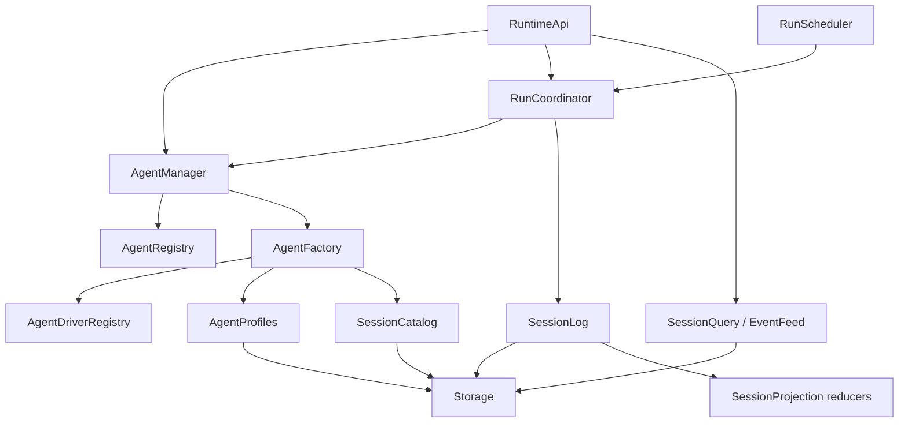
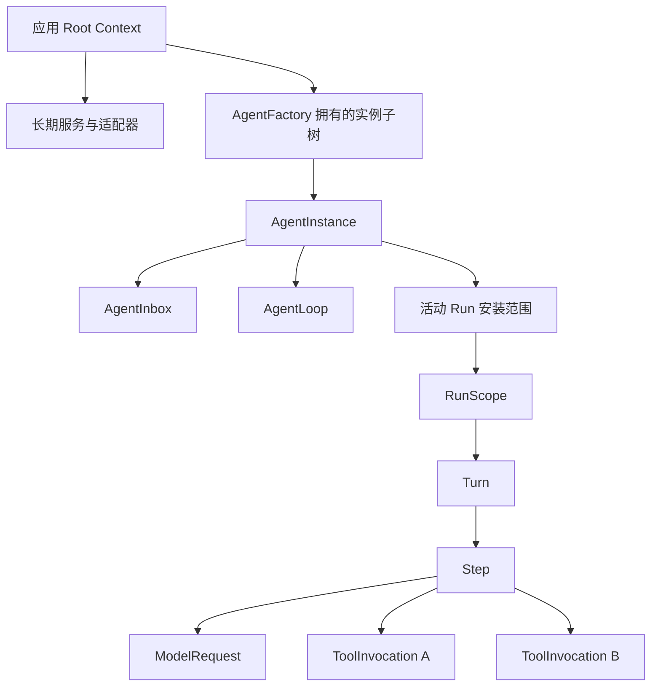
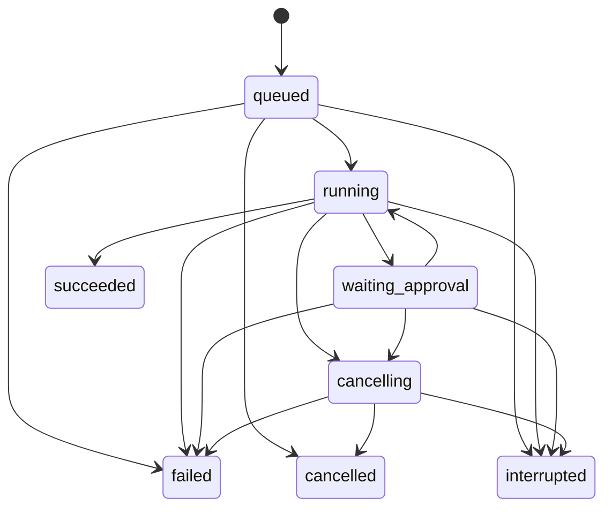

# Anybox Runtime v1 制作计划

状态：历史范围的待实施设计参考。日期：2026-09-06。

2026-09-07 范围调整：当前通用内核开发以[Agent 内核 v1 计划](agent-kernel-plan.md)为依据。下文固定 48 类组件、持久化后端和产品集成批次保留为参考，不作为当前首版的强制范围；下文 API 仍未实现。

本文件把已讨论的 **9 组、48 类组件**细化为从零制作计划：定义组件边界、服务契约、依赖、资源所有权、数据一致性、实施顺序和验收条件。表中的名称、方法、服务键和目录均为拟定设计，不能当作当前可调用 API。旧 harness 已删除，以下 Runtime 制作任务均未完成。

阅读顺序：先读第 1—4 节理解目标与所有权，再按第 5 节查组件，实施时使用第 12 节任务清单和第 14 节验收矩阵。

## 1. 目标、基线与交付范围

### 1.1 当前基线

- [application](../packages/application/src/index.ts) 已装配 Core、Loader、Include、HMR、Timer、ConsoleLogger；已有通用配置控制、启动失败清理和幂等关闭，空配置可以启动。
- 旧 Agent 组件、模型注入和单次 run 接口已删除。Agent 实例、执行算法、模型 SPI 和 Run 生命周期均按本计划从零实现。
- [现有 application 测试](../packages/application/tests/application.test.mjs)及 HMR、宿主测试是框架基础的回归基线，不能代替新增 Runtime 行为验收。
- 当前没有 Session/Run 持久化、模型调用、工具循环、流式事件协议或客户端 SDK；默认示例仅启动并关闭空组件应用。

### 1.2 Runtime v1 的交付结果

交付一个与 UI 无关、可嵌入 Node 宿主的组件化 Agent Runtime：

1. 持久保存会话、任务、输入、模型输出、工具调用和运行事件。
2. 一个活动 Agent 能先后处理多个 Run；任务具有明确的接受、取消、结果和资源边界。
3. Agent、模型、提示词、上下文、工具、权限、环境、存储均有独立替换入口。
4. 支持模型与工具的多步执行、运行限制、审批、事件补读和启动后的中断识别。
5. 组件卸载、配置变更和宿主关闭会停止并等待所拥有的操作，不自动重放旧任务。
6. 保留通用应用的无网络启动/关闭示例，另增 Runtime 的有限、无网络验证示例。

48 类表示组件边界，不表示 48 个独立进程、48 个 npm 包或启动时必须安装所有可选能力。每类可以有多个提供方实现，动态组件按需创建。

### 1.3 与既有文档的关系

| 文档 | 本文如何衔接 |
| --- | --- |
| [产品架构](architecture.md) | 九类长期职责域在本文展开为 48 类组件；产品目标和宿主边界保持一致 |
| [Runtime 协议](runtime-protocol.md) | 保留 Run 接受、幂等、终态、取消、事件游标等既定语义；本文细化其内部实现 |
| [Client SDK](client-sdk.md) | 不改变连接取消与任务取消的区别，不把 Nya 类型暴露给客户端 |
| [开发计划](development-plan.md) | 本文 R0—R2 完成 P1 的内核切片；R3—R5推进 P2 内核能力；Gateway、SDK、双宿主仍须独立交付 |

**R2 完成不等于整个 P1 完成。** P1 仍需要真实 HTTP 进程边界、同一 SDK 和两个宿主验收。R5 完成表示本文 Runtime 内核 v1 的完成，不代表四端 UI、自部署交付和所有隔离平台均已实现。

### 1.4 参考 DeepSeek Harness 的方式

参考其 Agent 接口与默认 Loop 分离、Session 日志推导历史、Agent 局部能力注册、工具管线等结构。[DeepSeek 官方架构](https://github.com/deepseek-ai/deepseek-harness/blob/master/docs/architecture.md)、[核心模块](https://github.com/deepseek-ai/deepseek-harness/blob/master/packages/core/README.md)

Anybox 保留自己的 Run 产品契约。DeepSeek 的 `followup()` 表达入队，单条输入不天然拥有后续输出；Anybox 的 RunCoordinator 明确管理被接受任务的执行区间。这里不能直接把 `followup()` 包装成承诺单任务结果的 `runs.start()`。[DeepSeek 输入与 Run 边界决策](https://github.com/deepseek-ai/deepseek-harness/blob/master/.agents/notes/implemented/architecture/2026-07-30-followup-enqueue-and-owned-runs.md)

流式策略也保持 Anybox 已有协议：首版对客户端公开的可补读输出事件先提交再发布。DeepSeek 当前的临时流式帧与最终日志结算仅作为实现参考，不改变该承诺。[DeepSeek 流式实现](https://github.com/deepseek-ai/deepseek-harness/blob/master/packages/core/agent-loop/src/assistant-stream.ts)

## 2. 已确定的设计决策

| 决策 | 第一版安排 |
| --- | --- |
| 运行模式 | 一个进程、一棵应用 Root Context、一个数据集写入所有者；禁止多个调度器并行消费同一数据集 |
| 活动 Agent | 同一 Runtime/Workspace/Session 最多一个活动 Agent；实例可跨越多个顺序执行的 Run |
| 任务模型 | 每 Session 最多一个非终态 Run；普通再次提交返回 `SESSION_BUSY` |
| 组件粒度 | 每项独立策略、注册表、可替换能力和资源所有者有单独组件边界 |
| 框架边界 | 使用 `@nya/core` 公共入口；不建立第二套容器、事件总线或生命周期框架 |
| 数据来源 | SessionLog 保存核心事实；投影为可重建视图；关键投影随事务同步提交 |
| 初始持久后端 | SQLite 单机适配器；Memory 仅测试与显式临时运行，不能冒充持久模式 |
| 数据库配置 | 拟用 WAL、本地数据目录、明确同步策略与备份接口；R0 验证驱动和 Node 最低版本后冻结依赖 |
| 模型与工具 | 注册描述、取得本次使用句柄、停止新获取、取消并等待旧使用者、释放提供方 |
| Profile | R1 即保存不可变 revision；接受 Run 时冻结配置；编辑界面与远程配置 API 后续增加 |
| 上下文 | 输入持久化与进入模型上下文分开；Step 只使用已领取输入和允许的历史边界 |
| 运行失败 | 普通模型/工具失败写入本次 Run；关键设施故障关闭接收门并影响就绪状态 |
| 崩溃恢复 | 旧实例全部非终态 Run（包括 queued）转 interrupted；不自动续跑或重试外部副作用 |
| 热替换 | HMR 仅显式开发模式；受影响运行中断，后续显式提交使用新服务 |
| 对外类型 | 协议仅包含可序列化数据；Context、Fiber、AbortSignal、Promise 和句柄留在宿主/SPI |
| 关闭 | 默认取消并等待；进程信号、强制退出和退出期限由宿主负责 |

SQLite 允许多个读事务及单个写事务，适合作为这里拟定的单写者后端。WAL 要求同机访问，数据库不能放在网络共享文件系统；这些限制不由应用事务接口消除。[SQLite 事务](https://www.sqlite.org/lang_transaction.html)、[SQLite WAL](https://www.sqlite.org/wal.html)

数据库 COMMIT 的断电保证取决于同步配置、文件系统和设备。R0 必须冻结驱动、实际 SQLite 版本、同步选项、检查点和备份策略；文档中的“已持久接受”不能只表示进入内存队列。

## 3. 领域对象与状态修改权

### 3.1 身份与边界

| 对象 | 语义 |
| --- | --- |
| `runtimeId` | 数据集的稳定身份；克隆成独立 Runtime 时重新分配 |
| `instanceId` | 每次进程启动的新身份，用于区分崩溃前后的运行所有者 |
| `agentGeneration` | 同进程组件重建后的 Agent 代际，与 Fiber ID 和业务 Run ID 分开 |
| `Session` | 持久会话；活动 Agent 被销毁后仍可查询 |
| `AgentInstance` | 驱动该 Session 的活动资源子树；不是历史数据对象 |
| `Run` | 一次被明确接受的任务，具有稳定 runId、快照、结束原因和结果范围 |
| `Turn` | Run 内的一段连续活动，可包含零个或多个 Step |
| `Step` | 一次请求组装、模型调用及其产生的工具执行范围 |
| `attemptId` | 一次实际模型尝试；失败尝试不与成功消息混为一条记录 |
| `toolCallId` | 一次工具调用的身份，关联参数、审批、调用结果和未知副作用状态 |

新建 Agent 使用独立实例身份并关联 sessionId；恢复 Session 可以产生新 Agent 代际。客户端继续以 sessionId/runId 识别业务对象，不依赖内存 Agent ID。

### 3.2 单一修改权

| 状态 | 唯一语义修改者 | 提交位置 |
| --- | --- | --- |
| Session 元数据及客户端版本 | SessionCatalog | Storage 事务 |
| Profile revision | AgentProfiles | Storage 事务 |
| Session 事件序号与原子追加 | SessionLog | Storage 事务 |
| 输入 queued/claimed/consumed/cancelled | AgentInbox 的领域命令 | 经 SessionLog/共享事务提交 |
| Run 状态、取消意图、最终结果 | RunCoordinator | 经 SessionLog/共享事务提交 |
| 排队顺序及执行许可 | RunScheduler | 持久 claim 与内存许可协调；不直接决定终态 |
| Turn 状态与结束原因 | Turn | 经 SessionLog 提交 |
| Step 状态 | Step | 经 SessionLog 提交 |
| 审批决定 | ApprovalCoordinator | 条件事务；结果交 RunCoordinator 协调运行状态 |
| Agent 是否接收/关闭 | AgentInstance | 当前代际内存门；必要生命周期通知 |
| 消息展示、历史投影、统计 | SessionProjection | 从已提交事实重建；不反向修改原始事实 |

RunCoordinator 可以组合 Inbox/Catalog 的领域变更，但不绕过它们的校验规则。实现采用同一事务句柄或纯变更计划参与统一提交，不以多个各自提交的服务调用拼接一次接受操作。

## 4. Nya 依赖图与资源树

### 4.1 服务依赖方向



- AgentRegistry 只做活动索引；Factory 不依赖 Manager/活动 Registry；具体驱动定义向 DriverRegistry 注册。由 Manager 协调发布，避免 Registry → Factory → Loop → Registry 循环。
- RunScheduler 消费 RunCoordinator 的认领/运行命令；Coordinator 通过提交后事件唤醒调度器，不反向注入 Scheduler。
- SessionProjection 的纯 reducer 由 SessionLog 在事务中执行；Projection 不回调 SessionLog。查询读持久投影或显式重建到同一水位。
- Recovery 在存储就绪后调用所属领域的修复入口；修复完成才打开运行门。不要让 RunCoordinator 注入 RuntimeHealth，再让 Health 注入 Coordinator 形成循环。

### 4.2 动态资源归属



图中的“安装范围”是所有权组织设施，不增加第 49 类业务组件。实际可以使用明确的子组件安装范围；不能用一次 `extend()` 冒充独立清理所有者。

1. Factory 拥有创建的 Agent 子树；创建者取得显式 dispose 句柄。Registry 索引不能成为第二份清理任务。
2. 每个组件使用同一 Root 下的子 Context/Fiber。`isolate()` 是严格服务地址解析，不自动提供全局到局部的回退合并。
3. Prompt/Tool/Context Registry 显式实现全局贡献与 Agent 局部覆盖，注册记录带 owner/generation；撤销 Effect 时仅移除该次注册。
4. 组件入口只初始化。协调器等待 Fiber 稳定并检查 ACTIVE 后，显式调用一次性执行入口。
5. AgentLoop 的等待循环也属于受管后台任务；组件初始化返回的 Promise 不等待永久循环。
6. 每个动态组件自身 cleanup 都 abort 并 await 真实工作。依赖失效可能先触发消费者卸载，不能仅依赖根部 drain 或注册先后。
7. 对外门面关闭先同步关闭接收门；随后并行请求所有 Run 取消，再等待它们。需要保留共享 Store 到最终状态提交完成。
8. `workDone` 仅表示业务工作停止，不能依赖自身 Fiber 的 dispose；`resourcesDone` 由父协调器等待释放；`terminalDone` 在终态提交后完成。三种边界不能相互递归等待。

Nya 当前公共入口和生命周期依据：[Context](../../NyaCore/packages/core/src/context.ts)、[Fiber](../../NyaCore/packages/core/src/fiber.ts)、[Effect 清理](../../NyaCore/packages/core/src/disposable.ts)。框架层若出现缺口，先在 NyaCore 仓库提出修改并补行为测试。

## 5. 48 类组件制作清单

所有名称省略 `Component` 后缀。服务键为拟定的 `Context` augmentation；表中方法是语义草案，最终签名在 R0/R2 的 SPI 中固定。动态组件通过父级取得的本次句柄及私有作用域服务通信，不在根上重复提供同名实例服务。

表中的“可选依赖”表示按已启用能力选择组件配置及安装依赖；不能把未安装的服务放进必需 inject 后期望组件仍 ACTIVE。每批组合必须明确能力开关、必要提供方和未启用时的错误行为。

### 5.1 数据与会话（C01—C06）

| ID / 组件 | 拟定服务或句柄 | 首批方法与职责 | 依赖 / 所有权 |
| --- | --- | --- | --- |
| C01 Storage | `anyboxStorage` | transaction、readSnapshot、migrate、close；事务与连接 | 选定存储适配器；自建连接归组件，借入连接按显式所有权处理 |
| C02 SessionLog | `anyboxSessionLog` | appendBatch、readRange；分配 sessionSeq/runSeq 并提交事实与必要投影 | C01、C04 reducer；拥有提交队列及提交后通知 |
| C03 SessionCatalog | `anyboxSessions` | create、rename、archive、prepareAcceptVersion；会话元数据 | C01/C02；不能启动 Agent 循环 |
| C04 SessionProjection | `anyboxSessionProjections` | registerProjector、reduceBatch、rebuild；可重建视图 | 注册的纯 reducer；拥有缓存和注册 Effect，无独立事实写权 |
| C05 SessionQuery | `anyboxSessionQuery` | listSessions、listMessages、getRunSnapshot；一致性查询 | C01/C04、C35；游标读取必须与投影同水位 |
| C06 SessionRecovery | `anyboxSessionRecovery` | inspectPreviousInstance、repairInterrupted；恢复检查 | C01/C02/C14 及各领域修复入口；拥有恢复任务和启动屏障 |

### 5.2 Agent 定义与实例（C07—C13）

| ID / 组件 | 拟定服务或句柄 | 首批方法与职责 | 依赖 / 所有权 |
| --- | --- | --- | --- |
| C07 AgentProfiles | `anyboxAgentProfiles` | getRevision、saveRevision、resolveSnapshot | C01/C35；revision 不可变，部署预配置在 R1 即存在 |
| C08 AgentRegistry | `anyboxAgentRegistry` | register、get、list、unregisterExact | 活动索引；按确切实例撤销，旧句柄不能删除同 ID 新实例 |
| C09 AgentDriverRegistry | `anyboxAgentDrivers` | register、acquire、describe | 驱动定义和版本；注册通过 Effect 撤销，跟踪使用者 |
| C10 AgentFactory | `anyboxAgentFactory` | prepare、install、rollback | C09/C07/C03 及能力注册表；拥有未发布和已发布的实例子树 |
| C11 AgentManager | `anyboxAgents` | create、open、get、close | C08/C10/C35；同 Session 创建串行化，发布成功后才返回句柄 |
| C12 AgentInstance | 本次 `AgentHandle` | startAccepting、stopAccepting、dispose | C10 创建；拥有 Agent Context、C13/C17 和活动 Run 子树 |
| C13 AgentInbox | Agent 局部 inbox | prepareEnqueue、claim、consume、cancelPending | C02/C12 的本次句柄；输入状态持久化，唤醒为进程内通知 |

创建默认驱动的注册由组合根拥有的 Effect 完成；注册的是组件定义/工厂，不是永久缓存的运行服务对象。AgentInstance 初始化的任何阶段失败都要清理未发布子树；发布、关闭和相同 Session 的再次打开须序列化。

### 5.3 任务与执行（C14—C20）

| ID / 组件 | 拟定服务或句柄 | 首批方法与职责 | 依赖 / 所有权 |
| --- | --- | --- | --- |
| C14 RunCoordinator | `anyboxRuns` | start、claimQueued、cancel、settle、wait；Run 唯一状态入口 | C02/C03/C07/C11/C20/C35；持有索引与完成通知，不复制执行控制器 |
| C15 RunScheduler | `anyboxRunScheduler` | wake、scanQueued、stopAndDrain；并发许可与队列 | C14、Timer；持有非重叠扫描任务与有限许可 |
| C16 RunScope | 本次 `RunHandle` | startOnce、requestStop、workDone、dispose | C12 子树；拥有 Run AbortController、计数器、Turn 和本次能力句柄 |
| C17 AgentLoop | Agent 局部 driver | wake、driveRun、whenIdle；默认继续/停止策略 | C13 静态依赖；C16 通过 driveRun(runHandle) 传入，不能静态 inject；无活动 Run 也须 ACTIVE |
| C18 Turn | 本次 Turn 句柄 | open、runSteps、finish | C16 子组件；拥有 Turn 状态、Step 序列及取消范围 |
| C19 Step | 本次 Step 句柄 | enter、requestModel、executeTools、finish | C18 归属，静态依赖 C24/C27；启用工具时追加 C32，由 C32 调 C31；拥有请求组及工具子组件 |
| C20 ExecutionLimits | `anyboxExecutionLimits` | resolve、createMeter、check | Profile/宿主上限；策略长期存在，计数归 C16，限制只取更严格值 |

AgentLoop 负责策略推进；Turn/Step 各自提交自己的领域状态。RunCoordinator 将执行结果转为 Run 状态。RunScheduler 不写终态，AgentLoop 不管理全局并发许可。

### 5.4 提示词与上下文（C21—C25）

| ID / 组件 | 拟定服务或句柄 | 首批方法与职责 | 依赖 / 所有权 |
| --- | --- | --- | --- |
| C21 PromptRegistry | `anyboxPrompts` | registerSection、registerVariable、resolveVisible | 全局/Agent 注册；稳定排序、唯一标识与 Effect 撤销 |
| C22 PromptAssembler | `anyboxPromptAssembler` | assemble；解析变量并生成系统提示词 | C21；扩展组装策略，缺失必要变量显式失败 |
| C23 ContextProviderRegistry | `anyboxContextProviders` | register、resolveVisible、collect | 上下文提供者描述；每次采集任务由调用 Step 所有 |
| C24 ContextAssembler | `anyboxContextAssembler` | buildRequestContext；合并历史、输入、工具和动态事实 | C22/C23/C05/C30/C20；通过 C05 同一持久快照读取历史和水位，将模型可见快照交 Step 提交 |
| C25 ContextCompaction | `anyboxContextCompaction` | propose、commitReplacement | C04/C20、可选 C27；生成压缩提案，由当前 Run 提交，保留原始事实 |

上下文压缩包含来源范围和版本。提交时范围发生变化则丢弃候选或重算；不得删除未配对的工具调用/结果。压缩若调用模型，也必须拥有 ModelRequest、限制和取消路径。

### 5.5 模型（C26—C29）

| ID / 组件 | 拟定服务或句柄 | 首批方法与职责 | 依赖 / 所有权 |
| --- | --- | --- | --- |
| C26 ModelRegistry | `anyboxModels` | registerProvider、describe、acquire | 描述、版本、能力和使用记录；注销阻止新获取并等待旧句柄 |
| C27 ModelRouter | `anyboxModelRouter` | resolveRoute、prepareRequest | C26；固定模型/提供方版本，检查需要的能力，无默认偷偷切模型 |
| C28 ModelProvider | 向 C26 注册适配器 | prepare、stream、close；SDK 转换与错误归一 | 可选 C38；每提供商实例拥有自己创建的客户端与底层连接 |
| C29 ModelRequest | 本次模型尝试句柄 | startOnce、abort、workDone、streamResult | C19/压缩调用方子组件；拥有迭代器、attemptId、输出合批、用量结果 |

首个提供方为按新 SPI 实现的 Mock，能够控制增量输出、延迟、失败和取消完成时机。真实提供方首选 DeepSeek，但具体 API 能力、版本和取消行为在 R4 以官方文档及适配器测试确认。第一版不默认自动重试模型；后续只允许明确证明尚无输出/副作用的重试策略。

### 5.6 工具（C30—C34）

| ID / 组件 | 拟定服务或句柄 | 首批方法与职责 | 依赖 / 所有权 |
| --- | --- | --- | --- |
| C30 ToolRegistry | `anyboxTools` | register、schemas、acquire、restrict | 工具定义/版本/作用域；拥有注册，不拥有某次执行 |
| C31 ToolExecutor | `anyboxToolExecutor` | prepare、execute；检查、授权、审批与结果管线 | C30/C36/C37/C34；把具体在途资源交 C33，拒绝绕过最终权限检查 |
| C32 ToolScheduler | `anyboxToolScheduler` | runGroup；有限并行及独占调用屏障 | C31；调用组归 C19，结果按模型调用顺序关联 |
| C33 ToolInvocation | 本次工具调用句柄 | startOnce、abort、workDone | C19 子组件；拥有参数快照、toolCallId、审批等待和执行资源 |
| C34 ToolResultProcessor | `anyboxToolResults` | normalize、limit、toModelContent | C20、可选 C44；结果处理扩展与大输出产物化，不直接修改 Run 状态 |

参数结构校验、JSON 编解码和纯结果 reducer 放独立模块，仍受组件接口和行为测试覆盖。工具的执行前事实先提交；执行结果不能因后续落盘失败而被自动重试。

### 5.7 权限与凭据（C35—C39）

| ID / 组件 | 拟定服务或句柄 | 首批方法与职责 | 依赖 / 所有权 |
| --- | --- | --- | --- |
| C35 AccessPolicy | `anyboxAccess` | assertWorkspace、assertObjectAccess | 受信宿主身份与工作区归属；所有公共读写均检查 |
| C36 ToolPermission | `anyboxToolPermission` | decide、guardBeforeDispatch | Profile、调用参数、C35/C40；允许/拒绝/审批策略及不可反向覆盖的拒绝 |
| C37 ApprovalCoordinator | `anyboxApprovals` | request、decide、expire、invalidate | C01/C02/C35、Timer；条件提交决定，等待句柄归 ToolInvocation |
| C38 Credentials | `anyboxCredentials` | describe、resolveForOperation、rotate、revoke | C39/C35；管理引用与元数据，每次操作重新解析 |
| C39 SecretBackend | `anyboxSecretBackend` | read、write、delete、close | 本地系统或服务端受保护后端；拥有秘密存储连接和自建资源 |

配置、Profile 和运行快照只保存引用，不保存秘密值。审批绑定 runId、toolCallId、参数摘要、工作区、版本和期限；取消或过期后不能据旧决定执行。R1 的单用户本地配置仍需使用受信身份及明确工作区，不直接相信业务请求中的 userId。

### 5.8 工作区与环境（C40—C44）

| ID / 组件 | 拟定服务或句柄 | 首批方法与职责 | 依赖 / 所有权 |
| --- | --- | --- | --- |
| C40 Workspace | `anyboxWorkspaces` | describe、resolveResource、openEnvironment | 工作区声明/C35；提供环境 ID、根范围及资源引用 |
| C41 FileSystem | `anyboxFileSystem` | read、write、list、stat | C40/C43 的本次环境句柄；文件句柄归调用操作 |
| C42 Process | `anyboxProcess` | spawn、terminate、wait | C40/C43 的同一环境；子进程组、管道和等待归调用操作 |
| C43 Sandbox | `anyboxSandbox` | openEnvironment、capabilities、closeEnvironment | 选定执行后端；为 FS/Process 提供一致的执行位置和隔离事实 |
| C44 Artifact | `anyboxArtifacts` | put、getMetadata、openContent | C01/C35 与产物后端；正文发布与元数据提交协调，清理孤儿临时内容 |

环境服务可以随本机/远端/隔离后端切换。文件路径与进程 cwd 必须来自同一个 environmentId。`host` 模式明确报告未提供系统沙箱隔离；只有实际隔离后端通过验证后才声明对应能力。受限路径判断须覆盖符号链接、Windows junction、大小写及重新解析竞态。

### 5.9 公共门面与观测（C45—C48）

| ID / 组件 | 拟定服务或句柄 | 首批方法与职责 | 依赖 / 所有权 |
| --- | --- | --- | --- |
| C45 RuntimeApi | `anyboxRuntime` | describe、sessions、agents、runs、approvals | 每次获取当前 C11/C14/C05 等服务；持有接收门，不缓存跨代服务 |
| C46 EventFeed | `anyboxEventFeed` | readAfter、subscribe、closeSubscription | C01/C05/C35、提交后通知、Timer；每订阅独立缓冲与清理 |
| C47 RuntimeHealth | `anyboxRuntimeHealth` | describeReadiness、watchFailure | Nya 生命周期观察与恢复屏障；区分必需/可选能力，不参与业务循环 |
| C48 Telemetry | `anyboxTelemetry` | observe、usageSnapshot、exportMetrics | Nya Logger/事件及已提交事实；拥有 sink/订阅，观测异常不能改任务结果 |

48 类全部保留独立目录和公共边界。Storage、ModelProvider、SecretBackend、Sandbox 等是提供方类别，可各有多个实现；它们的接口声明放 SPI，真实 SDK/数据库/系统库放适配器包。

## 6. 包、目录与配置制作方案

### 6.1 拟定目录

```text
packages/protocol/src/             浏览器可用的 DTO、事件、错误和校验
packages/runtime/src/
  index.ts                        嵌入入口及公共门面导出
  spi/                            独立公共子入口；服务和适配器契约
  components/
    data/                         C01—C06
    agents/                       C07—C13
    execution/                    C14—C20
    context/                      C21—C25
    models/                       C26—C29 的框架包装
    tools/                        C30—C34
    policy/                       C35—C39 的框架包装
    workspace/                    C40—C44 的框架包装
    api/                          C45—C48
  domain/                         状态规则、事务变更计划、纯 reducer
  tests/                          按行为和边界组织的合约测试
packages/adapters/src/
  storage/                        SQLite 与测试用 Memory
  models/                         按新 SPI 实现的 Mock 与 DeepSeek
  credentials/                    本地及服务端后端
  environments/                   host 和隔离环境后端
  tools/                          文件、命令等具体工具插件
packages/application/src/          Nya 配套装配、Include 配置和宿主管理门面
examples/runtime-demo.mjs          新增有限无网络 Runtime 示例（后续制作）
```

每个组件目录至少包含入口、类型/服务声明和职责说明；有纯规则时另设 domain 模块。分包依据发布/依赖边界，细分组件无需立即变成 48 个工作区。

目标依赖：`application → runtime + adapters`；`runtime → protocol + @nya/core/Timer`；`adapters → runtime/spi`。执行算法与生命周期组件共同位于 runtime，纯状态规则可以放入 domain。`runtime/spi` 导入不得加载组件入口、真实 SDK 或启动 Root。浏览器 protocol/client 使用独立 tsconfig，不继承 Node 类型环境。

### 6.2 配置归属

- Include/嵌入参数：组件安装、存储位置、提供方选择、宿主级限制。
- Storage：Profile revision、会话、Run、审批元数据和业务事实。
- SecretBackend：秘密值。
- 客户端：主题、快捷键、连接列表；不放 Runtime 执行状态。

单个组件 definition 作为可导入出口；供 Loader 使用的模块入口导出 default 组件。能力插件向相应注册表登记，Effect 撤销该注册。文件受管声明只通过 Include 修改，控制报告中的 `saved` 与运行 `partial` 分别处理。

## 7. 公共 API 与 SPI 的首批契约

以下为拟定契约范围，不是可执行示例；R0 固定类型与错误校验，后续批次补具体行为。

| 入口 | 命令或查询 | 明确语义 |
| --- | --- | --- |
| Runtime | start、describe、close | 启动完成要求恢复屏障和必需能力就绪；close 幂等且立即停止新接受 |
| Sessions | create、list、get、messages.list | 受信主体/工作区检查、分页、版本与一致性快照 |
| Agents（受信嵌入） | create、open、get、close | 返回 AgentHandle 给创建者；关闭 Agent 不删除持久会话 |
| Runs | start、get、cancel、wait、events | start 持久接受后返回；cancel 显式；wait 的 signal 只结束等待 |
| Approvals | listPending、decide | 同决定幂等，不同决定冲突；版本、参数及 Run 状态共同检查 |
| Providers（SPI） | register、acquire、unregister | 版本化描述、确切注册撤销、使用句柄和取消等待 |
| ModelAdapter（SPI） | prepare、stream | 通用消息/工具描述/流事件；接收 AbortSignal；结束含实际可取得的用量 |
| ToolDefinition（SPI） | schema、execute、metadata | 有限 JSON 输入输出、权限说明、并行分类与取消契约 |
| StorageAdapter（SPI） | transaction、readSnapshot、migrate | 同一事务可以覆盖业务记录、事实日志、Run 流和投影 |
| ExecutionEnvironment（SPI） | files、processes、capabilities | 明确执行位置、能力与资源归属；不能混用两个环境句柄 |

受信宿主提供 `ExecutionContext`（principal、workspace、requestId）；线上客户端不能自己构造它。TypeScript 类型只是声明，所有外部 JSON 入口仍须运行时校验。

内部 Inbox 可以区分 next-turn/next-step 与是否唤醒。R2 公共接口只允许通过 Run 接受路径提交；`steer`/`inject` 在 R3 内部验证，若增加线上路由，需要同时更新协议、能力协商和 SDK。它们不得绕过 SESSION_BUSY 或创建没有 runId 的隐式活动。

## 8. 持久模型、事务与事件

### 8.1 逻辑记录

| 记录 | 必需字段或约束 |
| --- | --- |
| runtime_meta | runtimeId、schemaVersion；启动记录含 instanceId |
| sessions | workspaceId、sessionId、profileId、version、activeRunId、元数据 |
| profile_revisions | profileId + revision 唯一；不可变配置快照 |
| runs | runId、sessionId、status、runVersion、acceptedInstanceId、executionToken、请求快照、终止原因 |
| inbox_entries | inputId、runId、target、source、状态、领取 Step；可重建待处理输入 |
| session_events | sessionId + sessionSeq 唯一；类型、来源 ID、事实内容、提交时间 |
| run_events | runId + runSeq 唯一；线上事件、对应 sessionSeq 或事实批次引用 |
| messages / run_projections | 版本化投影、最后应用水位；completed 与 partial 明确区分 |
| idempotency | principal/workspace/session/clientRequestId 唯一，语义摘要和原接受响应 |
| tool_calls / approvals | 调用开始/结果/未知状态；审批参数摘要、版本与期限 |
| artifacts | workspace、内容引用、大小、类型、已发布状态 |

这是一份逻辑数据模型；SQLite 表结构和索引在 R1 定义。核心不要求某种 ORM，事务也不能跨两个互不协调的数据库后端。

### 8.2 四个序号不能混用

| 名称 | 范围及用途 |
| --- | --- |
| Session.version | 客户端修改/接受新 Run 的乐观版本；接受一次只增加一次，不随每个 token 增长 |
| sessionSeq | 每个 Session 的核心事实序号，保存跨 Run 的顺序 |
| runSeq | 每个 Run 对外事件从 1 开始连续递增；线上 `seq`、`after`、`lastEventSeq` 和 SSE id 均使用它 |
| runVersion | Run 条件迁移版本；用来裁决取消、认领及终态竞争 |

内部 attempt 的 chunkIndex 仅属于该次模型流，不能作为恢复游标。若同一提交产生多条 Run 事件，要在事务内为它们分配连续 runSeq；回滚不发布序号。

### 8.3 接受事务

一次 `runs.start` 的次序固定为：

1. 校验主体、工作区、对象归属、请求结构与大小。
2. 在目标作用域查询幂等键：语义相同返回原接受结果；不同则冲突。
3. 对新命令检查 Session.version、Profile revision、依赖可用性、Session 非终态约束和队列配额。
4. 在同一事务内写用户输入/消息、Inbox queued 记录、Run queued 记录、冻结快照、Session 新版本、核心接受事实、首个 run.accepted 和幂等响应。
5. 提交后返回 runId，发布仅用于唤醒的通知。通知丢失时调度器仍通过队列扫描发现任务。

输入消息可以在接受时展示为已提交；模型历史投影必须使用明确的领取/消费边界，不能只因该消息已保存就把它加入另一个 Step。

### 8.4 其他事务边界

| 事务用例 | 原子修改 |
| --- | --- |
| claimRun | queued→running、executionToken/代际、状态事实和对应 Run 事件 |
| enterStep | 输入领取/消费、Step 开始、模型可见上下文快照或可重建引用 |
| appendOutput | 输出事实或批次、Run delta、消息投影及两个流的水位 |
| requestCancel | Run 条件状态→cancelling、取消原因、对应事实/事件；提交后通知执行器 |
| beginTool / finishTool | 调用身份、参数与执行前记录；完成结果与模型可见结果记录 |
| decideApproval | 审批条件决定及事件；后续执行仍重新检查有效性 |
| finishRun | 合法终态、结束原因、必要消息结算、释放 Session.activeRunId、终态事件 |

事务不包含模型网络请求、工具执行、审批等待或进程退出等待。锁竞争可以重试纯数据库事务；不能把已经执行的模型/工具操作放进自动重试闭包。

### 8.5 事件补读与保留

- SessionLog 的核心接受、消费、请求快照、助手结算、工具与状态事实按历史策略保留。完整历史不能仅依赖将被裁剪的 token delta。
- RunEvent 是对外可补读流，可按单独保留策略裁剪；先保证终态与完整消息/必要投影可读。
- `runs.get` 在同一读快照中取得状态、内容和 lastEventSeq。不能读旧投影再配上最新 `max(seq)`。
- EventFeed 只读已提交数据。先注册唤醒监听再读取，持续按最后连续游标补读，并用低频补查兜底。
- 每个订阅有缓冲上限；慢消费者断开后凭游标重连，不阻塞 Run 执行。
- 游标过期返回 CURSOR_EXPIRED，未来游标返回 INVALID_CURSOR；前者通过一致快照恢复。
- v1 默认不自动清理幂等映射。细粒度 delta 的自动裁剪默认关闭，达到配置的存储配额时停止新接受并报告；启用裁剪前运行相应恢复用例。

## 9. 执行、取消、故障与关闭

### 9.1 调度与一次性启动

同一时刻只有一个调度扫描执行。Timer 回调只唤醒任务，不返回永久循环；异步扫描必须登记 completion 并在关闭时等待。调度顺序使用 acceptedAt 与稳定 ID 排序，Session 单非终态约束始终有效。

认领前取得并发许可；CAS 失败释放许可。认领提交后即使创建 RunScope 失败，也必须由 Coordinator 结算该 Run。每个动态组件使用跨 `apply()` 代际保持的一次性启动门，加上 Run 的 executionToken/状态检查；组件重启不能重新消费同一个 token。

Run 快照固定 Profile、模型/工具版本、权限上限、workspace/environment 标识和上下文基线。凭据只记录引用，每次请求重新解析；不在一个运行中无记录地替换模型实现。

### 9.2 取消与完成竞争



- queued 取消与 claim 在事务中竞争；取消先赢则模型永不启动。
- 已运行的取消提交后进入 cancelling，立即通知 RunScope 并中止审批等待、模型和工具。
- 自然成功必须等工作结束与资源清理得到确认后，才能尝试终态事务。取消已先提交时不得改成 succeeded。
- 终态后拒绝追加新的 delta/工具调用；结算副作用信息必须在终态事务之前完成或作为明确允许的恢复审计事实处理。
- cleanup 失败不能返回成功或“已完全取消”；在存储仍可用时写 failed/cleanup_failed，向宿主报告原始清理错误。其他独立资源仍继续清理。
- stop reason 明确区分 user_cancelled、runtime_shutdown、dependency_replaced、deadline_exceeded 和执行失败；仅用户/正常关闭取消路径结算 cancelled，依赖替换按 interrupted 处理。

### 9.3 输出、工具与存储故障

| 故障 | 规定行为 |
| --- | --- |
| 模型在 abort 后返回成功 | 保存允许保留的已确认信息，但取消获胜后不得成功结算 |
| 工具执行前日志提交失败 | 不执行工具 |
| 工具已执行、结果写入失败 | 停止后续调用，保留不确定性；不能自动重试工具 |
| 模型输出批次写失败 | 停止发布未提交输出、中止本次运行；影响共享存储时关闭新接受 |
| Storage 失效 | fail closed：停止接收/调度，取消在途任务，报告未能持久结算的事实；重启再恢复 |
| 提供方注册被撤销 | 先阻止新获取，按使用句柄取消并等待受影响任务，再释放客户端 |
| 非合作适配器始终不结束 | 库继续等待并报告未完成状态；只有宿主决定超时终止进程 |

### 9.4 启动、恢复与关闭顺序

启动：取得数据集单写者锁 → Storage/迁移 → 注册领域服务与能力 → 读取旧实例活动 → Recovery 修复 → Agent/调度就绪 → 打开 RuntimeApi 接收门。公开启动返回前要检查必需 Fiber 状态，不能把 `await fiber` 本身当作 ACTIVE 证明。

数据集锁必须在旧持有者退出后才能接管；不能仅凭陈旧 PID 文件或超时猜测安全。文件锁策略在 R0 验证，同一数据库上的第二个 Runtime 必须启动失败。迁移失败不得继续启动或自动重置用户数据。

关闭：同步关闭接收门 → 停止调度扫描并等待进行中的接受/claim 协调 → 对所有活动 Run 发停止请求 → 等待操作及动态子树清理 → 提交终态/刷新事件 → 关闭 Agent、订阅与提供方 → 关闭 Store → 释放数据集锁。关闭期保留可用查询用于报告状态，但存储不可用时明确失败。

跨代恢复只修复上一实例或已确认停止的旧 generation。旧 queued 也标 interrupted；当前实例已提交 queued 的兜底扫描不是崩溃重放。恢复过程可重复执行，重复启动检查不能重复生成关闭事实。

### 9.5 HMR 与组件停用

Storage、SessionLog 和迁移入口属于稳定设施，v1 不支持其带任务热替换；此类更新报告 restart-required。模型/工具提供方卸载、替换，或管理员显式禁用旧 Profile revision 时，停止并等待受影响执行；已运行的该轮 Run 标 interrupted，后续新 Run 使用新定义。仅新增或编辑出一个 Profile revision 不影响已接受的 Run；它继续使用冻结的旧 revision。排队时必需版本被撤销且无法开始的任务明确失败，不偷偷替换版本。

稳定注册表内部条目变化不一定触发 Nya 服务依赖重启，所以条目自己的使用追踪、注销和 drain 必须实现。Registry 恢复、Fiber 再次 ACTIVE 或代码热更新均不能重新提交用户输入。

## 10. 建议默认限制

这些是待基准验证的产品初值，不是性能承诺。R2/R3 测试后调整；字段均须有限、校验范围并可由宿主下调。

| 配置 | 建议初值 | 行为 |
| --- | --- | --- |
| maxConcurrentRuns | 4 | 包含 waiting_approval/cancelling，直至清理及终态提交完成才释放 |
| maxQueuedRuns | 64 | 新请求在接受事务内检查；超限返回 RATE_LIMITED，幂等重试仍返回旧结果 |
| maxActiveRunsPerSession | 1 | v1 固定，终态前不能接第二个 Run |
| maxParallelToolCalls | 4 | 只并行明确声明可并行的工具，其他工具形成顺序屏障 |
| maxStepsPerRun | 24 | 用尽后停止继续模型请求，记录 limit_exceeded |
| maxRunDurationMs | 600000 | 从开始执行计时，包含审批等待；期限触发协作取消并等待 |
| approvalTimeoutMs | 300000 | 不得超出 Run 剩余期限；过期决定拒绝 |
| maxInputBytes | 262144 | UTF-8 JSON 内容上限；大文件走 Artifact |
| maxContextBytes | 524288 | 初始上下文保护；如模型提供可靠 token 估计再加模型 token 上限 |
| maxToolResultBytes | 65536 | 模型可见结果上限；大正文保存产物及有界摘要 |
| maxRunOutputBytes | 8388608 | 累积上限，超限停止扩展输出并按限制失败结算 |
| outputBatch | 50ms 或 16KiB | 任一到达即提交；最终结算前 flush；合批计时器归 ModelRequest |
| maxEventBytes | 65536 | 单帧上限，大 delta 按 UTF-8 安全边界拆分 |
| maxSubscriberBufferBytes | 1048576 | 慢订阅断开；按游标恢复 |
| queueScanIntervalMs | 1000 | 提交通知之外的兜底；扫描不重叠 |
| maxIdleAgents | 32 | 只回收无 Run、无待处理输入的空闲实例，释放资源后可从 Session 重建 |
| hostShutdownDeadlineMs | 5000 | 仅宿主初值；超时不声称库已清理完成 |

模型重试默认关闭；敏感副作用工具不自动重试。缺少精确 tokenizer 时，字节上限只能限制内存/请求大小，不能声称它等于模型 token 预算。总存储配额、保留周期与产物清理策略是 R0 必须填写的宿主配置，不承诺无限历史空间。

## 11. 每个组件的完成标准

制作一个组件时同步交付：

- [ ] 类型：配置 schema、Context 服务键或局部句柄、错误分类、输入输出和版本要求。
- [ ] 所有权：列明创建的资源、借入的资源、安装父级、abort/等待/注销路径。
- [ ] 依赖：静态 inject、运行期取得句柄、缺依赖行为和注册撤销行为。
- [ ] 行为：启动、常规调用、失败、重复释放、关闭竞态；有状态者覆盖真实事务边界。
- [ ] 扩展：注册 ID、局部覆盖、Disposer、版本可用性与可观察能力描述。
- [ ] 验证：相关合约测试通过，strict 不降低；生命周期变化必须有行为测试。
- [ ] 文档：公开接口和实际完成状态同步；纯工具模块只在需要时提升为运行实例。

跨所有组件共用一套测试夹具：可控 Mock 流、延迟工具、故障 Store、可暂停清理、可控调度时钟、真实临时数据库和独立进程测试宿主。避免以 sleep 断言时序；测试失败也必须释放自己制造的延迟任务。

## 12. 分批制作任务

### R0：契约、目录与技术验证

前置：读取本文与仓库约定，保留现有行为测试基线。交付状态仍为待执行，不以创建空目录作为完成。

- [ ] R0.1 创建 protocol、runtime/spi 与 adapters 的包边界；冻结 ID、Run 状态、事件、错误和运行时校验。
- [ ] R0.2 写一个单组件安装/主动停止/等待的 Nya 验证用例，验证动态子组件不会在依赖恢复后再次执行业务。
- [ ] R0.3 验证 SQLite 驱动支持 Node >=22.12.0、Windows 开发与 Linux 宿主、打包后的本地依赖；固定版本并记录所带 SQLite 版本。
- [ ] R0.4 固定 WAL/同步/检查点/备份策略和单写者锁实现；验证第二实例拒绝启动及异常退出后的安全接管。
- [ ] R0.5 固定逻辑数据模型、Session/run 双序号域、共享事务接口和幂等语义摘要规则。
- [ ] R0.6 从零定义 Agent 驱动、模型流和执行契约，固定 runtime 内 AgentLoop/Turn/Step 与纯领域规则的边界。
- [ ] R0.7 固定本地/服务端 SecretBackend 选择、首个隔离后端和存储配额；这些是 R4 前必须有结论的适配器决策。

退出条件：接口能在 strict 下使用；protocol 导入无 Node/Nya；驱动/锁验证通过；尚未固定的选择有负责人和阻塞批次，不能靠静默默认进入相关功能开发。

### R1：持久事实、会话与预配置

首批组件：C01—C05、C07、C35、C40。

- [ ] R1.1 实现 SQLite 与 Memory 的共同 Storage 合约，含事务失败回滚、读快照及关闭。
- [ ] R1.2 建立 Session、Profile revision、Run、Inbox、事件、幂等与必要投影表及索引。
- [ ] R1.3 实现 SessionLog 批次提交、双序号分配和同步投影；制作投影从核心日志重建测试。
- [ ] R1.4 实现 SessionCatalog/Query 的创建、读取和版本规则；Profile 从受信预配置导入固定 revision。
- [ ] R1.5 实现最小工作区描述及单用户 AccessPolicy，同时测试另一个主体/工作区拒绝读取。
- [ ] R1.6 实现接受事务的领域用例及恢复所需记录；先由测试调用，不要求此时启动模型。

退出条件：事务中途失败没有半条 Run；同键重试取得原结果；同键不同语义冲突；同 Session 并发接受只有一个成功；关闭重开数据库可读到同样的接受信息。

### R2：Agent、调度、模型与可观察运行闭环

首批组件：C06、C08—C24、C26—C30、C45—C48。该批按以下子步骤分别验收。C30 在 R2 提供实际可用的空工具注册表及局部注册基础；工具执行管线从 R3 接入。

- [ ] R2.1 Registry/DriverRegistry/Factory/Manager：同 Session 创建序列化、未发布 setup 回滚、确切句柄撤销、提供方卸载。
- [ ] R2.2 AgentInstance/Inbox/Loop：建立实际资源子树；普通入队和领取分开；长循环初始化后返回；空闲实例可回收。
- [ ] R2.3 RunCoordinator/Scheduler/Scope/Limits：接通持久接受、认领、全局许可、Run 结果边界和一次性启动门。
- [ ] R2.4 Turn/Step/Prompt/Context/Models：按新 SPI 实现模拟模型流，完成一个或多个受控 Step；模型可见输入可以追溯到日志。R2 Profile 使用 toolsEnabled=false；C19 此模式不注入 C32 工具管线，模型意外返回工具调用时以结构化错误结束。R3 开启工具模式时通过组件安装选项追加执行管线依赖。
- [ ] R2.5 EventFeed/Api/Health/Telemetry：快照与游标一致；订阅独立释放；错误与 readiness 分离；日志失败不干扰执行。
- [ ] R2.6 Recovery：启动时修复上一实例遗留 queued/running/cancelling；恢复结束前拒绝新任务；同进程丢通知可重新发现 queued。
- [ ] R2.7 新增有限无网络 Runtime 示例；验证两个会话并行、一个取消另一个完成、关闭后重开读历史。

退出条件：不依赖网络完成 start→持久接受→模拟输出→补读→cancel/wait/close；重复关闭结果一致；无自动重放；组件退出没有受管在途工作。对应 P1 内核切片，Gateway/SDK/双宿主验收继续另行实施。

### R3：工具执行、权限与审批

首批组件：C31—C34、C36—C37；扩展 R2 已建立的 C30。

- [ ] R3.1 工具描述、Schema、局部可见性与注册撤销；先提供纯计算及可控延迟工具。
- [ ] R3.2 ToolExecutor 管线与 ToolInvocation 子组件；执行前提交调用事实，结果结构化并写回模型上下文。
- [ ] R3.3 ToolScheduler 有限并行与独占屏障；取消队列中尚未执行的调用，保留相应结束事实。
- [ ] R3.4 ToolPermission 允许/拒绝/审批及执行前最终检查；工具不可通过另一条入口绕开检查。
- [ ] R3.5 ApprovalCoordinator 持久决定、重复决定、冲突、超时、撤销与取消竞争；用嵌入 API 验证，不要求 UI。
- [ ] R3.6 完成 mock model→tool→model 的多步循环；工具失败可以作为结果返回模型，基础设施失败则停止运行。
- [ ] R3.7 内部 steer/inject 绑定 runId，验证 Step 领取时机和取消；保持旧线上接口不变。

退出条件：未经有效授权的工具零执行；并发行为及结果顺序确定；审批取消后不执行；工具作用已发生而结果未提交的故障不重放。审批等待计入 Session 位置与全局许可。

### R4：真实环境、产物、凭据与模型提供方

首批组件：C38—C39、C41—C44；扩展 C28/C34/C40。

- [ ] R4.1 Credentials 与本地/服务端 SecretBackend：引用解析、元数据、轮换、撤销和资源归属。
- [ ] R4.2 Workspace 环境句柄与 FileSystem：读取、列举、受限写入、路径解析和共享环境身份。
- [ ] R4.3 Process：有界输出、stdin、进程树停止、等待和管道关闭；分别验证 Windows/Linux。
- [ ] R4.4 Sandbox：先明确 host 模式能力，再实现 R0 选定的隔离后端；隔离能力按实际测试结果报告。
- [ ] R4.5 Artifact：临时内容、发布、元数据提交、大结果引用和孤儿内容清理；断点失败不得返回悬空成功引用。
- [ ] R4.6 DeepSeekModelProvider：真实 API 格式、流、工具调用转换、取消、错误和可用用量；自动测试仍使用模拟 HTTP/适配器。
- [ ] R4.7 文件和命令工具以独立插件注册；每次工具操作取得当前环境/凭据句柄。

退出条件：本地与单实例服务端内核使用相同 Profile/SPI；文件和进程操作位置一致；取消后实际子进程结束；凭据不进入消息/事件/通用日志。真实 API 手工验证使用明确配置的凭据；没有凭据时不得把未验证项勾为完成。

### R5：上下文压缩、完整故障验证与集成交付

首批组件：C25；完成其他 47 类的集成与生产约束。

- [ ] R5.1 压缩提案、来源范围、基线冲突检查和替换提交；压缩调用本身可取消、可限制。
- [ ] R5.2 实现运行限制的全部路径：Step、时长、输入/上下文/输出/工具结果、队列、订阅和存储配额。
- [ ] R5.3 执行接受/claim/输出/工具/终态提交各断点的独立进程崩溃测试。
- [ ] R5.4 实现模型/工具卸载、业务组件 HMR、稳定设施 restart-required 和旧服务句柄测试。
- [ ] R5.5 验证事件保留、游标过期和完整历史重建；慢消费者不拖慢无关 Run。
- [ ] R5.6 验证通用 application 与新 Runtime 的同树装配；同步文档和构建顺序；分别验证空配置示例与 Runtime 示例。
- [ ] R5.7 验证 SQLite 备份恢复、迁移失败保留原数据、单写者接管和数据集身份规则。
- [ ] R5.8 以另一组模型/工具/存储适配实现运行同一合约套件，验证独立替换边界。

退出条件：第 14 节矩阵通过；48 类组件都有实现位置、契约和完成证据；未启用平台/后端明确列为未交付；无网络回归检查通过。

### 12.1 批次依赖与并行工作

```text
R0 契约与技术验证
  └─ R1 持久数据
       └─ R2 Agent / 模型闭环
            ├─ R3 工具 / 审批
            ├─ R4 凭据 / 环境适配器的独立部分
            └─ Gateway / SDK / 双宿主（产品 P1 的另一路工作）
                 R3 + R4 → R5 完整集成
```

数据与协议冻结后，模型适配器、工具定义、环境后端可以由不同任务并行制作。事务模型、ID/版本、公共 SPI 和状态所有权由同一集成负责人协调；不能在并行工作中各自创造一套 Session/Run 类型。

每批以可演示的纵向功能合并，相关组件共同交付；不以“一组件一 PR”作为强制规则。任务负责人和预计工期在开始该批时填写，当前计划不虚构排期。

## 13. 从零制作与应用接入

| 模块 | 制作步骤 | 约束与验收 |
| --- | --- | --- |
| runtime/spi | 从零定义通用消息、模型流、工具、Storage 和 Agent 驱动契约 | 取消信号到达真实操作，完成与清理边界明确；没有旧模型接口包装 |
| Storage/SessionLog | 先实现事务与事实日志，再接入 Session、Profile 和 Run 接受 | 内存与持久实现跑相同合约，持久化另有真实进程验证 |
| AgentLoop/Turn/Step | 在 runtime 内从零实现执行与 Nya 资源归属 | 只保留一套执行规则；组件初始化不能阻塞于任务或永久循环 |
| application createApplication | 保留通用装配；通过配置或组合入口接入新 Runtime 组件 | 空配置仍可启动；六包同 Root、Include 来源管理、显式 HMR、启动失败清理 |
| RuntimeApi | 按新契约实现接受、查询、取消、等待和订阅 | 请求中止不等于取消 Run；业务 API 不塞回通用 application |
| application.failure | 保留生命周期错误通道；普通 Run 结果经 Runtime 业务通道 | 不把一次模型失败升级成整个应用关闭 |
| examples | 保留 demo/host 的通用示例，另增 runtime-demo | 默认不访问网络；有限示例有明确最终退出 |
| package.json / tsconfig | 增加 protocol/runtime/adapters/application 的正确构建顺序 | strict、单份 Core 公共入口、浏览器包无 Node 污染 |

旧 harness 已删除，不保留旧导出、模型适配包装或 application.run 兼容层。Runtime 的会话边界、并发规则与持久化模式直接遵守本文新契约；通用 application 本身不创建 Runtime 数据库。

Root Fiber dispose 后框架可能仍允许重新安装；应用和 Runtime 自己的 closed 门必须保持关闭，不能因为 Root 回到 ACTIVE 就重新接受用户请求。

## 14. 验收矩阵

| ID | 场景 | 预期结果 | 批次 |
| --- | --- | --- | --- |
| V01 | 同键重试，包括首次响应丢失 | 返回原 Run，执行次数不增加；鉴权仍先检查 | R1/R2 |
| V02 | 同键不同输入或 Profile revision | IDEMPOTENCY_CONFLICT，不改已有记录 | R1 |
| V03 | 接受事务任意写入点失败 | 用户消息、版本、Run、事件、幂等一起回滚 | R1 |
| V04 | 同 Session 两个新提交并发 | 只有一个被接受，另一个 BUSY/版本冲突符合固定检查顺序 | R1/R2 |
| V05 | Profile 被修改、Run 排队后才执行 | 执行原 revision；必需旧提供方不存在则明确失败/中断，不暗换版本 | R2 |
| V06 | 接受提交后通知丢失 | 当前实例扫描启动一次；不额外创建 Run | R2 |
| V07 | claim 与 queued cancel 同时发生 | 条件更新只允许一条路径，取消先赢时模型零调用 | R2 |
| V08 | 提交成功后 Agent/RunScope 初始化失败 | 任务明确结算，许可释放，无幽灵 running | R2 |
| V09 | 达到全局并发/队列上限 | 有界执行和内存；等待不绕过 Session 限制 | R2 |
| V10 | 流关闭、wait 中止、客户端断线 | 只释放该等待/订阅；Run 继续 | R2 |
| V11 | 模型/工具取消后延迟返回 | close 仍等待；迟到成功不能覆盖已接受取消 | R2/R3 |
| V12 | 自然完成与取消竞争 | 终态唯一且无后续 delta；结果符合提交顺序 | R2 |
| V13 | 一个任务失败，另一个运行 | 独立任务继续；无全局失败误报 | R2 |
| V14 | 两个 Agent 注册同名局部工具/提示词 | 互不污染；全局贡献按明确规则合并 | R2/R3 |
| V15 | Agent setup 抛错或创建中关闭 | 不发布不完整实例，资源全释放，同 Session 可再次打开 | R2 |
| V16 | 旧 disposer 遇同 ID 新实例 | 只清理原确切实例 | R2 |
| V17 | followup/steer/inject 在 Step 边界竞争 | 按 target 领取；未消费输入不污染历史；归属 runId 明确 | R3 |
| V18 | 并行工具夹杂独占调用 | 并发不超限，独占屏障生效，结果关联顺序稳定 | R3 |
| V19 | 权限拒绝、无效参数、过期审批 | 工具零执行，返回明确结果 | R3 |
| V20 | 两客户端审批/审批与取消竞争 | 只有一个有效决定；取消后不恢复工具执行 | R3 |
| V21 | 工具完成后、结果落盘前进程死亡 | 保留 started/unknown，中断恢复不重放 | R3/R5 |
| V22 | 凭据轮换或撤销 | 下一次操作重新解析；受影响运行按策略停止，日志不含值 | R4 |
| V23 | Windows/Linux 子进程取消 | 目标进程组结束、管道关闭后才确认清理 | R4 |
| V24 | 跨工作区引用、symlink/junction 路径变化 | 权限/环境边界检查生效，不串用资源 | R4 |
| V25 | Artifact 正文或元数据提交失败 | 不返回悬空成功引用，孤儿可识别和清理 | R4 |
| V26 | 快照读取与新事件同时发生 | 内容与 lastEventSeq 同水位；恢复无缺口或重复拼接 | R2/R5 |
| V27 | Session 有多个 Run | 线上 seq 每 Run 独立连续，sessionSeq 不充当 SSE 游标 | R2 |
| V28 | 慢消费者、重复/过期/未来游标 | 有界缓冲，错误与重建行为明确，不阻塞执行 | R2/R5 |
| V29 | 存储写失败、磁盘满、锁丢失 | 停止新接受和后续副作用；不伪造成功/持久终态 | R5 |
| V30 | 进程重启，含旧 queued 与 running | 历史保留，所有旧非终态 interrupted，无自动模型/工具调用 | R2/R5 |
| V31 | 模型/工具条目撤销及组件 HMR | 受影响任务取消等待；旧句柄失效；依赖恢复不重放 | R5 |
| V32 | 关闭、接受、claim、cleanup 失败竞争 | 接收门立即生效；错误完整保留；独立清理继续；重复 close 同结果 | R2/R5 |
| V33 | 压缩期间输入/历史基线变化 | 提案条件提交失败或重算，不覆盖新事实或拆断工具配对 | R5 |
| V34 | 替代 adapter 跑相同合约 | 业务语义不依赖具体 SDK/Store；借入资源不被误关闭 | R5 |
| V35 | 通用 application 空配置与 Runtime 同树装配 | 空配置仍能启动关闭；Runtime 按配置接入；业务 API 和资源归属独立明确 | R5 |
| V36 | 第二实例、迁移失败、备份恢复 | 单写者保证、原数据保留、恢复后身份与 schema 一致 | R0/R5 |

自动测试使用 Mock 模型和可控工具；涉及重启、SQLite 和进程树的用例必须跨真实进程边界，不能仅以函数 Mock 代替。Memory 和 SQLite 运行同一 Store 合约，但 Memory 通过不代表持久化验收通过。

### 14.1 检查命令与完成证据

当前仓库要求完成变更运行 `npm run check`，修改示例后运行 `npm run demo`。新增 Runtime 示例制作时再新增并实际验证其脚本；本文不宣称该脚本现在存在。

修改 NyaCore 时先停止 `nya:watch`，在框架仓库实施并验证，等待 `npm run nya:build` 成功后再验证 AnyboxV2。运行完整框架构建/检查前同样停止 watch，防止构建产物竞争。

每次完成任务记录：实现路径、测试路径、命令及结果、平台/适配器范围、未解决限制。只有关联行为通过后才勾选；文档审阅通过或类型编译通过不能替代运行验收。

## 15. v1 内核完成定义及后续接口

- [ ] 48 类边界均有实现、文档和行为证据；动态所有权与静态服务依赖分别可检查。
- [ ] 接受、执行、取消、事件、恢复与关闭通过第 14 节矩阵。
- [ ] 存储、模型、工具、驱动、凭据和环境适配器可按各自接口替换。
- [ ] 默认有限示例无网络可运行；真实提供方与隔离后端列明已验证版本和平台。
- [ ] 通用 application 配置/HMR/生命周期与空配置 demo 回归通过；TypeScript strict 和 Nya 公共入口约束保持。
- [ ] 源码实际支持的能力决定 Runtime.describe；未实现或未验证的能力不能报告可用。

下一层工作包括 HTTP Gateway、身份认证接入、SSE 传输、Client SDK、本地/服务端宿主及四端 UI，沿用既有产品计划。MCP 工具提供方、技能、长期记忆、子 Agent、后台 Job 和自动化可作为后续独立组件族接入；本次 48 类不虚报这些能力已经完成。

## 16. 制作追踪

| 批次 | 状态 | 负责人 | 完成证据 |
| --- | --- | --- | --- |
| R0 契约与验证 | 待开始 | 开始时指定 | 待填写 |
| R1 持久事实 | 待开始 | 开始时指定 | 待填写 |
| R2 Agent 闭环 | 待开始 | 开始时指定 | 待填写 |
| R3 工具与审批 | 待开始 | 开始时指定 | 待填写 |
| R4 环境与真实提供方 | 待开始 | 开始时指定 | 待填写 |
| R5 完整验证与集成 | 待开始 | 开始时指定 | 待填写 |

优先从 R0.1—R0.6 固定公共契约和关键生命周期验证，再进入 R1 的真实持久接受事务。48 类组件描述是后续制作边界，不以本文件的存在代替任何一项实现。
